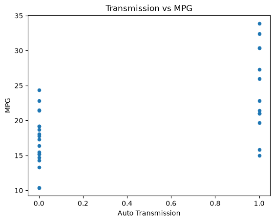
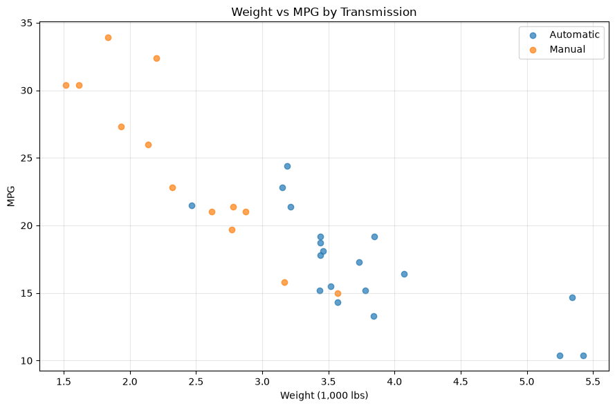

# 1주차 팀 wiki 토론

## Mission 1

### 이런 데이터셋을 분석해서 얻을 수 있는 경제적 가치는 무엇일까요? 어떤 비즈니스 상황에서 이런 데이터셋을 분석해서 어떤 경제적 가치를 얻을 수 있을까요?

mtcars 데이터 셋을 분석하면 현대자동차 같은 자동차 제조사에서는 차량 스펙과 연비의 상관관계를 분석하여 더 효율적인 연비를 가지는 자동차를 개발할 수 있습니다. 여러 독립변수가 연비에 어떤 영향을 미치는지 회귀분석으로 파악해두고 목표 연비를 맞추는 최적의 조합을 찾아내거나, 무게가 늘어날 때 연비가 얼마나 떨어지는지 정도를 수치적으로 확인하여 차량 경량화를 전략적으로 추진할 수 있습니다.

판매량이나 연령층과 같은 데이터가 추가로 있다면 무게나 배기량, 판매량 등의 상관관계를 분석해 고객층을 정교하게 나눠 특정 수요에 맞춘 제품을 출시하여 판매율을 끌어올리는 용도로 쓰일 수도 있으며, 소비자가 민감하게 반응하는 연비나 마력 같은 변수가 가격에 얼마나 영향을 주는지 산출해내면 마진을 극대화하는 최적의 스펙을 도출하는 데도 활용할 수 있습니다.

물류업체나 택시회사에서는 데이터 분석을 통해 변속기 타입이나 기어 수에 따라 연비 효율이 어떻게 달라지는지 비교해서, 회사 이익을 가장 많이 남길 수 있는 차량 모델을 고르며 경제적 가치를 창출할 수 있습니다.

자동차가 아닌 데이터의 경우에도 데이터 분석은 유용합니다. IT 업계의 경우, 클라우드 서비스의 CPU 코어 수, RAM 용량, 트래픽, 응답 속도 같은 지표를 분석하면 트래픽이 몰릴 때도 안정적으로 버티면서 가성비 좋은 인스턴스를 골라낼 수 있으며 이를 통해 클라우드 임대 비용을 절약할 수 있습니다.

따라서 데이터 분석의 이점은 특정 산업에 국한되지 않으며, 어느 관점에서 무엇을 위해 분석하느냐에 따라 다양한 경제적 가치를 창출할 수 있다고 할 수 있습니다.

---

### 변수들 간의 상관 관계가 높은 조합을 임의로 2개 선택해서 해당 데이터 간의 상관 관계를 그래프로 그리고 어떤 결론을 내릴 수 있는지를 토의하세요.




앞서 말한 내용에 따라, 변속기 종류에 따른 연비 차이의 이유는 위 사진과 같은 방식으로 분석할 수 있습니다. 위 시각화만 보면 수동 변속 차량이 자동 변속 차량보다 연비가 좋다는 결론에 도달하게 됩니다. 결론 자체는 맞지만, 그 과정에서 올바른 추론이 이루어졌다고 보기는 어렵습니다.

아래 시각화를 보면, 수동 변속기 차량(노랑)은 자동 변속기 차량(파랑)보다 무게가 가볍고 연비도 높습니다. 즉 연비 차이는 단순히 수동/자동의 차이 때문이 아니라 `차량의 무게`에서 비롯되었을 가능성이 있습니다. 이처럼 **한 가지 측면만 보고 단순하게 결론을 내리면 올바른 추론이 이루어지지 않으며, 그 분석 결과를 기반으로 의사결정을 할 때 오류가 생길 수 있다고 할 수 있습니다.**

따라서 데이터 분석을 진행할 때는 두 변수 간의 관계만 볼 것이 아니라, 데이터를 다각적으로 바라보는 과정이 필요합니다. 




<details>
<summary>수동/자동차량의 무게에 따른 연비 차이 그래프 시각화 코드</summary>

```python
# 수동/자동 차량 데이터 분류
automatic_cars = df[df["am"] == 0]
manual_cars = df[df["am"] == 1]

plt.figure(figsize=(9, 6))

# 자동 데이터 그래프 표기
plt.scatter(
    automatic_cars["wt"],
    automatic_cars["mpg"],
    label="Automatic",
    alpha=0.7
)

# 수동 데이터 그래프 표기
plt.scatter(
    manual_cars["wt"],
    manual_cars["mpg"],
    label="Manual",
    alpha=0.7
)

plt.title("Weight vs MPG by Transmission")
plt.xlabel("Weight (1,000 lbs)")
plt.ylabel("MPG")
plt.legend()
plt.grid(alpha=0.3)

plt.tight_layout()
plt.show()
```
</details>

<details>
<summary>그래프 그리기 코드</summary>

```python
import matplotlib.pyplot as plt

plt.figure(figsize=(7, 5))

plt.scatter(
    df['am'],
    df['mpg'],
    color='blue',
    alpha=0.7,
    edgecolors='black',
    s=80
)

plt.title('Transmission vs MPG', fontsize=14, fontweight='bold')
plt.xlabel('Auto Transmission', fontsize=12)
plt.ylabel('MPG', fontsize=12)

plt.tight_layout()
plt.show()
```
</details>

<details>
<summary>correlation 상위 순위 구하는 코드</summary>

```python
# correlation 구하기
corr = df.corr(numeric_only=True).round(3)

# correlation 1차원으로 만들기
correlation_pairs = (
    correlation_matrix
    .stack()
    .reset_index()
)

# column명 변경
correlation_pairs.columns = [
    "variable1",
    "variable2",
    "correlation"
]

# 이름 정렬
correlation_pairs = correlation_pairs[
    correlation_pairs["variable1"]
    < correlation_pairs["variable2"]
].copy()

# 상관관계 절대값 구하기
correlation_pairs["abs_correlation"] = (
    correlation_pairs["correlation"].abs()
)

# 절대값 기준 내림차순 정렬
correlation_pairs = correlation_pairs.sort_values(
    by="abs_correlation",
    ascending=False
)
# 상위 10개만
correlation_pairs.head(10)
```
</details>


## Mission 2

### 각자가 이해하기 어려웠던, 또는 이해하지 못한 keyword에 대해서 함께 토의해 봅시다.

총 5가지 내용을 이야기했습니다.

1. NULL을 검사할 때 왜 NULL = NULL로 비교가 안되고, IS NULL로 해야할까
- SQL에서 NULL은 값이 없다는 것을 나타내는게 아니라 알 수 없음을 나타내기 때문입니다. 알 수 없기 때문에 등호 비교 연산이 성립하지 않는 것입니다. 그래서 NULL을 비교하기 위해서는 IS NULL을 이용해야 합니다.
- 추가로 알 수 없음이라는 특성 때문에 NOT IN 서브쿼리 결과에 NULL이 하나라도 포함되면 전체 결과가 빈 집합이 될 수 있기에 주의해야 합니다.

2. UNION 이랑 UNION ALL 차이

- 둘 다 여러 SELECT 결과를 합치는건 동일하지만 중복 처리 여부에서 차이가 있습니다. 이는 성능이랑도 직결됩니다. 
- 중복 제거라는 동작은 내부적으로 정렬과 해시 연산을 실행하기 때문에 데이터가 많을수록 중복이 제거되는 UNION이 성능이 낮아집니다. 
- 따라서 두 결과 집합에 중복 없다는 것을 미리 알거나 중복이 있어도 상관없다면, UNION ALL을 사용하는 것이 성능 상 유리합니다.

3. DELETE 랑 TRUNCATE랑 DROP

- 셋 다 제거 작업인데 대상과 동작 방식이 다릅니다. 이 차이를 외우는게 좀 어려움이 있다는 의견이 있었습니다.
- DELETE는 행을 지우고, WHERE를 사용할 수 있으며, 롤백이 트랜잭션 내에서 가능합니다. 다만, 행 단위로 삭제하기에 속도가 상대적으로 느립니다.
- TRUNCATE의 경우 테이블 전체 데이터를 삭제하기에 WHERE를 사용하지 않고, 롤백이 DBMS에 따라 안 되거나 제한적입니다. 속도는 빠릅니다.
- DROP의 경우 테이블 자체를 구조를 포함해서 삭제하기에 WHERE를 사용하지 않습니다. 롤백도 TRUNCATE처럼 DBMS에 따라 불가하고 제한적이고 속도가 빠릅니다.
- 이러한 keyword에 따라 작업할 수 있는 것이 다르고, 성능/특성이 다르기 때문에 상황에 따라 DELETE/TRUCATE/DROP을 적절히 사용해야 합니다.

4. 논리 연산자 우선 순위

- 논리 연산자에 우선 순위가 존재하기에 이 순서를 모르고 그냥 앞에서부터 쓰면 생각이랑 다른 결과가 나오는걸 경험했습니다.
- 논리 연산자는 NOT -> AND -> OR 순서로 진행됩니다.
- 성능에서도 OR 조건은 인덱스 활용을 방해하는 경우가 많기 때문에, IN으로 대체하거나 UNION ALL로 분리하는게 성능 상 유리함을 알고 있을 필요가 있습니다.

5. DBMS별 세부 문법 차이
오라클, MySQL, SQLite 등 DBMS마다 지원하는 SQL 세부 문법에 차이가 있습니다. 특히 실습에 사용한 SQLite에서는 ANY, SOME 등의 기능이 지원되지 않아 예시 쿼리를 실행하는 데 문제가 있었고, 이를 해결하기 위해 문법적인 차이를 학습하고 적용하는 어려움이 있었습니다.

---
이러한 5가지 내용에 대해 회고를 진행했습니다.

## Mission 3
### wikipedia 페이지가 아닌, IMF 홈페이지에서 직접 데이터를 가져오는 방법은 없을까요? 어떻게 하면 될까요?
[IMF 공식 홈페이지](https://www.imf.org/external/datamapper/NGDP_RPCH@WEO/OEMDC/ADVEC/WEOWORLD)를 확인해보면 Data Mapper와 API를 직접 제공하고 있으며, CSV 파일 형태로도 데이터를 다운로드할 수 있습니다.

따라서 Wikipedia 대신 IMF 홈페이지에서 데이터를 가져온다면 다음과 같은 방법을 시도할 수 있습니다.

1. Data Mapper 활용: IMF 홈페이지에서 제공하는 Data Mapper를 통해 데이터 확인
2. 파일 다운로드: 제공되는 CSV/엑셀 파일을 직접 다운로드하여 갱신
3. API 연동: 스케줄러를 구성해 백엔드에서 최신 데이터를 자동으로 갱신

기존 웹 스크래핑 방식에는 다음과 같은 한계가 있습니다.

- 표 구조가 변경되면 기존 코드가 대응하지 못할 수 있음
- Wikipedia는 IMF 데이터의 원천이 아닌 2차 출처임
- 원천 데이터와 갱신 시점에 차이가 발생할 수 있음
- IMF 외 다른 기관(World Bank, UN 등)의 데이터가 섞여 있음

데이터 소스를 IMF가 공식 지원하는 방식으로 변경하면, 페이지 구조 변경 등 외부 요인의 영향을 덜 받는 안정적인 파이프라인을 구성할 수 있습니다. (ex, region 표기 변경 등)


### 만약 데이터가 갱신되면 과거의 데이터는 어떻게 되어야 할까요? 과거의 데이터를 조회하는 게 필요하다면 ETL 프로세스를 어떻게 변경해야 할까요?

과거 데이터 조회가 필요하다면, 새 데이터로 기존 데이터를 덮어쓰는 대신 ETL 실행 시점의 Timestamp를 기록하여 스냅샷 형태로 누적 저장해야 합니다. IMF는 WEO 데이터를 연 2회 발표하므로, 기준 연도와 발표 버전(전기,후기)을 구분 컬럼으로 추가해 관리할 수 있습니다.

ETL 프로세스는 다음과 같이 변경할 것 같습니다.

- 기존: Extract → Transform → Load — 최신 데이터로 overwrite 저장
- 변경 후: Extract → Transform → 기준 시점(Timestamp/버전) 추가 → Load — 신규 데이터를 insert로 누적 저장

다만 누적 저장 방식은 데이터가 쌓일수록 "현재 시점 기준 최신 데이터"를 조회하는 쿼리가 매번 버전 필터링을 거쳐야 해서 번거롭고 성능에도 불리할 수 있습니다. 이를 보완하기 위해 이력 테이블과 별도로 최신 버전만 담는 뷰 또는 테이블을 함께 두는 방식도 가능할 것 같습니다.

- 이력 테이블 : 모든 스냅샷을 버전 구분과 함께 누적 보관하여 과거 시점 조회에 사용
- 최신 뷰/테이블 : 가장 최근 발표 버전만 저장하여 빠른 조회용