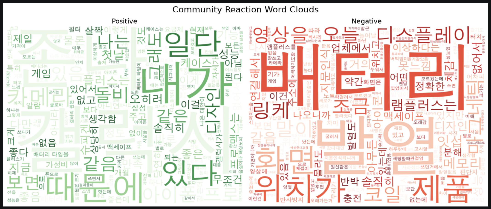
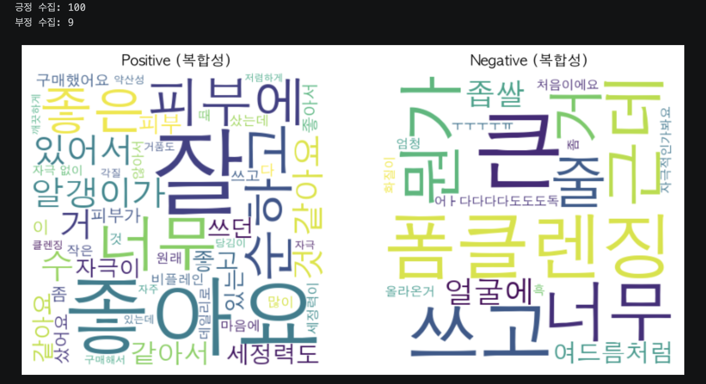
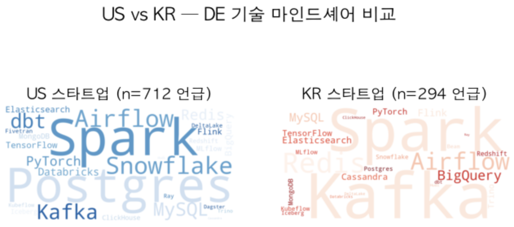
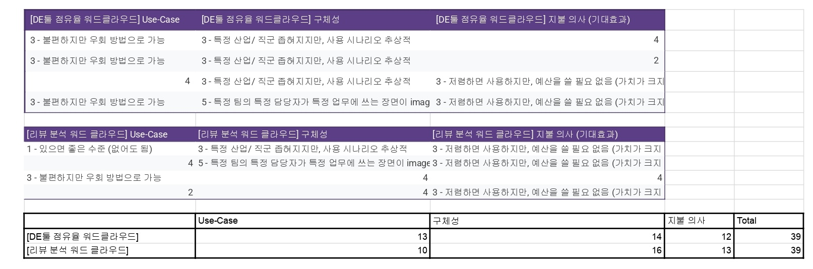
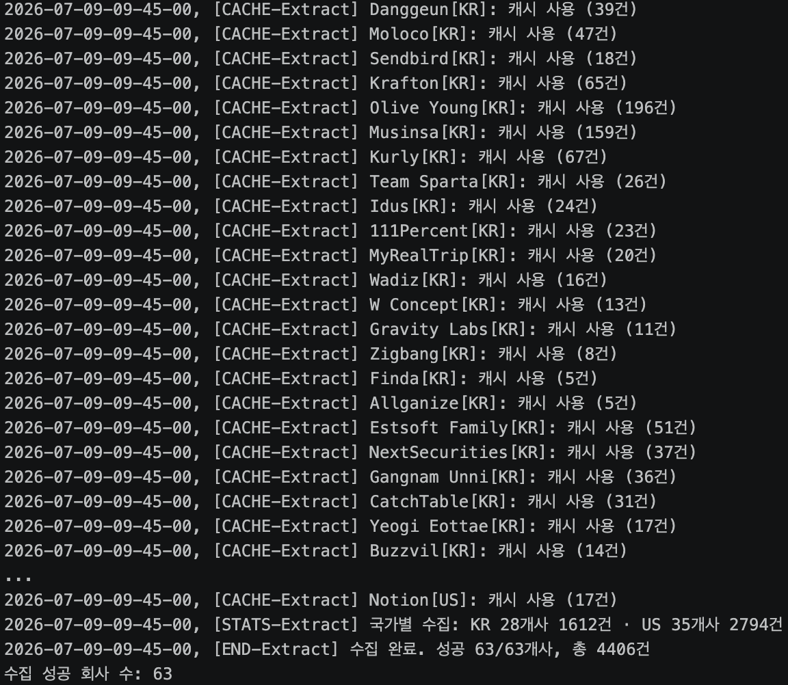
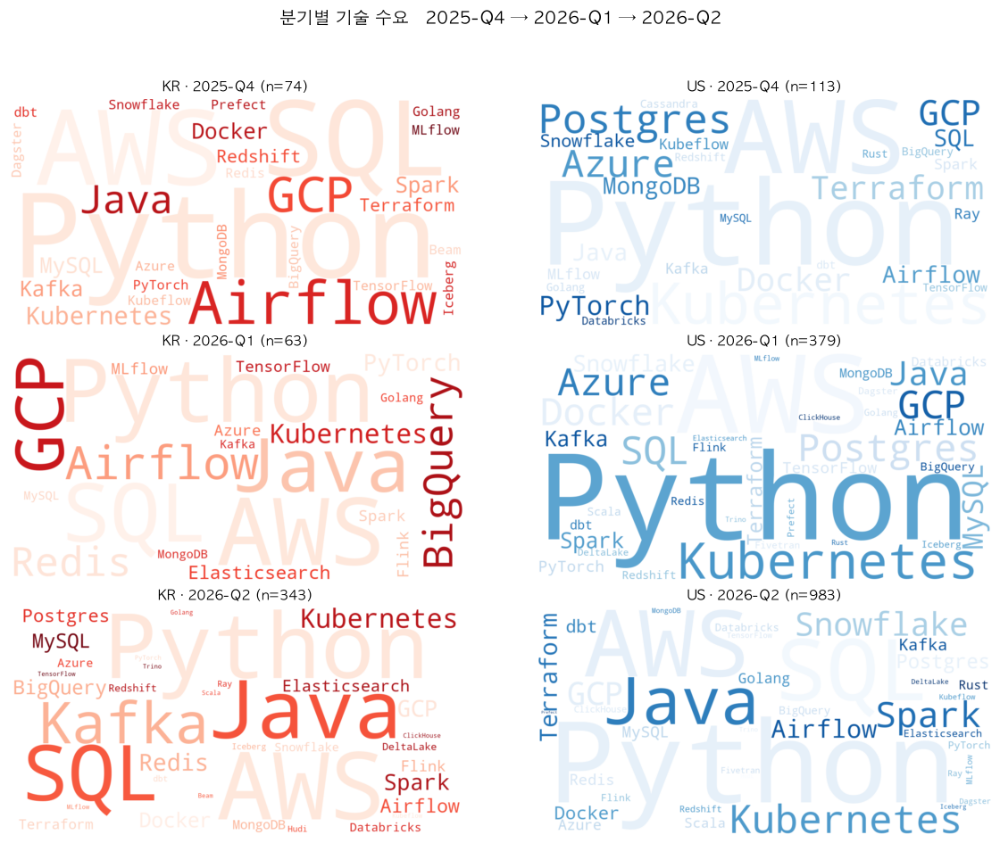
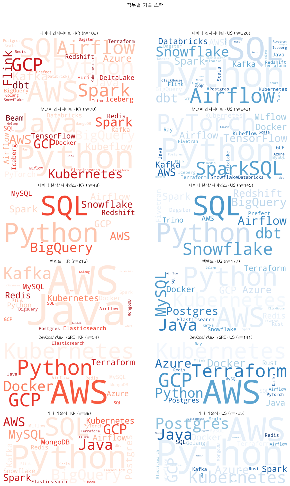
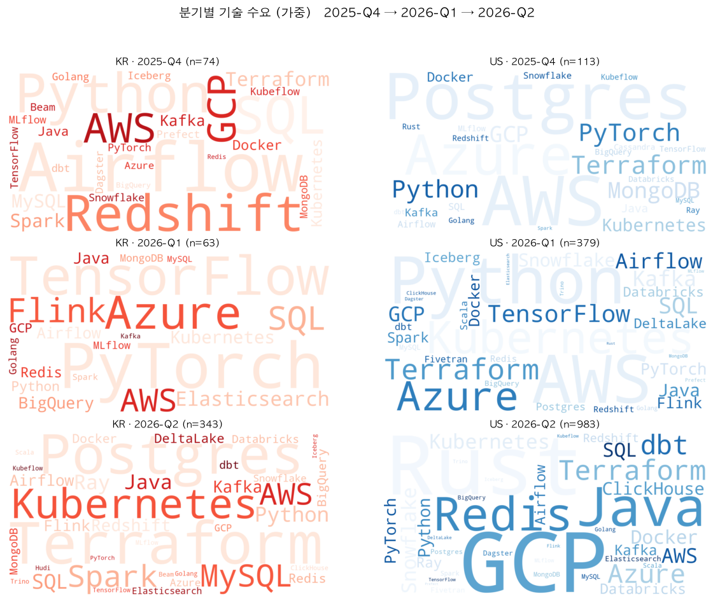
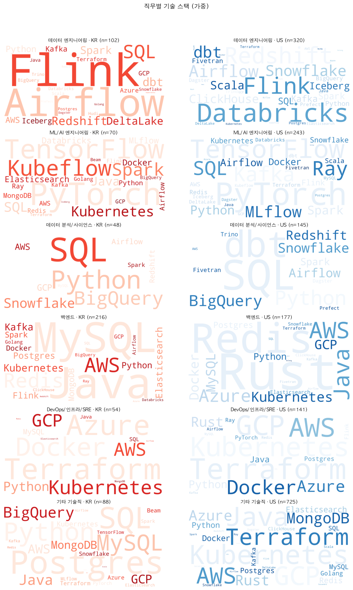

# 2주차 Team Wiki
> 팀원 : 전길원, 문종민, 김은정, 이민하

## 목차

1. [W2M5](#w2m5)
   - [팀 활동 요구사항](#팀-활동-요구사항)
   - [7/6 · 개인 아이디어 도출](#76--개인-아이디어-도출)
   - [7/7 · 팀 아이디어 선정 및 프로토타입 개발](#77--팀-아이디어-선정-및-프로토타입-개발)
   - [7/7–7/8 · 구현 및 개선](#7778--구현-및-개선)
2. [W2M6](#w2m6)

---

## W2M5

### 팀 활동 요구사항

- [X] 먼저 해당 데이터셋을 통해서 어떤 비즈니스 가치를 만들 수 있을지에 대해 토론하세요. (먼저 여러 개의 아이디어를 만들고 그중에 하나를 고르는 게 효율적입니다.)
- [X] 데이터셋은 웹 스크레이핑을 통해 직접 만든 다음, word cloud를 만들어 봅시다.
- [X] 데이터셋을 만들 때 어떤 작업들이 추가적으로 필요할까요?
- [X] prototyping에는 최소 1,000개 이상의 데이터를 사용하세요.
- [X] 프로토타입을 만든 다음, 만들기 전에 생각했던 비즈니스 가치를 만들 수 있는지에 대해서 다시 토론하세요.

> 진행 흐름 : `개인 아이디어 도출` → `팀 아이디어 선정` → `개별 프로토타입 검증` → `아이디어 고도화·한계 논의` → `구현 및 개선`

---

### 7/6 · 개인 아이디어 도출

각자 비즈니스 아이디어를 하나씩 준비해 온 뒤, 서로 피드백을 주고받았다.

| 담당자 | 아이디어 | 타겟 고객 | 피드백 결과 |
| --- | --- | --- | --- |
| 전길원 | 구인 글 JD 크롤링으로 DE 툴 트렌드 파악 | DE 인프라 벤더사(Snowflake·AWS·Databricks)의 마케팅/DevRel 리드 | IT 교육기관(부트캠프·학원)으로 타겟 전환 제안 → **팀 아이디어로 채택** |
| 김은정 | 올리브영 리뷰 분석으로 제품 장단점 파악 | 화장품 브랜드의 기획·마케팅 담당자, 구매 고려 소비자 | 고객사 지불 의사·한국어 형태소 품질 이슈 지적 → 쿠팡 등 대형 플랫폼으로 타겟 압축 |
| 문종민 | 신제품 초기 반응으로 이후 판매량 예측 | 삼성전자 등 주기적으로 신제품을 출시하는 제조 기업 | 타겟층이 넓다는 지적 → 커뮤니티 좁혀 수집하면 보완 가능 |
| 이민하 | 지그재그 리뷰 분석으로 제품 장단점 파악 | 화장품 리뷰 데이터를 보유한 커머스 플랫폼 | 김은정 항목과 동일한 피드백 공유 |

ideation 상세 내용 및 피드백

**전길원**
- 내용: 구인 글 JD 크롤링하여 DE 툴 분석하여 트렌드 파악
- 필요성
  - 벤더사의 마케팅 lead는 현재 카테고리가 마인드 셰어를 얻고 있는지, 예산을 어디에 사용해야 효율적인지를 감으로 결정한다.
  - 현재 진행하는 연간 설문 조사는 실시간 신호를 얻을 수 없음. 후행적임
- 고객
  - Snowflake / AWS / Databricks 와 같은 DE 인프라 벤더사의 마케팅, DevRel 리드
- 조사 대상
  - 미국 / 국내 스타트업 (B~D 시리즈)
    - 기술 전환이 빨라 추이가 실시간으로 변경될 가능성이 높음
    - 시리즈 A는 마케팅 예산 대비 효율이 나오지 않을 것으로 예상
    - 시리즈 D 이후는 기술이 어느정도 고정되어 있을 가능성이 높아 변경하지 않을 가능성이 높음
    - 그래서 유동적으로 변할 수 있고, 돈도 사용할 수 있는 B~D로 선정
- 조사항목
  - 채용 공고 및 기술 블로그
- Word Cloud를 사용하는 이유
  - 채용 공고에서 많이 언급하는 것은 실제로 그 기업에서 주요하게 사용할 가능성이 높고, 현재 사용하지 않더라도 마이그레이션을 준비하는 단계일 가능성이 높음
  - 이를 Word Cloud에서 선행적으로 확인할 수 있음
  - 기술 블로그에서는 선행적인 예측이 아닌 현재 기업에서 기술을 어떻게 사용하고 있는지 파악 가능
- 피드백
  - 해당 단계의 스타트업들만 수집하려면 난이도가 높지 않나?(종민)
    - 스타트업 명단이 따로 있음, 하지만 난이도가 있긴 하다(은정)
    - 이미 구현함(길원)
  - 타겟을 IT/데이터 교육기관(부트캠프나 학원 같은)으로 잡으면 좋을 듯(종민)
    - 최신 기술스택과 트렌드를 파악해서 교육과정에 반영해 경쟁력 강화(종민)
  - 다른 통계 자료들로 대체 가능할 것 같음(종민)
    - 현재 많이 사용하는 툴과 앞으로 많이 사용할 툴은 다르다(길원)

**김은정**
- 내용: 올리브영 리뷰 분석을 통해 제품 장단점 파악
- 필요성
  - 특정 화장품의 소비자 반응을 확인할 때 평균 별점이나 일부 리뷰만 보고 제품의 강점과 문제점을 판단하는 경우가 많다. 별점은 전반적인 만족도를 보여주지만, 높은 별점 리뷰 안에도 향, 자극, 끈적임, 용기와 같은 세부 불만이 포함될 수 있다. 제조사와 판매자는 수많은 리뷰를 직접 확인해야 하므로 반복적으로 언급되는 만족 요소와 불만 요소를 빠르게 파악하기 어렵다. 리뷰 데이터를 분석해 소비자가 실제로 만족하는 요소와 개선이 필요한 요소를 정리하고, 제품 개선 및 마케팅 방향을 결정하는 데 활용한다.
- 고객
  - 해당 화장품을 제조하거나 판매하는 브랜드의 상품기획, 마케팅, 고객경험 담당자
  - 해당 제품 구매를 고려하고 있는 소비자
- 조사항목
  - 별점, 리뷰 내용, 작성일, 구매 옵션, 도움 수 별점을 기준으로 리뷰 작성자의 전반적인 만족도를 구분한다.
    - 4-5점은 긍정 리뷰, 3점은 중립 리뷰, 1-2점은 부정 리뷰로 분류한다.
    - 리뷰 내용에서는 보습력, 발림성, 흡수력, 향, 피부 자극, 끈적임, 용기, 가격과 같은 평가 요소를 확인한다.
    - 제품 자체에 대한 평가와 배송, 포장에 대한 평가를 구분해 제품 품질 분석에 불필요한 내용을 제거한다.
    - 높은 별점 리뷰 안에 포함된 부정적인 문장과 낮은 별점 리뷰 안에 포함된 긍정적인 문장도 별도로 확인한다.
- Word Cloud 사용 이유
  - 긍정 리뷰의 Word Cloud를 통해 소비자가 제품에서 실제로 만족하는 요소를 빠르게 확인할 수 있다.
  - 부정 리뷰의 Word Cloud를 통해 반복적으로 언급되는 불만과 개선이 필요한 요소를 확인할 수 있다.
  - 긍정과 부정 Word Cloud를 비교하면 동일한 제품 속성이 서로 다른 평가를 받고 있는지도 파악할 수 있다.
  - 예를 들어 '향'이라는 단어가 긍정과 부정 리뷰에 모두 자주 등장한다면, 향이 제품의 주요 특징이지만 소비자에 따라 평가가 크게 갈리는 요소라고 해석할 수 있다.
  - Word Cloud는 전체 리뷰에서 자주 등장하는 키워드를 빠르게 탐색하는 데 유용하지만, 단어의 문맥까지 보여주지는 못한다.
  - 따라서 Word Cloud에서 발견한 주요 키워드는 실제 리뷰 문장과 함께 확인하고, 긍정 리뷰 안의 부정 의견과 부정 리뷰 안의 긍정 의견을 추가로 분석한다.
- 비즈니스 가치
  - 제조사는 긍정 리뷰에서 반복적으로 나타나는 제품의 강점을 광고와 상품 설명에 활용할 수 있다.
  - 부정 리뷰에서 반복적으로 나타나는 불만을 바탕으로 제형, 향, 용기, 성분, 용량 등의 개선 우선순위를 정할 수 있다.
  - 높은 별점을 준 고객이 공통적으로 언급하는 아쉬운 점을 확인해, 제품에 전반적으로 만족하지만 일부 불편을 느끼는 고객의 이탈을 줄일 수 있다.
  - 판매자는 소비자가 자주 언급하는 질문과 불만을 상품 상세페이지에 반영해 구매 전 정보 부족을 줄일 수 있다.
  - 소비자는 수많은 리뷰를 직접 읽지 않고도 제품의 주요 장점과 주의점을 확인할 수 있다.
- 피드백
  - 소비자 입장에선 유용하지만 고객사(쇼핑몰) 입장에서는 필요성이 약해보임(길원)
  - 플랫폼 입장에서는 굳이 돈을 들여가며 사서 추가할 이유가 없어보인다.(길원)
    - 고객 또한 해당 서비스에 돈을 지불하지 않을 가능성이 높을 것 같다.(길원)
  - 데이터 품질의 측면에서, '이쁘지 않다.'를 '이쁘'로 형태소가 갈라져 나오면, 오해의 여지가 있을 수 있다.(길원)
    - '디자인은 이쁜데, 성능이 좋지 않다.'라고 하면 이것을 어떻게 라벨링할지 모호하다.(길원)
      - 명확한 기준을 세우기 어렵다.(길원)
  - 한국어 형태소 분석 어려워서 sLLM 쓰는 것도 좋을 수도(종민)
    - 장점: ollama 통해 gemma4 사용해서 테스트해 보니 'ㅅㅌㅊ' 등 기존 형태소 분석 툴로 분석이 힘든 단어들까지 잘 분석함
    - 단점: 동일한 단어가 서로 다르게 분석되어 나올 수 있다.
  - 데이터 자체를 분석한 인사이트를 판매하는 것이 아니라 데이터 분석 툴을 제공하는 것이라 고객사에 의존적임 → 많은 리뷰를 갖고 있는 고객사에만 적용 가능(종민)
    - 쿠팡, 네이버쇼핑 등 대규모 이커머스 플랫폼으로 타겟을 좁히자
  - 보통 부정적인 리뷰가 긍정적 리뷰보다 적은데 데이터가 충분히 존재하는지(민하)
    - 쿠팡의 경우 워낙 전체 리뷰 수가 많아서 부정적인 리뷰도 충분히 유의미하게 존재한다
  - 다른 쇼핑몰의 리뷰 데이터를 수집해서 새로 등록하는 품목에 대한 분석 데이터를 제공하는 것은 어떤지(종민)
    - 리뷰는 자산으로 분류되어서 불법임
  - 쿠팡 리뷰 수집은 괜찮은지(종민)
    - 사실 그러면 웬만한 크롤링은 다 불법임. 일단 프로토타입 수준이기에 어쩔 수 없다.

**문종민**
- 내용: 신제품 초기 반응과 이후 판매량 추이 분석을 통한 판매량 예측
- 필요성
  - 삼성전자
    - 갤럭시 S22이 예상보다 조금 팔려서 악성재고가 많이 쌓여 손해를 봤다
    - 갤럭시 S23이 예상보다 많이 팔렸는데 생산량이 따라가지 못해서 물 들어올 때 노를 덜 저었다
    - 이러한 context가 있을 경우 판매량 예측을 통해 미리 생산량을 조정함으로써 이득을 볼 수 있다
- 고객
  - 삼성전자 등 주기적으로 신제품을 출시하는 제조 기업
- 조사 항목
  - 전자기기, 자동차 등 대상 제품 관련 커뮤니티에서 신제품에 대해 출시 직후 초기 몇 달간의 반응
    - 전자기기: 퀘이사존, 디시인사이드, 클리앙 등 IT 관련 커뮤니티 크롤링
    - 자동차: 네이버 자동차 관련 카페 크롤링
    - 구글 검색을 통해 관련 게시글 수집
  - 제품의 판매량 데이터 수집
    - 갤럭시 S의 경우 하나증권 등의 삼성전자 실적 분석 데이터 조사
- 비즈니스 가치
  - 판매량과 비교하며 초기 사용자 반응을 통한 판매량 예측
  - 이를 통해 미리 생산량을 조절하여 과잉생산이나 품귀 현상 등을 방지해 이득을 볼 수 있다.
- 피드백
  - 극초기 수요 예측엔 도움 안되지 않나?(길원)
    - 극초기 이후의 수요를 예측하는데에 도움이 되기에 유효할 것
  - 타겟층이 너무 넓다(길원)
    - 데이터 수집해보고 관계성 높은 카테고리에 대해 좁히면 가능
    - 특정 연령층/성별/계층이 사용하는 커뮤니티에 대해 좁혀서 수집하면 타겟 좁게 설정 가능
    - ex) 예를 들어 40-50대 남성이 주로 사용하는 커뮤니티의 반응
  - 고객사는 어디인가?(길원)
    - 삼성전자 등 주기적으로 신제품을 출시하는 제조 기업
  - 크롤링 할 때 데이터를 어디서 가져올건지(민하)
    - 구글에서 OSINT 쿼리를 통해 기간/사이트/키워드 조건을 걸어 URL을 수집하고 해당 URL들을 크롤링할 예정

**이민하**
- 내용: 지그재그 리뷰 데이터 분석을 통해 제품 장단점 파악
- 필요성
  - 플랫폼은 사용자 리뷰 데이터를 기반으로 구매 전환율을 높이고, 사용자에게 더 나은 쇼핑 경험을 제공
  - 본 프로젝트는 리뷰 데이터를 활용하여 사용자 특성(ex. 민감성 피부, 지성, 수부지 등)에 맞는 정보를 제공함으로써, 플랫폼 서비스의 개인화 수준 향상
- 고객
  - 화장품 리뷰 데이터를 보유한 커머스 플랫폼 (ex. 지그재그, 쿠팡, 올리브영과 같은 플랫폼)
- 조사 항목
  - 별점 → neg/pos
  - 리뷰 본문으로 word cloud
- 비즈니스 가치
  - 플랫폼이 보유한 리뷰 데이터를 재가공하여 사용자 특성 기반의 개인화된 정보를 제공할 수 있도록 한다.
  - 구매 전환율 증가
    - 사용자에게 더 적합한 정보를 제공함으로써 구매 결정 가능성을 높임
  - 반품 및 고객 불만 감소
    - 피부 자극과 같은 문제를 사전에 인지하게 함으로써 구매 실패 줄일 수 있음
  - 사용자 경험 개선
    - 리뷰 탐색 과정이 효율화되면서 사용자 만족도와 서비스 이용 경험 향상
- 피드백
  - 김은정 항목과 동일한 피드백 공유

---

### 7/7 · 팀 아이디어 선정 및 프로토타입 개발

#### 개별 프로토타입 구현 (구현 가능성 검증용)

> 간단 프로토타입으로 크롤링 가능성 확인 / 전처리 방법 고안

| 담당자 | 크롤링 소스 | 결과 |
| --- | --- | --- |
| 문종민 | 구글 / DC inside | 선정한 소스의 Data 품질에 문제가 있어 탈락 |
| 이민하 | 지그재그 | Data 분포와 양이 생각과 달라 탈락 |
| 김은정 | 쿠팡 (크롤링 → 워드클라우드까지 구현) | 쿠팡에서 크롤링 차단 |
| 전길원 | 그린하우스 (크롤링 → 워드클라우드까지 구현) | 정상 수집·분석 확인 → **채택** |

개별 프로토타입 화면

- 문종민 — 구글 / DC inside
  
- 이민하 — 지그재그
  
- 김은정 — 쿠팡
  
- 전길원 — 그린하우스
  

---

#### Google Form 아이디어 평가

객관적인 비즈니스 선정을 위해 아래 항목을 1-5점으로 평가했다.

| 항목 | 1점 | 3점 | 5점 |
| --- | --- | --- | --- |
| Use-Case | 있으면 좋은 수준 (없어도 됨) | 불편하지만 우회 방법으로 가능 | 지금 당장 해결책을 적극적으로 찾는 중 |
| 구체성 | 기업이 사용 가능하다 정도의 막연함 | 특정 산업/직군은 좁혀지지만 사용 시나리오는 추상적 | 특정 팀의 특정 담당자가 특정 업무에 쓰는 장면이 image화 |
| 지불 의사 (기대효과) | 무료여도 사용할지 의문 (가치가 없다는 느낌) | 저렴하면 사용하지만 예산을 쓸 필요는 없음 (가치가 크지 않다는 느낌) | 문제 해결 가치가 명확해서 높은 가격에도 구매/도입할 근거가 있음 |

- 구글 폼 평가 결과
  
  - 동률 → 최종적으로 **길원 아이디어로 선정**

---

#### 아이디어 고도화

> 이 아이디어로 어떤 비즈니스 가치를 만들 수 있을까 심화 논의
>> 마케팅팀보다 `IT 교육 업체에서 더 필요로 할 것 같다.`는 의견으로 제품 `피봇팅`

- 이민하
  - 타임박싱 해서 늘어지지 않게 하자
- 문종민
  - 타겟은 IT 취업을 위한 부트캠프/학원 등이 좋을 것으로 보인다
- 전길원
  - 헤드헌팅사 등도 괜찮을 것 같긴 한데 IT 취업을 위한 부트캠프/학원이 제일 적합해 보인다
  - DE 툴에 국한시키지 말고 전체 테크스택으로 확장하자
  - 테크스택 딕셔너리 확장 필요
    - 기존 DE → 전 분야
    - Claude를 이용하여 테크스택 딕셔너리 구성하겠다.

---

#### 한계 논의

> 채용 인원이 모두 다르고, 영세한 기업/악덕 기업일수록 채용이 잦다.
>> 이러한 것을 모두 1회로 계산하여 측정하면 부정확한 결과가 나올 것
>>> 커스텀 가중치를 이용하여 계산

- 문종민
  - 고도화 방안
    - 테크스택 세분화
      - 수집은 전체 다 하되, FE/BE/DE 등 카테고리별 분석 정보도 별도로 표시
    - 분기별 언급 증감량
      - 수집을 기간별로 나눠서, 분기별 분석 결과나 증감 추이를 표시하는 기능
- 이민하
  - 기업 도메인별로 사용하는 기술이 달라서 도메인 차이로 워드 클라우드가 달라질 수 있다.
    - 도메인별로도 분석이 가능하게 하자
- 전길원
  - 단순 언급 수가 아닌 회사 수로 집계하여 Word Cloud를 만들 때 Custom 가중치로 넣자.
    - 한국은 공고 수가 미국에 비해 적어서 일부 기업이 10%, 20%를 차지하는 경우가 있음
  - 기업 도메인을 다양하게 조사해서 특정 업종에서 자주 쓰는 기술만 보이는 걸 피해야 할 듯
    - 세그먼트별로 나눠 총 62개 회사 공고 조사
  - 최신 분기에 언급이 늘어나고 있는 게 더 잘 보여야 부트캠프에서 의사결정을 할 수 있을 것 같다.
    - 이 또한 Custom Weight로 1분기 전마다 *0.6을 해서 지금 뜨는 기술을 강조하여 보여주자.
  - 특정 직무에서만 쓰는 테크 스택을 보여주는 게 부트캠프 커리큘럼이나 마케팅 의사결정에 도움이 될 것 같다.
    - TF-IDF 구조를 이용하여 전체 테크 스택 대비 특정 직무에서 언급되는 양을 점유율비로 계산해 Custom Weight로 WordCloud 표현
- 문종민
  - 채용이 잦은 소규모 기업에서는 중복되는 공고가 나올 수 있어서 특정 테크스택이 실제 수요에 비해 부풀려질 수 있다.
    - 회사별/분기별로 1번씩만 집계하는 기능
  - 분기별/회사별/테크스택 카테고리별/도메인별 등 데이터 수집할 때 태그를 세분화해서 붙이면 여러 방향에서 분석 가능
  - 일단 기본 기능부터 구현한 후 하나씩 시도해보자

---

#### 데이터셋을 만들 때 어떤 작업들이 추가적으로 필요할까요?

- 전길원
  - 크롤링 / 스크래핑
  - 전처리
    - 분류, 매칭, 특정 기간별로 나누기
    - ex) 이번 과제에서는 분기별로 분류해서 SQLite에 저장
- 문종민
  - 텍스트 정제
    - 해시태그, 네임태그, html 태그 제거 등
  - 토큰화 및 불용어 제거
    - haven't, i'm 등

수집된 양(4,406건) 확인

---

### 7/7–7/8 · 구현 및 개선

프로토타입은 다음 두 버전으로 발전시켰다.

| 구분 | 1차 프로토타입 | 2차 프로토타입 |
| --- | --- | --- |
| 특징 | 첫 구현 버전 | Custom Weight를 추가한 버전 |
| 집계 방식 | 동일 회사의 비슷한 공고도 다 카운팅 | 회사 공고를 1회만 집계 |
| 가중치 | 없음 | 기간별: 같은 국가 종합에서 이 분기에 많이 나온 기술에 가중치 / 직무별: 이 직무에 많이 나온 기술 + 최신 공고 기술에 가중치 |

**1차 프로토타입**

- 기간별 테크 스택 워드 클라우드 (직무 종합)
  
- 직무별 기술 스택 워드 클라우드 (기간 종합)
  

**2차 프로토타입**

- 기간별 테크 스택 워드 클라우드 (회사 공고 1회 집계 + 같은 국가 종합에서 이 분기에 많이 나온 기술 가중치)
  
- 직무별 테크 스택 워드 클라우드 (회사 공고 1회 집계 + 직무 종합에서 이 직무에 많이 나온 기술 가중치 + 최신 공고에 있는 기술에 가중치)
  

---

### 사용 기술

> `Extract → Transform → Load → Render` ETL 파이프라인 구조로 구성

| 단계 | 기술 | 무엇을 / 왜 |
| --- | --- | --- |
| **Extract** (수집) | `requests` + `BeautifulSoup4` | ATS가 정적 HTML/JSON을 주기에, 무거운 브라우저 자동화(Selenium) 대신 가벼운 `requests`로 수집·파싱 |
| | ATS 어댑터 (Greenhouse / Greeting / Ashby / 자체 페이지) | 회사마다 다른 채용 플랫폼을 하나의 공통 공고 형식으로 통일해 이후 단계를 단순화 |
| | `ThreadPoolExecutor` | 공고 본문은 네트워크 대기가 대부분이라, 병렬 요청으로 수집 시간 단축 |
| | JSON-LD / `__NEXT_DATA__` 파싱 | SPA 채용 페이지에서 구조화된 `JobPosting` 데이터를 안정적으로 추출 |
| **Transform** (전처리) | 1. 직무 필터 (`is_tech_role`) | 제목 키워드로 기술직만 골라 무거운 본문 분석 대상을 좁힘. 비기술직은 `jobs`에만 기록 |
| | 2. HTML 평문화 (`html.unescape` + `BeautifulSoup.get_text`) | 엔티티 이스케이프된 Greenhouse 본문을 복원 후 태그를 벗겨 평문으로 정제 |
| | 3. 기술명 추출 (정규식 매칭) | 기술명 사전 기반 화이트리스트 매칭. 단어 경계로 오탐 방지(`spark`≠`sparkling`), 긴 별칭 우선, `PySpark/Apache Spark → Spark` 표기 통일 (Claude로 사전 구성)|
| | 4. 공고당 1회 집계 · 분기 버킷팅 | `set`으로 한 공고 내 중복 언급을 제거하고, 게시일을 `2025-Q4`로 변환해 분기별 추이 분석 |
| **Load** (적재) | `pandas` + `SQLite` | `jobs / mentions / granular` 3개 테이블로 정규화 |
| **Render** (시각화) | `wordcloud` + `matplotlib` | 결과 표현 |
| | Custom Weight — `recency`·`breadth`·`lift` | 왜곡 보정: 최신 분기 강조(분기당 ×0.6 감쇠), 회사당 1회 집계, TF-IDF식 상대빈도(`lift`)로 특정 직무의 기술 부각 |

----

## W2M6

- [X] Docker를 사용하는 이유가 뭘까요?
    - 환경 일관
        - 빌드된 이미지만 있으면 어디서든 실행 가능해짐
    - 배포 간편
        - 빌드된 이미지를 전달하는 방식이나 hub에 올리고, 다운 받는 방식으로 배포가 편해진다.
    - 격리
        - 한 PC에서 여러 Docker Container를 돌려도 의존성 충돌이 발생하지 않는다.
    - 가벼움
        - OS커널을 공유하기 때문에 VM에 비해 가볍다.
            - 시작이 빠르고, 리소스 사용량이 적음
    - 버전 관리와 롤백
        - 이미지에 태그를 붙여 버전을 관리하는게 가능해서 문제가 생기면 이전 버전 이미지로 롤백하기 편하다.
    - CI/CD
        - 빌드 결과물이 이미지로 나오기 때문에 테스트, 빌드, 배포 파이프라인 자동화가 쉽다.

- [X] 어떤 점은 더 불편한가요?
    - 초기 학습 관리
        - Dockerfile을 작성을 위한 학습이 필요
            - image 최적화 등에 대한 학습도 필요함
        - 받는 쪽에서도 Docker 설치와 레지스트리 로그인과 인증이 필요하다
    - CPU 아키텍처 문제
        - Mac에서 빌드한 이미지가 x86 EC2에서 동작하지 않는 등 아키텍처 이슈가 생길 수 있다.
    - 디버깅
        - 디버깅하려면 컨테이너 내부에 들어가서 확인해야 해서 로컬 직접 실행보다 디버깅이 번거로움
    - 데이터 영속성
        - 컨테이너를 지우면 내부 데이터도 사라지므로 볼륨 관리를 신경써야 한다.
    - 이미지 용량
        - 이미지 잘못 만들면 너무 커져서 느려진다. 멀티 스테이지 빌드나 경량 베이스 이미지 등의 기술을 통해 최적화해야한다.

- [X] 이번 미션에서는 하나의 EC2에 하나의 Docker container를 배포했습니다. 만약에 여러대의 EC2에 여러 개의 컨테이너를 배포해야 한다면 어떻게 해야 할까요?
    
    - 수동으로 하면 수 많은 서버마다 SSH 접속, 설정, pull, run을 반복해야 하고, 컨테이너가 죽어도 자동으로 복구되지 않는다. 
        - 그래서 여러 대에 여러 컨테이너를 배포해야 하는 경우 ECS나 Kubernetes 같은 컨테이너 오케스트레이션 도구를 사용해서 자동으로 관리한다.
        - 추가로 로드 밸런서로 여러 컨테이너에 트래픽을 분산하고, 컨테이너 재배치로 IP가 바뀌어도 서로 찾을 수 있도록 서비스 디스커버리가 필요하다.

    - 오케스트레이션 도구 기능
        - 스케줄링: 어느 서버에 어떤 컨테이너를 띄울지 자동 결정
        - 자가 복구: 컨테이너/서버 장애 시 자동 재시작,재배치
        - 스케일링: 트래픽에 따라 컨테이너 수를 자동 증감
        - 무중단 배포: 롤링 업데이트 및 문제 발생 시 롤백
