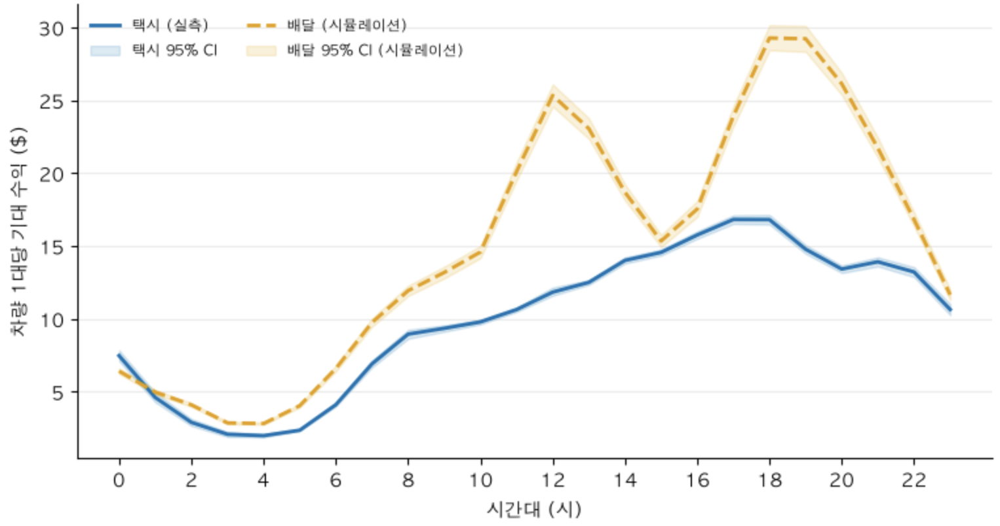

# W4M2 
> 자율주행 택시, 택시 사업만으로 충분한가 
>> 자율주행 택시 회사 사업 확장 고려를 설득하기 위한 제안

## 결론

> **차량 운용을 택시 사업 하나에만 묶어두지 말고, 유휴시간에 배달 등 인접 사업을 함께 검토해야 한다.**
>> 자율 주행 택시 회사의 수익성을 높이고자하는 제안

자율주행차는 사람 운전자와 달리 근무시간 제약이 없는데도, 지금은 택시 업무만 하도록 운용되고 있다. 뉴욕 택시 데이터를 자율주행차 데이터로 가정해 분석한 결과, **낮 시간대(특히 점심·저녁)에는 배달 쪽 수익이 택시보다 뚜렷하게 높게 나타났다.** 택시 사업에만 차량 역량을 한정하는 지금 방식이 최선이 아닐 수 있다는 뜻이다.

## 근거

| 시간대 | 관찰된 경향 | 제안 |
|---|---|---|
| 00~01시, 23시 | 배달과 차이 없음 | 전환 불필요 |
| 02~14시 | 배달 수익이 뚜렷하게 높음 (점심 12시경 최대) | 대체 업무 검토 |
| 15~16시 | 뚜렷한 차이 없음 | 판단 보류 |
| 17~22시 | 배달 수익이 뚜렷하게 높음 (저녁 19시경 최대) | 대체 업무 검토 |

**택시 수익 계산** 
- 2025~2026년 Yellow Taxi(17개월, 6,400만 건)에서 시간대별 총매출을 뽑고, 이를 뉴욕시가 허가한 택시 차량 총수(13,587대)로 나눠 `차량 1대당 시간대별 기대 수익`을 구함. 
  - 실제 운행 데이터에 기반한 값
> 한계: 13,587대는 법이 허용하는 최대치이고, 실제로 그만큼 다 운행되는 것은 아니다(실제 운행 대수는 이보다 적을 것으로 추정). 따라서 실제론 택시 수익이 이보다 약간 더 높을 수 있다.

**배달 수익 계산** 
- 뉴욕시는 배달 플랫폼 노동자의 시간당 평균 수입(전체 평균 $22.28, 팁 포함)과 주간 총 배달 건수 같은 공식 통계를 발표함.
  - 다만 이 통계는 "하루 전체 평균"만 있고 "몇 시에 얼마를 버는지"는 나와 있지 않음. 
    - 그래서 이 공식 평균값을 기준점으로 삼고, 시간대별로 배달 요청이 많을 때는 더 벌고 적을 때는 덜 번다는 가정을 적용해 시간대별 수익을 팀에서 추산했다.
      - 시간대별 식사 비율을 기반으로 가중치를 적용하여 시간대별 배달 수입을 역계산함.
> 한계: 이 시간대별 배분은 팀의 추정, 뉴욕시가 시간대별 배달 실적이 없어서 정확하지 않다. 다만 기준이 되는 전체 평균 자체는 뉴욕시 공식 통계다.

이 결과가 우연에 의한 차이가 아닌지도 통계적으로 확인했고, 2013년 데이터로 만든 초안과 비교해도 결론의 방향은 같았다.

## 한계
- 유휴 차량이 배달 수요가 있는 지역에 실제로 있는지는 개략적으로만 확인했다.
- 연료비, 차량 감가상각, 업무 전환에 드는 비용은 이번 분석에 포함하지 않았다.
