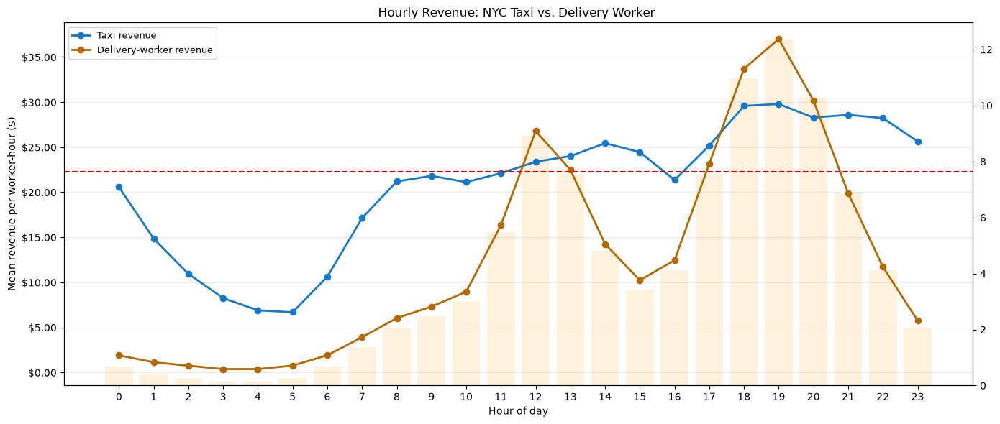

# 자율주행차 유휴시간 수익 최적화 데이터 프로덕트 — 최종 보고서

## 목차
- [1. 과제 개요](#1-과제-개요)
- [2. 제안 데이터 프로덕트](#2-제안-데이터-프로덕트)
- [3. 프로토타입 1 — 기사ID·인플레이션 기반 초안](#3-프로토타입-1--기사id인플레이션-기반-초안)
- [4. 프로토타입 1의 한계](#4-프로토타입-1의-한계)
- [5. 프로토타입 2 — Spark 기반 재구축](#5-프로토타입-2--spark-기반-재구축)
- [6. 프로토타입 2 결과](#6-프로토타입-2-결과)
- [7. 종합 결론](#7-종합-결론)
- [8. 한계 및 다음 단계](#8-한계-및-다음-단계)

---

## 1. 과제 개요

이번 과제는 NYC TLC 택시 운행 데이터가 사람이 운전하는 차량이 아니라 자율주행차에서 발생한 데이터라고 가정하고, 자율주행차의 특성을 활용할 수 있는 데이터 프로덕트를 제안하는 것을 목표로 했다.

자율주행차는 사람 운전자와 달리 운전자의 휴식시간이나 근무시간 제약이 적고, 택시 수요가 낮은 시간에도 다른 업무를 수행할 수 있다. 이에 따라 차량이 택시 업무만 수행하는 것이 아니라 유휴시간에 배달, 퀵, 이동형 공간 대여, 광고, 충전·방전 등의 추가 서비스를 수행하도록 지원하는 데이터 프로덕트를 구상했다.

## 2. 제안 데이터 프로덕트

> 자율주행차의 시간대별 택시 수익과 대체 서비스 수익을 비교하여, 차량이 각 시간대에 가장 높은 수익을 얻을 수 있는 업무를 추천하는 데이터 프로덕트

주요 사용자는 자율주행차·로보택시 운영사이며, 다음 의사결정에 이 제품을 활용할 수 있다.

- 시간대별 택시 수익성 확인
- 택시 수익이 낮은 유휴시간대 탐색
- 배달 등 대체 서비스의 시간당 수익 비교
- 시간대별 최적 업무 추천

이 문서는 이 아이디어를 검증한 **두 번의 프로토타입**을 순서대로 담는다. 프로토타입 1은 기사ID가 포함된 2013년 데이터에 인플레이션을 반영해 만든 초안이고, 프로토타입 2는 그 한계를 고쳐 PySpark + JupyterLab으로 다시 만든 버전이다.

---

## 3. 프로토타입 1 — 기사ID·인플레이션 기반 초안

> 원문: `W4M2.md`

### 3.1 아이디어 전개 방향

```text
택시 수요와 수익은 시간대별로 변동한다.
        │
        ▼
수익이 낮은 시간에는 차량의 유휴시간이 발생한다.
        │
        ▼
대체 서비스의 시간당 수익을 함께 비교한다.
        │
        ▼
시간대별로 가장 높은 수익의 업무를 추천한다.
```

### 3.2 활용 데이터 및 방법

- **택시 수익**: 차량/기사 단위 수익을 계산하려면 개별 기사 식별 정보가 필요했는데, 2015년 이후 공개된 옐로우캡 데이터에는 기사ID가 없다. 이에 따라 **기사ID가 포함된 2013년 택시 데이터**를 기준으로 삼고, 아래 표대로 요금을 2026년 수준으로 인플레이션 보정했다.

  | 항목 | 2013년 기준 | 2026년 반영 기준 |
  |---|---:|---:|
  | 기본요금 | $2.5 | $3.0 |
  | 거리요금 | 0.2마일당 $0.50 | 0.2마일당 $0.70 |
  | 정체·정차요금 | 60초당 $0.50 | 60초당 $0.70 |
  | 야간 할증 | 기존 기준 | 2배 반영 |
  | 평일 러시아워 할증 | 기존 기준 | 2.5배 반영 |
  | 맨해튼 96번가 이남 혼잡 할증 | 없음 | $2.5 반영 |
  | 맨해튼 60번가 이남 혼잡통행료 | 없음 | $0.75 반영 |

- **배달 수익**: 2026년 배달 기사 1인당 시간대별 수입 자료를 조사해 택시 수입과 같은 그래프에 표시했다.

### 3.3 결과

최종 시각화에서 택시 수입보다 배달 수입이 높은 시간대는 **12시부터 13시, 18시부터 20시**로 나타났다. 해당 구간에서는 택시 업무만 유지하는 것보다 배달 업무를 함께 수행하는 방안을 고려할 수 있다는 결론을 냈다.



---

## 4. 프로토타입 1의 한계

프로토타입 1이 스스로 짚었던 한계는 다음 세 가지였고, 이 문서의 프로토타입 2는 이 세 가지를 정면으로 고치는 작업이다.

1. **택시 수요가 동일하다는 가정** — 2013년엔 우버·리프트 같은 플랫폼이 보편화되지 않았는데, 그 시절 수요 구조를 2026년 요금으로만 환산해 억지로 적용했다.
2. **서로 다른 출처의 수익 데이터 비교** — 택시는 2013년 인플레이션 보정치, 배달은 2026년 실측치로, 시점과 산정 방식이 아예 다른 두 값을 나란히 비교했다.
3. **자율주행차 비용 미반영** — 연료, 감가상각, 보험, 업무 전환 비용 등을 반영하지 않고 총수입만 비교했다.

여기에 더해, 실제로 팀이 재검토하며 추가로 짚은 문제도 있었다.

4. **인과관계 vs 상관관계 부재** — 택시 수익과 배달 수익, 두 시계열이 같이 움직인다고 해서 그 시간·그 위치에 있는 차량이 실제로 배달 콜을 잡을 수 있다는 보장은 없었다. 유휴 차량의 실제 위치가 배달 수요 지역과 겹치는지는 검증되지 않았다.

---

## 5. 프로토타입 2 — Spark 기반 재구축

### 5.1 왜 다시 만들었나

프로토타입 1의 핵심 문제는 "기사 1인당 시간당 수입"이라는 지표를 쓰려고 기사ID가 있는 2013년 데이터로 후퇴한 것이었다. 프로토타입 2는 이 지표 자체를 버리고, 아래 4가지 개선을 통해 최신 데이터만으로 같은 질문에 답하도록 다시 만들었다.

| # | 프로토타입 1 | 프로토타입 2 |
|---|---|---|
| 1. 지표 | 2013년 인플레이션 보정 기사 개인 수입 | 최신 데이터 기반 매출 ÷ 전체 공급(차량-공급 보정 매출) |
| 2. 배달 데이터 | 2026년 배달 기사 수입(출처 불명확) | DCWP 실측치 기반, 실측 없는 부분은 라벨링된 추정으로 대체 |
| 3. 통계 처리 | 없음(단순 그래프 비교) | 신뢰구간 + Mann-Whitney U 검정 + 효과크기 + 최소 의미 임계값 |
| 4. 인과/상관 | 시계열 겹침만으로 결론 | 실제 도착지 데이터로 공간적 겹침 검증, 결론은 조건부 문구 |

기술 스택은 **PySpark + JupyterLab**(로컬 모드)이며, 원본 데이터는 NYC TLC 옐로우캡 트립 데이터(`product/data/yellow_tripdata_2025-01.parquet` ~ `2026-05.parquet`, 17개월)다.

### 5.2 진행 단계 — 1단계 검증 후 2단계 확장

17개월치 데이터(6,400만 행)를 처음부터 통째로 돌리며 파이프라인을 디버깅하면 느리고 비효율적이므로, 두 단계로 나눠 진행했다.

- **1단계 (`product/notebooks/01_prototype_single_month.ipynb`)**: `yellow_tripdata_2026-05.parquet` **한 달치만** 사용해 지표 계산 → 배달 시뮬레이션 → 통계 검정 → 공간 검증까지 파이프라인 전체를 빠르게 검증했다. 결과가 상식적으로 말이 되는지(예: 새벽에 유휴 차량이 많은지, 출퇴근 시간에 매출이 높은지) 확인하는 단계다.
- **2단계 (`product/notebooks/02_full_range_analysis.ipynb`)**: 1단계 로직이 검증되자, `config/run_config_full_range.yaml`의 `file_list`만 2025-01~2026-05 **17개 파일**로 바꿔 동일한 `src/` 코드로 재실행했다. 이 방식이 가능했던 것은 파이프라인을 처음부터 "분석 대상 파일 목록"을 설정값으로 받게 설계했기 때문이다 — 코드 변경 없이 설정 변경만으로 표본이 hour당 31개(1단계)에서 ~500개(2단계)로 늘었고, 신뢰구간이 그만큼 좁아지는 것을 직접 확인했다.

이후 배달 쪽 데이터의 정교함을 두 차례 더 끌어올리면서(아래 5.4절), 최종적으로 `product/notebooks/03_team_hourly_estimate.ipynb`가 프로토타입 2의 최신 버전이 되었다. 세 노트북 모두 같은 `src/`(택시 지표·통계 검정·공간 검증) 코드를 공유하고, 배달 데이터를 만드는 부분만 세 단계에 걸쳐 달라졌다.

### 5.3 개선사항 1 — 지표 교체: 매출 ÷ 전체 공급

기사ID 없이도 계산 가능한 지표로 바꿨다.

- **분자**: 시간대별 총매출 = `fare_amount + extra + mta_tax + tolls_amount + improvement_surcharge + congestion_surcharge + Airport_fee + cbd_congestion_fee` (팁은 제외 — 자율주행차는 팁을 받지 않는다는 전제).
- **분모**: NYC 옐로우캡 메달리온 법정 상한 **13,587대**(TLC Office of Financial Stability 2024 연차보고서 기준. 팀이 초기에 참고했던 13,437은 outdated 값으로 확인해 교체함).
- **매출 ÷ 13,587** = 시간대별 차량 1대당 기대 매출. 수요가 낮은 시간엔 분모가 고정돼 있으므로 기대 매출이 자연히 낮아지는 효과가 그대로 반영된다.
- **유휴 차량 추정**: 트립 데이터만으로 Little's Law(`L = λW`, λ=시간당 트립 발생 건수, W=평균 트립 시간)를 적용해 그 시간대에 승객을 태우고 있던 차량 수(L)를 역산하고, `13,587 − L`로 유휴 차량 수를 추정했다.

### 5.4 개선사항 2 — 배달 수익 데이터: 세 단계로 정교화

조사 결과 NYC 배달 주문량·시급 어느 쪽도 **시간대별 실측 데이터가 존재하지 않았다.** 이 문제를 세 단계에 걸쳐 다뤘다.

**(1단계 — 노트북 01/02 초안) 법정 최저 시급 기반 평평한 시뮬레이션**
NYC DCWP가 공표하는 배달노동자 법정 최저 시급($21.44/hr, 2025-04 기준)을 중심으로, 24시간 모두 같은 평균을 쓰는 로그정규분포 몬테카를로 시뮬레이션을 만들었다. 문제는 이러면 시간대 구분이 사라져 "언제나 배달이 유리하다"는 밋밋한 결론만 나왔다.

**(2단계 — 노트북 02 개선) DCWP 실측 평균 + BLS 식사시간 패턴**
법정 최저 시급 대신 DCWP가 실측 집계한 **평균** 시급(2024년 4분기 $22.28/hr, 팁 포함)으로 수준을 바꾸고, 시간대별 형태는 미국 노동통계국(BLS) American Time Use Survey의 "시간대별 식사 인구 비율"을 제곱근 완화(`shape_attenuation=0.5`)해서 근사로 썼다. NYC 배달 주문량 실측치가 아니라는 점을 명확히 라벨링했다.

**(3단계 — 노트북 03, 최신) 팀 자체 추산 — 개인 배달기사 시간대별 매출**
BLS 근사보다 더 구체적인 모델이 필요해, DCWP 실측 앵커값에서 시작해 시간대별 **개인 배달기사 매출**을 직접 도출하는 방법론을 만들었다.

- **DCWP 실측 앵커 (Q4 2024 리포트 기준)**

  | 항목 | 값 |
  |---|---|
  | 시간당 수입 | $22.28 (기사료 $19.78 + 팁 $2.50) |
  | 주당 총배달 | 2.72M 건 |
  | 주당 총수입 | $23.9M |

- **(a) 시간대별 건당 배달료 `p(h)`**
  - 레벨(실측 유도): 건당 매출 = $23.9M ÷ 2.72M = **$8.79/건** → 기사료:팁 비율로 분해(기본급 $7.80 + 팁 $0.99).
  - 형상(모델): 기본급이 시간 비례 정액이라 건당 기본급은 배달 소요시간(≈도로 혼잡도)에 비례한다고 가정.
    `base(h) = 7.80 × (1 + β_c × (혼잡도정규화(h) − 1))`, β_c = 0.30. 팁은 daypart별 소폭 조정하고, 볼륨가중 평균이 $8.79가 되도록 보정.
  - 결과: $8.05 ~ $9.08 (거의 평평).

- **(b) 시간대별 개인 배차 건수 `r(h)`**
  - 통제총량(실측 유도): A = 시간당 수입 ÷ 건당 매출 = $22.28 ÷ $8.79 ≈ **2.53건/시**.
  - 형상(모델): A를 시간대별 배달 요청 가중치 `w(h)`로 분배.
    `r(h) = k × w(h)^(1−λ)`, 수요가중 평균 = A가 되도록 스케일 `k`를 정함. `λ`는 공급반응 계수(0=요청 그대로 따라감, 1=개인당 평평) — 0.3~0.6 범위에서 민감도를 확인.

- **(c) 시간대별 개인 매출 `v(h)`**
  - `v(h) = r(h) × p(h)`, 두 조각을 곱한 뒤 수요가중 평균이 공식치 $22.28/기사·시를 복원하도록 보정.
  - 결과물이 `product/reference/hourly_revenue_per_worker.csv`이며, `deliveries_per_worker`(=r(h)), `revenue_per_delivery`(=p(h)), `revenue_per_worker_hour`(=v(h)) 세 컬럼으로 저장했다.

이 값은 **팀에서 직접 추산한 것으로, 외부 실측 출처가 없는 가정치**다. DCWP 앵커(레벨)는 실측이지만, 시간대별로 어떻게 나눠지는지(형상)는 팀의 모델이라는 점을 항상 구분해서 라벨링한다. 이 평균을 중심으로, 시간대 내 기사별 개인차는 여전히 로그정규분포 가정(CV=0.35)으로 시뮬레이션했다 — 이 표는 평균만 담고 있고 분산 정보는 없기 때문이다.

### 5.5 개선사항 3 — 통계적 유의성

- 시간대별 표본을 **(날짜, 시간)** 단위로 만들어(1단계 hour당 31개 → 2단계 이후 hour당 ~516개) 부트스트랩 95% 신뢰구간을 구했다. 매출 분포가 우측으로 치우칠 가능성이 높아 정규근사 대신 부트스트랩을 썼다.
- 택시 표본과 **동일한 크기**로 만든 배달 시뮬레이션 표본 간 Mann-Whitney U 검정을 수행했다 — 표본 크기가 다르면 p-value가 실제 신호가 아니라 크기 차이로 왜곡될 수 있어서다.
- p-value와 함께 **효과크기(평균의 % 차이)**를 항상 같이 보고한다. 표본이 커지면 사소한 차이도 유의하게 나올 수 있으므로, 결과를 보기 전에 미리 정한 **최소 의미있는 차이 임계값(15%, 업무 전환 비용을 감안한 보수적 기본값)**에 못 미치면 "통계적으로 유의하나 전환 비추천"으로 표기한다.

### 5.6 개선사항 4 — 인과관계 vs 상관관계

'택시 매출이 낮다'와 '그 시간·위치에서 배달 콜을 잡을 수 있다'는 별개의 주장이라는 문제의식에서, "배달 전환 고려 가능"으로 나온 시간대에 대해 그 시간에 내려준 트립들의 실제 도착지(`DOLocationID`)가 상업 밀집 지역(`product/reference/commercial_zone_tags.csv` — TLC service_zone "Yellow Zone" + 수동 태깅한 밀집 상업지구)과 얼마나 겹치는지 확인했다. 결론 문구는 항상 조건부로 쓴다 — "이 시간대는 배달 수요와 공간적으로 겹치는 경우에 한해 전환을 고려할 수 있다"는 식으로, 통계적 차이만으로 단정하지 않는다.

---

## 6. 프로토타입 2 결과


최신 버전(03, 2025-01~2026-05 17개월, 배달 데이터는 5.4절의 팀 추산 방법론 기준)의 시간대별 결론이다.

| 시간대 | 결론 |
|---|---|
| 0시, 1시, 23시 | 택시와 큰 차이 없음(일부는 택시가 근소 우위) — 심야 |
| 15시, 16시 | 통계적으로 유의하지 않거나 효과크기가 임계값(15%) 미달 — 전환 비추천 |
| 2~14시, 17~22시 | 배달이 통계적으로 유의하게 높음, 점심(12시 +114%)·저녁(19시 +98%)에 격차가 가장 큼 |

새벽엔 두 곡선이 거의 붙어 있다가, 오후 3~4시경 잠깐 격차가 좁아진 뒤 저녁에 다시 크게 벌어지는 모양이 나왔다 — 프로토타입 1이 원래 노리던 "시간대별로 차별화된 업무 추천"이라는 가치가 이번 버전에서 가장 잘 살아났다.

이 결과는 지표를 바꿔가는 과정에서 계속 달라졌다는 점도 함께 기록해둔다. 메달리온 법정 상한(13,587대)을 분모로 쓰면서, 배달 수익을 시간대와 무관한 평평한 평균으로만 시뮬레이션했던 초기 버전에서는 **24시간 내내 배달이 이기는** 결과가 나왔었다. 배달 쪽에 시간대별 형태(BLS → 팀 추산)를 반영하면서 심야 시간대의 차별점이 되살아났다.

---

## 7. 종합 결론

자율주행차는 사람 운전자의 제약 없이 여러 업무를 수행할 수 있다는 전제 아래, 택시 수익이 낮은 시간대에 배달 등 다른 서비스를 추천하는 데이터 프로덕트를 제안했다. 프로토타입 1은 기사ID가 포함된 2013년 데이터와 인플레이션 보정으로 이 아이디어의 방향성만 확인하는 수준이었고, 프로토타입 2는 최신 트립 데이터와 실제 공개 통계(DCWP, BLS, TLC)만으로 같은 결론에 이르도록 다시 만들었다.

최종적으로, 낮 시간대(특히 점심·저녁)에는 배달 전환을 고려할 근거가 통계적으로도 뚜렷하고, 심야(0~1시, 23시) 및 오후 이른 시간(15~16시)에는 택시 업무를 유지하는 편이 낫거나 차이가 불확실하다는 결론을 얻었다. 다만 이 결론은 "배달 수요와 공간적으로 겹치는 경우에 한해"라는 조건이 붙는다.

## 8. 한계 및 다음 단계

- **분모 가정에 대한 민감도**: 메달리온 법정 상한(13,587대) 대신 실제 운행 중인 차량 수(TLC 추정 ~10,300~10,900대)를 분모로 쓰면 결과가 어떻게 달라지는지는 검증하지 않았다.
- **배달 데이터는 여전히 추정이다**: DCWP 앵커(레벨)는 실측이지만, 시간대별 배분(형상)은 팀의 모델(β_c=0.30, λ=공급반응 계수 등)이다. NYC 배달 주문량의 실측 시간대별 데이터가 나오면 반드시 교체해야 한다.
- **Little's Law 근사**: 시간 버킷 경계를 넘는 트립의 영향을 보정하지 않았다.
- **공간적 겹침 검증은 근사**다 — 실제 차량 위치 추적이 아니라 dropoff_hour 시점 DOLocationID로 근사했고, "상업 밀집" 태그도 TLC service_zone + 수동 큐레이션이라 실제 배달 수요 밀도 데이터는 아니다.
- **비용 미반영**: 연료/충전, 감가상각, 보험, 업무 전환 재배치 시간 등은 이번 분석에 포함하지 않았다. 최소 의미있는 차이 임계값(15%)이 이 비용을 부분적으로 대신하지만 정밀한 비용 모델은 아니다.

**관련 파일**
- 프로토타입 1 원문: `W4M2.md`, `W4M2_memo.md`
- 프로토타입 2 코드/노트북: `product/src/`, `product/notebooks/01_prototype_single_month.ipynb`, `product/notebooks/02_full_range_analysis.ipynb`, `product/notebooks/03_team_hourly_estimate.ipynb`
- 프로토타입 2 데이터 출처/가정: `product/README.md`, `product/reference/`
