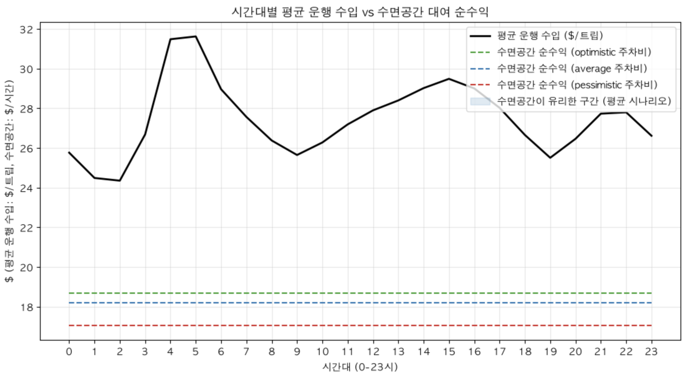

# 4조 팀위키
> 참여자 : 김용진, 전길원, 정기준, 이승연

## 목차
- [W4M2](#w4m2)
- [W4M3](#w4m3)

## W4M2
- 최종 목표 : `어떤 데이터 제품을 만들면 될까`
- 전제 : `만약 이 데이터가 사람이 운전하는 차량의 데이터가 아니라 '자율 주행차' 데이터라면`
    - 데이터는 동일한데, 발생 주체가 `자율 주행차`에서 발생한 것이다.

### 데이터 분석 1단계 
#### timeboxing 15분 (14:00 - 14:15)
> 전제를 이해하기 위해 데이터 분석을 진행하고, 자율 주행차에서라면 뭐가 달라질지 생각함.
1. 길원 
    - 자율주행이 어느정도 고도화인지부터 정의가 필요할듯
    - `trip_distance` 
        - 사람 : 최적의 경로로 가는 사람도 있고, 돌아가는 사람도 있음
        - 자율 주행 : 최적 경로가 아닐 수는 있지만, 일관된 시스템에 의해 운행됨
    - `tip_amount`
        - 사람 : 직접 받는거라 존재
        - 자율 주행 : 존재하지 않음
2. 용진 
    - 자율주행은 컬럼이 변경되는게 맞지 않나? 이 상태로 할 수 있는게 맞을까?
3. 승연
    - Column이 달라질 수 있다지, 달라져야 한다는 아님.
    - `자율 주행이면 이런게 달라질 수 있다.`로 해석 
4. 기준
    - 데이터 자체는 그대로 가도 될 것 같다.
---
### 아이디어 선정 
#### timeboxing 15분 (14:15 - 14:30)
> 자유롭게 의견 개진
1. 승연
    - 예측 정비같은거 하면 어떠냐
        - 움직이는데 필요한 부붐들이 있을텐데, 그런 데이터를 자율주행차가 스스로 점검해서 이상이 생기면 정비소로 알아서 간다.
        - 질문 : 데이터가 있어야 데이터 프로덕트를 만들 수 있는거 아니냐?
            - 그렇다.
        - 질문 : 우리가 지금 할라는게 TLC 데이터를 이용해야 하는데, TLC 데이터가 아니라 다른걸 이용하는 것 같아서 안 맞는 것 같다.
    - 사람 개입과 같은 Column 정보를 추가해서, 버스 회사에 자율주행을 도입할 수 있게 파는 것은 어떨까
        - 질문 : 데이터가 택시에서 버스로 바뀌는게 애매하다.
2. 기준
    - TLC 데이터가 자율 주행이라는 가정하에 우리가 어떤 데이터 프로덕트를 만들 수 있을까를 생각하자.   
3. 길원
    - 일단 누구한테 팔지부터 생각을 해보고 그 다음에 어떤걸 만들면 좋을지 생각해도 좋을 것 같다.
    1. HVFHV데이터기반
        - 헤지펀드/자산운용사의 Lyft,UBER 투자 의사결정 돕는 데이터 프로덕트
        - 테슬라 로보택시 사업부에 뉴욕 택시 배치 위치 의사결정 데이터 프로덕트
            - 시간 당 가장 많은 돈을 벌 수 있는 지역을 시각화하여 보여주면서 로보택시를 어디에 배치해야 할지 추천해줌
----
#### timeboxing 15분 (14:30 - 14:45)
> 각자 다시 판매 대상 아이디어 searching
1. 길원 - HVFHV
    1. 로보택시 확장을 위한 증빙 자료
        - 로보 택시를 뉴욕에서 사업하기 위해선 최소 백대는 필요함. 이는 몇십억의 돈
        - 이를 빌리거나 투자받아서 사용
            - 이때 투자/대출의 수익성 증명 용도가 필요한데, 현재 로보택시는 시장이 많이 발전하지 않아 명확하게 계산이 어려움
            - 이를 돕는 감정평가사 역할
        - 데이터에서 추출하는 정보
            - 차 한 대가 시간 당 버는 돈
            - 차가 일하는 평균 시간 비율 (24시간 중 얼마나)
            - 빈 차로 돌아다니는 낭비 비율
        - 결과 : 대시보드 및 보고서 형식
            - 로보택시 1대당 시간 당 평균 얼마 벌고, 하루의 어느정도를 일했고, 어느 정도 빈차였는지, 직전에 비해 수입은 어떻게 늘었는지
        
    2. 로봇택시의 보험 요율
        - 1번과 마찬가지로 로보택시가 발전한지 얼마 안돼서 요율 산정이 어려움. 이를 돕는 의사결정 제품
            - 보험료 정하는 방식
                1. risk 정도(사고 발생 비율)
                2. 사고 당 평균 비용
                - 우리는 여기서 1번을 명확히 알려줄 수 있다.
        - 데이터에서 추출하는 정보
            1. 얼마나 어디를 달렸는지
                - 많이 달리면 사고 확률 높아짐
            2. 위험한 조건 비중 계산
                1. 심야 주행 비중 : 어두울 땐 카메라가 잘 작동 안할 수 있음 (테슬라는 카메라)
                2. 평균 속도 : 평균 속도가 높은 구간의 동네에서는 큰 사고가 발생할 가능성 높음
        - 결과 : 대시보드 및 요약 보고서
            - 같은 동네 같은 시간대에서 로봇택시는 사람보다 야간 주행이 2배 많고, 평균 속도는 15% 낮다. 
            - 고속도로를 얼마나 달렸고, 일반 시가지를 얼마나 달렸다.

---
#### timeboxing 30분 (14:45 - 15:15)
> 이전 단계 개별 생각 기반 의논 결과
- 전길원 아이디어의 부족한 점
    - 사람이 한거랑 자율 주행이랑 별로 다른게 없다.
        - 사람이 수기 작성한 데이터로 똑같은 대시보드를 만들어도 되는 것 아닐까?
---
#### timeboxing 30분 (15:15 - 15:45)
> 아이디어 다시 고민 및 재논의
- 전길원
    1. 자율 주행 차량의 Software는 일괄적으로 관리됨.
        - 새로운 알고리즘 정책이 배포되면 일괄적으로 변경됨
        - 이에 따라 보험사에서 대응이 필요함.
        - BUT, 현재는 알 수 있는 방법이 없다. 
        - 이를 알아내는 데이터 프로덕트 만들기
        - 데이터 프로덕트에서 표시할거
            1. 출발지랑 도착지를 고정해두고 다음 항목 확인
                - 구간 평균 속도 : 주행 스타일 변경 확인 가능 
                    - 공격적인지 완화되었는지 등
                - 구간 이동 거리 표준 편차 또는 시계열 : 경로 선택 로직 변경 확인 가능
                - 새로운 zone 등장 : 운행 가능 영역 확장
- 정기준 
    1. 택시의 유후 시간대에 새로운 추가적인 서비스를 제공하면서 자율주행차량의 수익 곡선을 수평으로 만들기
        - 택시는 보통 출근,퇴근 등 피크 시간대 위주로만 수익이 많이 발생
        - 그러나 이는 자율주행이니 그 외의 다양한 수익을 낼 수 있을 것
        - 다양한 추가 수익을 낼 수 있는 데이터를 함께 표시하여 자율 주행 차량의 수익 곡선을 평탄화하자.
        - 전길원 : 쏘카에서 옛날에 제공한 차량 수면실 서비스
        - 정기준 : 음식 배달, 퀵 등
---
#### timeboxing 15분(15:55 - 16:10)
> 정기준 아이디어로 선정 후, 데이터를 어떻게 가져올 수 있을지 각자 찾기
- 전길원
    - 어떤 시간대에는 다른 서비스로 할 수 있을까의 기준 : `base_passenger_fare/trip_miles`(택시 운송 단가)
        - 기회비용 계산 대상
    - 수익성 저하 시간대에 차가 어디 위치하는지 확인 : `D0LocationID`
        - 유휴 차량이 보통 어디에 위치하는지 파악 후, 관련 서비스 매칭
    - 뉴욕시는 배달 최저임금제 시행 때문에 앱들이 매달 시에 실적 데이터를 의무 보고함 : `NYC DCWP`
    - `Gridwise Analytics` : Uber, Lyft, DoorDash, Grubhub, Instacart, Amazon Flex 등에서 일하는 기사들의 익명화된 위치·트립·수익 기록 수백만 건을 수집해, 전국·메트로 단위의 기사 수익, 노동 패턴, 고객 가격 데이터를 제공합니다. 시장·시간대별 트립 거리·시간, 픽업까지의 거리·시간, 기본수익·보너스·팁, 트립 마일당/분당 총수익까지 있어서 우리 대시보드의 배달 축과 해상도가 정확히 맞습니다. 10억+ 건 태스크, $110억 수익, 110억 마일 규모의 패널이고, 심지어 AV가 인간 기사 수익에 미치는 영향을 분석한 2026 AV Impact Report도 냅니다 — 우리 주제와 직결. 유사 서비스로 Solo(worksolo) 패널도 있습니다.
    - Uber Direct API / DoorDash Drive API  : 음식 배송
    - Roadie(퀵)
    - Curri·GoShare·Dolly (택배 메신저 배달)
    - 수면 공간 대여
        - Nap York : 시간당 $27부터 시작하고 시간을 늘릴수록 단가가 내려가는 수면 포드를 3개 지점에서 운영
        - 3DEN : 낮잠 공간 + 오피스  
        - Dayuse.com / HotelTonight : 낮 시간대 호텔 객실 시간 단위 판매
        - Peerspace / WeWork On Demand : 시간당 공간 대여 시세 (회의,촬영 공간)
        - STR/CoStar 호텔 ADR(상용), AirDNA
    - 이동 광고: NYC LED
    - 에너지 아비트리지(V2G) : NYISO 공개 API의 Zone (충전, 피크 방전 시간 당 가치 계산)
    - 주차 시세 : SpotHero/ParkWhiz의 동네별 시간당 주차가(스크레이핑) + NYC Open Data의 미터 요금
        - "그 시간에 그 존에 서 있는 것"의 비용/기회 기준선.
- 이승연
    - TLC 데이터
        - Yellow / Green / HV 그거가 실제로 낮은 구간이 존재하는지 확인해야 한다.
            - 실제로 확인해보니 19:00 - 06:00까지가 낮았다.
                - 이때 할 수 있는건 퀵, 택배, 메신저 배달
                - 확인해볼만한건 음식까지(밤에 수요가 있나?)
- 정기준
    - DoorDashAPI
        - 실시간으로 출발 위치랑 도착 위치, 청구하는 배달료를 알려준다.
        - 실시간으로 이 시간에 DoorDash 정보를 받아올 수 있으니까 이거랑 비교하는게 가능하다.
        - 평균 금액이나 후행적인게 아니라 실시간으로 비교가 가능하다.
- 김용진_albert
    - Fedex/Amazon Logitics : 화물차 분류별 교통량 / 트럭 경로 / 택배 보관 관련 데이터 찾을 수 있다.
    - NYC department transportation : 트럭 공식 자료를 기반으로 어디 지역으로 트럭들이 이동하는지 파악할 수 있을 것 같다.
    - NYC tourism : 호텔 공급 객실/판매 객실/평균 가격 등을 제공한다.
---
### 데이터를 수집해서 프로토타입 구현
1. 길원 : NAP York 데이터를 기반으로 가격 비교
    > 가설과 맞지 않음, 생각보다 택시 수입이 너무 높음
    
    - 의견 : 데이터 신뢰성을 위해선 택시 기사 개인 당 수입을 알아야 할 것 같다.
        - 기준 : 2013년엔 기사 ID가  포함되었다. 이를 이용하고, 택시비 인플레이션을 반영하자.
2. 택시비 인플레이션 반영
    - 2013년 뉴욕 택시 -> 2026년 뉴욕 택시 가격 인상
        1. 기본 요금 : 20% 인상
            - $2.5 -> $3.0 
        2. 거리 요금 : 40% 인상
            - 0.2마일당 $0.50
            - 0.2마일당 $0.70
        3. 정체·정차요금 : 40% 인상
            - 60초당 $0.50
            - 60초당 $0.70
        4. 야간 할증 : 2배
        5. 평일 러시아워 할증 : 2.5배
        6. 맨해튼 96번가 이남 혼잡 할증 : 2.5불 생김
        7. 맨해튼 60번가 이남 혼잡통행료 : 0.75불 생김

3. 기준 : 2013년 데이터애 택시비 인플레이션 반영, 2026년 배달 기사 1인당 수입 산출하여 시각화
    

### 해석

1. 택시 수요가 동일하다는 가정하에 진행
    - 가정을 증명할 방법은 없었을까? 
        - 데이터의 개수를 비교해보자!
            - 2013년엔 우버같은 플랫폼이 없고, 현재는 대부분 우버같은 플랫폼으로 택시를 이용하니까 정확한 비교가 되지 않을듯
2. 택시 수입배달 수익보다 낮은 12:00-13:00 구간과 18:00-20:00 구간은 배달의 수익이 더 높으니 배달을 같이 하는 것을 고려할 수 있다.

## W4M3

**글**: "Crawling a billion web pages in just over 24 hours" (Andrew Chan, 2025)
10억 개 웹페이지를 25.5시간, $462에 크롤링한 개인 프로젝트 회고.

---

### 1. 가장 인상적이었던 내용

**전길원** — 파싱이 최대 병목이었다는 반전이 가장 인상적이었다. 네트워크가 느려서 못 할 거라 예상했는데, HTML을 읽어들이는 CPU 작업이 병목인게 인상적이었다. 웹페이지 크기가 점점 커지기 때문이라는 원인 분석이 공감됐다.

**정기준** — 새로운 병목이 SSL(HTTPS)이라는 점이 인상적이었다. 요즘은 거의 모든 사이트가 https라 암호를 여는 계산에만 CPU 시간의 25%가 쓰였다. 반대로 예전엔 병목이던 DNS,네트워크 대역폭이 이제 문제도 안 된다는 대비가 흥미로웠다.

**이승연** — 10억 페이지를 하루, 단돈 $462에 개인이 혼자 해냈다는 규모 대비 비용이 가장 인상적이었다. 큰 인프라 없이도 최적화만으로 이 정도가 가능하다는 게 놀라웠다.

**김용진_Albert** — JavaScript를 아예 실행하지 않고 HTML만 긁었는데도 웹의 상당 부분이 여전히 크롤링됐다는 점이 인상적이었다. 요즘 웹은 JS 없으면 안 돌아가는 곳이 많다고 생각했는데, 옛날 방식으로도 꽤 많은 게 접근 가능하다는 사실이 의외였다.

---

### 2. 놀라웠던 의사결정

**전길원** — Redis 프로세스 하나당 15개 프로세스에서 확장을 의도적으로 멈춘 것에 놀랐다. 무조건 키우는 게 답이 아니라는 걸 보여줬다.

**정기준** — 저장소로 S3가 아니라 인스턴스 스토리지를 택한 것에 놀랐다. S3는 요청당 과금 때문에 계산해보니 $2000~5000이 나와서, 실제 비용을 때려보고 갈아탄 근거가 명확했다.

**이승연** — 대용량 서버 1대에 몰아넣는 수직 확장을 시도하다, 데드라인 때문에 깔끔하게 포기하고 12노드 수평 확장으로 갈아탄 것이 놀라웠다. 완벽한 설계보다 시간 안에 되는 설계를 택한 현실 감각이 놀라웠다.

**김용진_Albert** — 페이지 내용을 250KB에서 잘라버린 것이 놀라웠다. 데이터를 온전히 저장해야 한다고 생각했느데, 이 크기면 대부분 페이지는 통째로 담긴다는 근거로 과감히 데이터를 버렸다. 속도를 위해 완벽함을 포기한 것이다.

---

### 3. 아키텍처 논의

이 크롤러는 교과서/면접식 정답과 반대로 했다.

- **교과서 방식**: 기능별로 서버 풀을 분리 (fetcher, parser, 저장소, 상태관리).
- **이 프로젝트 방식**: 모든 기능을 다 담은 노드 1개를 완성한 뒤, 그걸 12개로 복제. 각 노드는 도메인의 일부를 맡고, 노드끼리 통신은 하지 않는다.

각 노드 구성은 **Redis 1개 + fetcher 프로세스 9개 + parser 프로세스 6개**다.
- Redis가 크롤링 상태를 전부 메모리에 들고 있다.
- fetcher는 asyncio로 코어당 수천 개 워커를 돌려 페이지를 가져오고, parser는 CPU를 많이 써서 워커 수가 적다.

**팀 논의 요점**: 노드끼리 통신을 없앤 게 이 설계의 핵심이라고 봤다. 도메인을 나눠 맡으니 서로 겹칠 일이 없어 통신 자체가 필요 없어졌고, 그만큼 시스템이 단순해졌다. Hadoop 다중 노드 실습에서 노드 간 조율이 얼마나 까다로웠는지를 생각하면, 통신을 없애서 문제를 없앤 발상이 특히 와닿았다. 다만 이 설계로 인해, 인기 도메인이 몰린 노드만 더 바빠지는 hot shard 문제와, 해당 도메인의 frontier가 수십 GB까지 커지는 메모리 폭증 문제가 발생했다. 결국 설계는 트레이드 오프를 고려하여 예산,시간,목표에 가장 잘 맞는 구조로 해야한다는 것을 느꼈다. 예산이 넉넉했다면 교과서대로 기능을 분리하고 frontier를 별도 저장소에 뒀을수도 있겠지만, 일회성 샘플 크롤이라는 목적엔 지금 설계가 더 합리적일 수도 있겠다라는 결론이었다.

---
