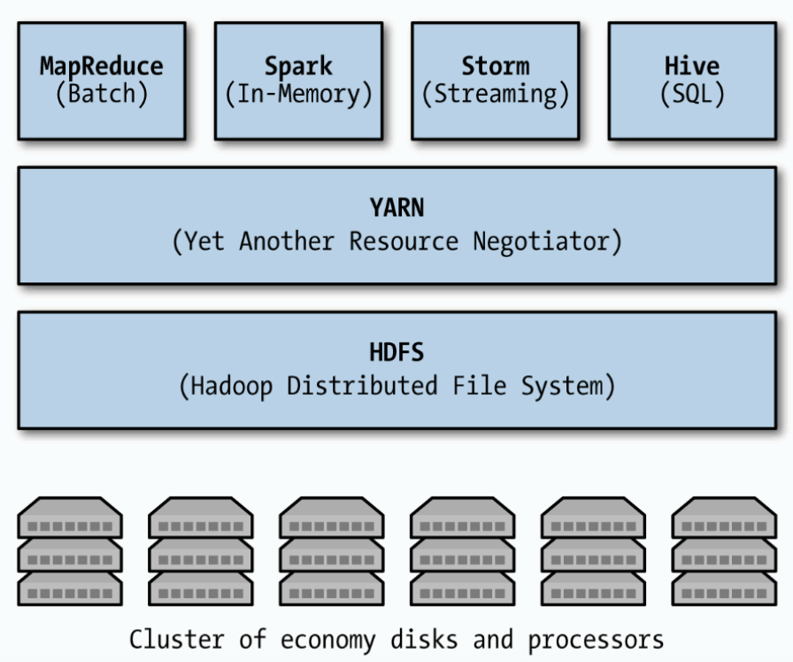
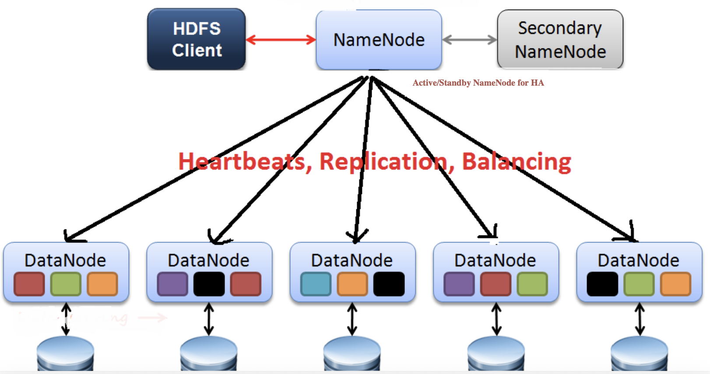
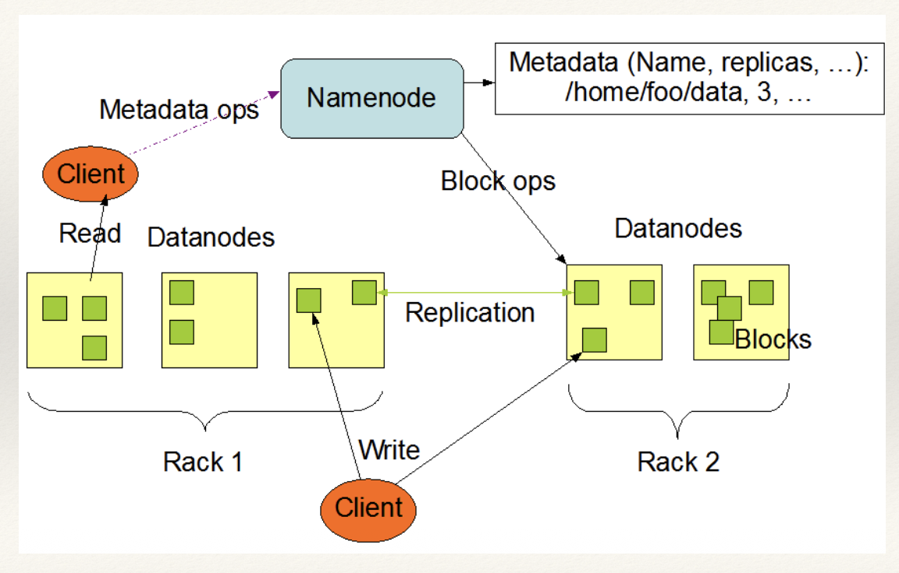
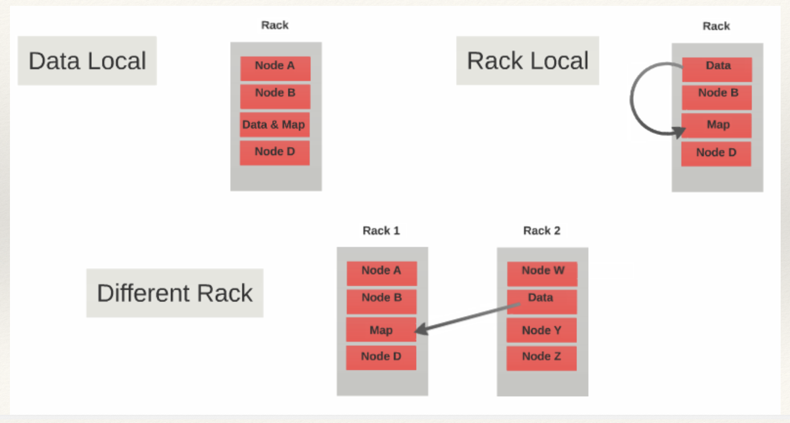
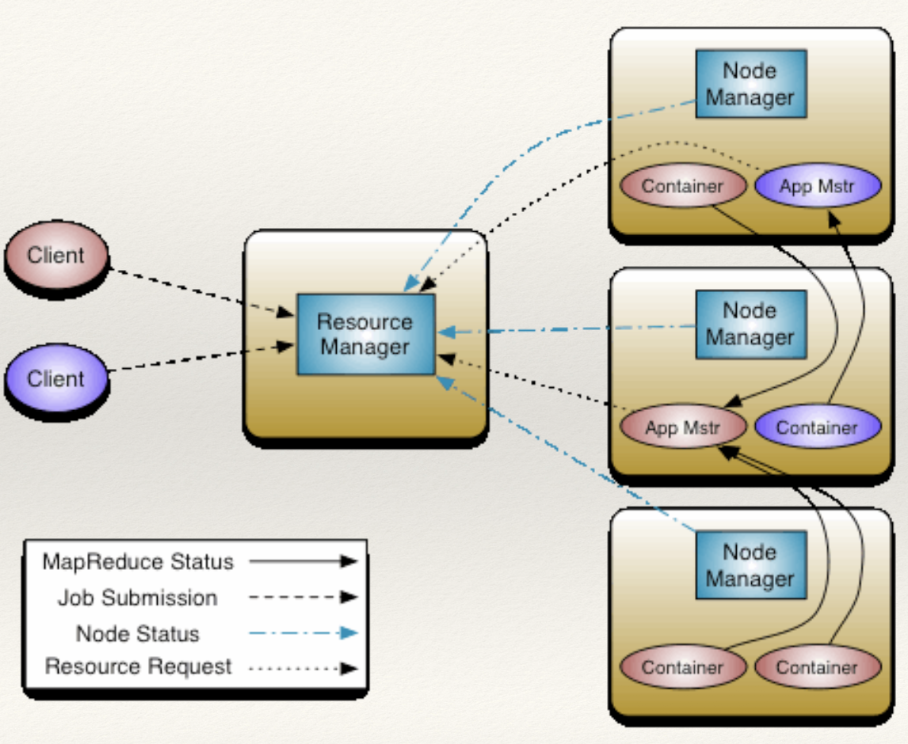
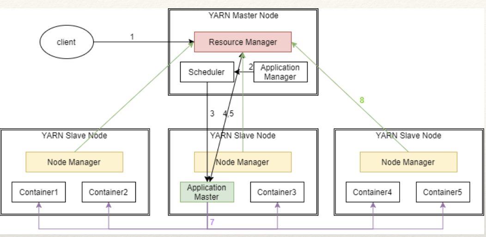

# 7월 13일 학습 내용 정리

## 목차
1. [Hadoop](#hadoop)
2. [W3M1 과제](#w3m1-과제)
5. [기타]

## Hadoop
### Hadoop이란?
> **병렬 처리**와 **저렴한 하드웨어를 이용**하여 **큰 규모의 데이터셋**을 **효율적으로 저장하고 처리**하는 도구
### Hadoop의 등장 배경
- 2000년 초 웹데이터의 폭발적 증가
    - 이렇게 구조화되지 않은 **엄청난 양의 데이터**를 **인덱싱하고 저장하고 분석**했다.
    - But, 당시 기술 배경
        - Cloud 없음 -> 직접 서버 하드웨어를 구매해서 운영 -> 비쌈
            - 전통 DB(RDB)는 수평 확장이 불가했음
- 위와 같은 상황에 Google에서 발표한 두 가지 논문을 기반으로 생겨난 기술
    1. Google File System -> HDFS의 아이디어
    2. MapReduce -> Hadoop MapReduce의 아이디어
### Hadoop 구성 요소
> Common / HDFS / Yarn / MapReduce 4가지로 구성
>> HDFS, Yarn, MapReduce는 담당하는 영역이 각자 다르다. (Layer로 구별)(추상화되어 있음)

1. Hadoop Common
    - 다른 하둡 모듈 돕는 common utilities (중요하진 않음)
2. HDFS
    - 분산 파일 시스템
        - Application Data에 높은 처리량 접근 제공
    - Storage Layer
3. Yarn
    - job scheduling, cluster resource management를 위한 프레임워크
    - Resource Management Layer
4. MapReduce
    - 대규모 데이터셋 병렬 처리를 위한 **YARN 기반 시스템**
    - Application Layer




### Hadoop - HDFS
1. [HDFS의 가정과 목표](#hdfs의-가정과-목표)
2. 
#### HDFS의 가정과 목표
>> 이걸 이해해야 왜 그렇게 설계했는지 알 수 있음
1. Hardware Failure : 하드웨어는 언제든 실패할 수 있다.
    - **하드웨어가 언제든 고장날 수 있다는 가정**하에 **설계를 진행**했다.
    - 언제든 고장날 수 있다는 것을 가정했다면, 어떻게 대비하도록 설계했을까?
        - Data Replica가 가능하도록 설계
2. Streaming Data Access
    - Streaming Data Access
3. Large Data Sets : 대규모의 데이터셋을 다룬다.
    - **큰 규모의 데이터셋을 다룬다는 것을 가정**하여 **설계**했다.
    - 큰 규모의 데이터셋을 다룰 수 있게 어떻게 설계했을까?
        - Data Split 설계
        - Parallel Processing 설계
4. Simple Coherency Model : 간단한 일관성 모델
    - **파일은 한 번 쓰고 여러 번 읽는 접근 모델(WORM)**을 따른다는 가정
        - 한 번 생성되고 쓰여지고 닫힌 파일은 변경될 필요가 없다는 가정이다.
            - 이 덕분에 데이터 일관성 이슈를 simplify할 수 있었고, 데이터 접근을 더 빠르게 할 수 있게 되었다.
    - 위와 같이 설계하면 왜 Coherency가 단순해질까?
        - 데이터를 분할하고, 복제하여 저장하는 시스템에서
            - 만약 동시에 Random Write/Update가 가능하도록 설계했다면, 수정이 일어날 때마다 모두 동기화해야 한다.
            - 이를 위해서는 분산 락, 캐시 무효화, 버전 관리 같은 일관성 프로토콜이 필요해지는데 위 제약을 걸면 필요 없어진다.
5. “Moving Computation is Cheaper than Moving Data” : 데이터를 움직이는 것보다 계산을 움직이는게 더 싸다.
    > 여기서 싸다 의미는 **실제로 가격이 싸다.**도 있지만, **가치 창출이 훨씬 많이 된다.**로도 해석된다.
    - 데이터보다 계산을 움직이는게 싸다는 가정하에 설계했다.
    - 계산을 움직이는게 더 저렴하다는 생각으로 어떻게 개발?
        - **각 노드**가 **분할된 데이터**를 가지고 있고, **계산되는 코드를 계산이 필요한 데이터로 넘기는 구조**
6. Portability Across Heterogeneous Hardware and Software Platforms
    - 다양한 하드웨어, 소프트웨어 플랫폼에 이식 가능
    - 여기저기에 쓸 수 있도록 왜 만들어야 할까?
        - 현실적으로 모든 노드를 동일한 스펙으로 구성하기 어렵다.
            - 만약 갑자기 고성능 노드가 필요하다면? 다 끄고 다시 할 순 없다.
            - 또한, 섞여서 구성한 경우 매번 코드를 바꿀 수도 없다.
        - 위와 같은 문제를 방지하기 위해 이러한 목표가 존재한다.

#### NameNode와 DataNode
- Name Node : 파일 시스템의 **메타데이터 저장**
    - 파일 이름,파일 블록에 대한 정보, 블록 위치 등
- Data Node : 실제 business data를 저장하는 slave node
    - NaemNode 지시에 따라서 client의 read/write 요청을 제공한다.

#### HDFS의 아키텍처
- 
    - Client는 Name Node와만 소통한다.
        - 여기서 **Secondary NameNode**는 **NameNode가 죽었을 때 대체**하기 위한 노드다.
    - Name Node는 Client의 요청을 받아서, 처리하기 위해 각 DataNode들에게 요청을 보낸다.
        - 이때 요청 외에 Heartbeat, Replication, Balancing이 수행된다.
- 
    > 마스터/슬레이브 구조와 데이터가 흐르는 경로를 한 장에 압축한 그림
    - NameNode : 마스터 서버 (파일 시스템의 메타 데이터 관리)
    - Metadata ops : Client가 Namenode에 보내는 메타데이터 요청 (제어 정보만 오가고, 데이터는 이동하지 않음)
        - 메타데이터 요청 예시 
            1. 이 파일 위치 어디야?
            2. 파일 새로 만들래
    - DataNode : 실제 데이터를 저장하는 노드
        - 파일을 블록 단위로 쪼개져 DataNode들에 분산 저장된다. (초록색 사각형)
    - Read : Client가 DataNode에서 직접 데이터 읽음
        - 순서 
            1. 네임노드에게 메타데이터 정보 받음
            2. 받은 정보를 기반으로 DataNode에서 직접 읽음
        - 순서 나눈 이유
            - 데이터 트래픽으로 인해 Namenode가 병목이 되는 것을 방지
    - Write : Client가 DataNode에 직접 씀.
        - 실제로는 그림과 다르게 **파이프라인** 방식
            - Client는 첫 번째 Datanode에만 쓰고, 첫 번째 DataNode가 두 번째로, 두번째가 세번째로 전달하며 복제본을 만드는 방식
    - Block ops : Namenode가 Datanode에게 명령
        - 명령 예시 
            1. 이 블록을 저 노드에 복제하라.
            2. 이 블록을 삭제하라
    - Replication : Datanode간 Block 복제

#### Data Locality

> 데이터를 옮기는 것보다 Computation을 옮기는 것이 싸다는 것을 Scheduling 관점에서 구체화
- Data Local
    > 가장 좋은 경우
    - Data가 있는 노드에 정확하게 Computation이 배치되어 수행됨
- Rack Local
    > 두번째로 좋은 경우
    - Data를 가진 노드가 현재 바빠서, 다른 노드에서 Computation 수행
    - 이때, Data를 옮기는 것은 비싸기 때문에 데이터를 요청해서 받는 식으로 수행한다.
- Different Rack
    > 가장 안 좋은 경우
    - Data를 가진 노드가 현재 바쁜데, 해당 랙의 모든 노드가 바쁘다면 
        - 다른 랙에 있는 한가한 노드에 배치
    - 이때도 Data를 옮기는 것은 비싸기 때문에 데이터를 요청해서 받는 식으로 수행
- 이게 가능한 전제 조건
    1. NameNode가 모든 블록의 위치를 알고 있다.
        - 그래야 나눠줄 수 있음
    2. Rack Awareness 설정으로 어떤 노드가 어떤 랙에 속하는지 클러스터가 알고 있어야 한다.
- 동작 방식
    - MapReduce의 Application Master는 input split(chunk)별로 위치 선호도를 담아 Yarn에 컨테이너를 요청한다.
        - 위치 선호도 : Data Local -> Rack Local -> Different Rack
    - 참고) Fair/Capacity 스케줄러의 **delay scheduling**
        - node-local 자리가 당장 없어도 바로 rack-local로 타협하지 않고, 짧게 기다리기
- Replication은 Data Locality를 위한 수단이기도 하다. (Data Local이 될 가능성을 높여줌)
- Data Locality 최적화는 **Map task**에만 적용
- 현재는 Cloud 환경에서 주로 수행하기 때문에 노드 단위 지역성이 성립하지 않는다.
    - 현재는 **데이터 이동 최소화** 원칙에 따라 **캐싱**, **파티션 프루닝** 등을 이용
### Hadoop - Yarn
#### Yarn이란? 
> Resource Manager(RM)과 Application Master(AM)으로 구성
>> 즉, Yarn은 크게 2가지 일을 하는 것이다.
- Resource Manager
    - Global에 1개 존재
- Appliaction Master
    - Appliaction마다 1개 존재

#### 등장 배경
- ver1에서는 JobTracker라는 단일 마스터가 AM/RM 업무를 모두 했다.
    - 그러자 세 가지 문제가 발생
        1. 확장성 한계
        2. Job Tracker가 죽으면 실행 중인 모든 Job이 다 죽는 SPOF
            - SPOF(Single Point of Failure) : 단일 장애점
                - 하나만 고장나도 시스템 전체가 멈춰버리는 지점
        3. MapReduce 외의 다른 프레임워크는 Cluster를 사용하지 못함.
    - 위 3가지 문제를 해결하고자 기존의 책임을 둘로 쪼갠 Yarn이 탄생
        - Resource Negotiation : RM
        - Application Execute 관리 : AM
#### YARN 동작 간단

- Resource Manager : 전체 자원 관리 담당 (Cluster에 1개 존재)
    - 내부적으로 2개로 나누어짐
        1. Scheduler : Capacity/Fair같은 정책에 따라 자원 배분
            - 다양한 동작 application에 대해 자원 할당을 책임짐
            - Scheduler는 모니터링이나 상태 추적은 하지 않고 그냥 순수하게 scheduling만 한다.
        2. Application Manager : Job Submission을 받아 컨테이너를 띄워주고, 죽으면 재시작
            - 하는 일
                1. job 제출 받음
                2. Application Master를 실행하기 위한 첫 번째 컨테이너 협상
                3. Application Master Container가 실패하면 재시작 서비스 제공
- Node Manager : 각자 노드의 자원 관리 담당 (각 워커 노드마다 1개)
    - 자기 노드에서 컨테이너 실행 감시
    - 노드의 자원 사용량 및 리소스의 상태(바빠, 놀아 등)를 보고
- Appliaction Master (AppMstr) : 앱 전용 마스터 (App당 1개씩 생성)
    - RM과 자원을 협상하고 받은 Container에서 Task를 실행하기 위해 Node Manager에게 요청
        - Task 진행 상황 추적, 실패 태스크 재시도까지 책임
    - 워커 노드 일반 컨테이너 안에서 동작
    - 하는 일
        - Scheduler로부터 적절한 리소스 컨테이너 요청
        - 동작하는 Container 상태 추적
        - 진행상황 검사
- Container : 특정 노드에서 할당된 자원 묶음의 추상화
    - Map-Reduce 코드가 실행되는 곳

- 그림에서 보이는 것과 같이 한 노드 안에서 서로 다른 앱의 컨테이너와 AM이 함께 존재 가능 (멀티태넌시)
#### YARN 동작 상세

1. Yarn client가 제출하는 Job/Application이 Resource Manager에게 제출
    - Resource Manager 내부에서 AppliactionsManager가 받음
    - ApplicationsManager가 Scheduler에게 Application의 Application Master를 실행할 첫 번째 컨테이너 할당을 요청
2. AM 동작 시작 : Scheduler가 Slave Node 하나에 컨테이너를 할당하고, 거기서 Application Master가 시작
    - But, 실제로는 Scheduler가 AM에게 직접 명령하는 것이 아니라 해당 노드의 Node Manager에게 컨테이너 실행을 지시하고, Node Manager가 AM 프로세스를 띄우는 것
    - Resource Manager는 어떠한 워커 프로세스도 직접 실행하지 않는다.
3. 생성된 AM이 RM에 자기를 등록
    - 자기 주소와 tracking URL도 전달
4. AM이 task 실행에 필요한 Container들을 Scheduler에 요청
    - 이때, Data Locality와 관련된 위치 선호도가 같이 포함
5. Scheduler가 컨테이너를 할당해주면, Application Master가 Node Manager에게 container 실행을 지시
6. 실행 중인 각 Container들이 자신의 AM에게 진행률과 상태를 보고
    - AM은 이 정보로 task를 추적하고 실패한 task를 재시도
7. Node Manager들이 RM에게 각 노드의 생존 여부와 자원 사용량을 heartbeat로 보고


### Hadoop - Map Reduce

## W3M1 과제

### 학습 방식
> AI를 활용한 자기주도 학습
- 이를 위해 AI에게 아래와 같이 말을 했고, "AI 단계별 학습" 접은 글에 보이는 것처럼 단계별로 하나씩 알려준다.
    <details>
    <summary>자기주도학습 Prompt</summary>

    > 제가 할 수 있게 단계별로 가이드를 해주실 수 있나요? 제가 가장 원하는 방향은 지금 제가 어떻게 해야하는지 알려주는 것입니다. 예를 들어, Dockerfile 작성을 위해 Docker에 들어가서 ~~~게 해서 테스트해보고 작성해라 이런식으로 실무적인 방법을 알려주시면 감사하겠습니다. 다만, 제가 이렇게 했는데 방향을 못잡을 수 있으니 그때는 더 상세하고 직관적으로 알려주시며 ㄴ됩니다. 이해하셨나요?

    >> 단순히 하는 방법만 알려주지 마시고, 이걸 왜 하는지 이게 뭔지도 같이 설명하며 해주세요.
    </details>

    <details>
    <summary>AI 단계별 학습</summary>

    Hadoop이 뭐냐? 한 대의 컴퓨터에 다 안 들어가는 거대한 데이터를 여러 대 컴퓨터에 쪼개서 저장하고(HDFS) 처리하는(MapReduce) 소프트웨어예요. 원래는 수십~수천 대를 묶어 쓰지만, 이 과제는 "한 대(single-node)" 로 흉내 내는 겁니다. 진짜 여러 대는 없으니, 한 컴퓨터 안에서 "저장 담당 프로세스"와 "관리 담당 프로세스"를 각각 띄워서 클러스터인 척하는 거죠.

    그럼 Docker는 왜? Hadoop을 내 맥북에 직접 깔면 지저분해지고, 지웠다 다시 깔기도 번거로워요. Docker는 "Hadoop이 깔린 깨끗한 가상의 리눅스 한 대"를 통째로 상자(container)에 담는 도구예요. 상자를 지우면 흔적 없이 사라지고, 남한테 그 상자 설계도(Dockerfile)만 주면 똑같은 환경이 재현됩니다. 과제가 원하는 게 바로 이 "재현 가능한 Hadoop 상자"예요.

    그래서 지금 STEP 2는? 그 상자 안에 Hadoop이 돌아갈 재료(Java)와 Hadoop 본체를 넣는 단계입니다.

    ---
    STEP 2를 다시, 이유와 함께

    2-0. 컨테이너 안으로 다시 들어가기

    docker start -i hadoop-lab
    - 이게 뭔지: 아까 만든 hadoop-lab이라는 상자를 다시 켜서(start) 그 안 셸로 들어가는(-i) 거예요.
    - 왜 하는지: 우리는 지금 "Dockerfile을 바로 쓰지 않고, 상자 안에서 손으로 먼저 다 해보는 중"이에요. 되는 걸 확인한 다음에 Dockerfile로 옮길 거라, 실험실(hadoop-lab)로 돌아가는 겁니다.

    2-1. Java 설치

    apt-get update
    apt-get install -y openjdk-8-jdk wget
    - 이게 뭔지: apt-get은 우분투의 앱스토어(패키지 관리자)예요. update는 "지금 뭐가 설치 가능한지 목록을 새로 받아와"라는 뜻이고, install은 실제 설치.
    - 왜 Java인지: Hadoop은 Java로 짜인 프로그램이라 Java가 없으면 아예 실행이 안 돼요. STEP 1에서 java -version이 "없음" 나온 거 기억나시죠? 그 빈자리를 지금 채우는 겁니다.
    - 왜 하필 8인지: Hadoop이 Java 버전을 가려요. 최신 Java에선 경고나 오류가 잘 나서, Hadoop과 가장 안정적으로 검증된 Java 8을 고른 거예요. (wget은 다음 단계에서 Hadoop을 인터넷에서 내려받을 도구)

    확인:
    java -version
    → 1.8.0 나오면, "이 상자엔 이제 Java가 있다"는 게 증명된 거예요.

    2-2. JAVA_HOME 경로 찾기

    readlink -f $(which java)
    - 이게 뭔지 / 왜: Hadoop은 "Java를 알아서 찾아줘"가 안 되고, "Java가 정확히 어느 폴더에 있는지"를 JAVA_HOME이라는 변수로 직접 알려줘야 시동이 걸려요. 마치 "차 키가 어디 있는지" 손으로 짚어주는 것과 같아요.
    - which java는 java 명령의 위치를, readlink -f는 그 진짜 원본 경로를 풀어줍니다. 결과에서 /bin/java를 뗀 앞부분이 JAVA_HOME이에요. 보통:
    /usr/lib/jvm/java-8-openjdk-amd64
    - → 이 값을 적어두세요. STEP 3 설정 파일에 이 경로를 넣습니다.

    2-3. Hadoop 본체 내려받아 풀기

    cd /opt
    wget https://archive.apache.org/dist/hadoop/common/hadoop-3.3.6/hadoop-3.3.6.tar.gz
    tar -xzf hadoop-3.3.6.tar.gz
    mv hadoop-3.3.6 hadoop
    - 이게 뭔지: Hadoop은 apt로 안 깔고, Apache 공식 사이트에서 압축파일(.tar.gz)로 받아서 푸는 방식이에요. wget이 다운로드, tar -xzf가 압축 해제.
    - 왜 /opt인지: 리눅스 관례상 "직접 설치한 추가 소프트웨어"는 /opt에 둬요. 꼭 지켜야 하는 규칙은 아니지만, 나중에 경로가 깔끔해집니다.
    - 왜 mv로 이름 바꾸는지: 원래 폴더명이 hadoop-3.3.6이라 버전 숫자가 들어가요. 그냥 hadoop으로 바꿔두면, 나중에 설정이나 Dockerfile에서 버전이 바뀌어도 경로를 안 고쳐도 되게 하려는 실무 습관이에요.

    확인:
    ls /opt/hadoop
    - 왜 이걸 보는지: 나오는 폴더들이 각각 역할이 있어요. 알아두면 앞으로 편합니다:
    - bin/ : 우리가 칠 명령어들(hadoop, hdfs)이 사는 곳
    - sbin/ : 서비스 켜고 끄는 스크립트(start-dfs.sh 등)
    - etc/hadoop/ : 설정 파일 3종이 사는 곳 ← STEP 3에서 계속 올 곳
    - share/ : 라이브러리(jar)들

    2-4. 설치 확인

    /opt/hadoop/bin/hadoop version
    - 왜 전체 경로로 치는지: 아직 PATH 환경변수를 안 잡아서, 그냥 hadoop이라고만 치면 "그런 명령 없음" 나와요. 그래서 지금은 어디 있는지 정확히 다 적어서 실행하는 거예요. (이 불편함을 없애려고 나중에 PATH에 /opt/hadoop/bin을 추가할 겁니다 — 그게 "환경변수 설정"의 일부)
    - Hadoop 3.3.6 찍히면 → Java도 Hadoop도 상자 안에 잘 들어갔다는 최종 확인. STEP 2 끝!

    ---
    정리하면 STEP 2는 "빈 리눅스 상자에 Hadoop이 돌 최소 재료(Java + Hadoop 본체)를 넣고, 각각이 진짜 동작하는지 눈으로 확인" 하는 단계였어요. 아직 설정도 안 했고 실행(서비스 기동)도 안 한 상태입니다 — 그게 STEP 3예요.

    해보시고 알려주세요:
    - java -version에서 1.8 나왔는지
    - 2-2에서 나온 JAVA_HOME 경로 (그대로 붙여주세요)
    - hadoop version에서 3.3.6 나왔는지

    되면 STEP 3(설정 파일 3종이 각각 무슨 역할인지 설명하면서 작성 → 포맷 → 서비스 켜기)로 갑니다.
    </details>

### 학습 내용
1. Dockerfile 작성용 E2E 테스트
    > Docker interactive 모드로 한 줄씩 실행하며 옮겨적기
    - base image : ubuntu
        - 완전 기본 이미지에서 build하는 연습을 위함
        ```bash
        docker run -it --name hadoop_test ubuntu:22.04 bash
        ```
    - install jdk
        ```bash
        apt-get update
        apt-get install -y openjdk-8-jdk wget
        ```
    - JAVA_HOME 찾기
        ```bash
        # which java : java 명령 위치 반환
        # readlink -f : 진짜 원본 경로로 풀어줌 
        readlink -f $(which java) 
        # 출력 : /usr/lib/jvm/java-8-openjdk-arm64/jre/bin/java 
        # 출력에서 /jre/bin/java 뺀게 경로
        ```
    - Hadoop 설치
        - 공식에서는 너무 오래걸려서, kakao 미러 버전으로 다운로드
        ```bash
        cd /opt # 관례상 직접 설치한건 opt 폴더에 다운로드함.
        wget https://mirror.kakao.com/apache/hadoop/common/hadoop-3.4.1/hadoop-3.4.1.tar.gz # 압축 파일 다운로드

        tar -xzf hadoop-3.4.1.tar.gz # 압축 해제
        mv hadoop3.4.1 hadoop # 파일명 변경
        ```
    - Hadoop 설치 확인
        ```bash
        ls /opt/hadoop

        # 출력 : LICENSE-binary / NOTICE.txt / etc / libexec /share / LICENSE.txt / README.txt / include / licenses-binary / NOTICE-binary / bin / lib / sbin
        ```
        - bin/ : 우리가 입력할 명령어들
        - sbin/ : 서비스 켜고 끄는 스크립트
        - etc/hadoop : 설정파일 3개 (아래에서 작성) 
        - share/ : 라이브러리(jar들)
    - Hadoop 버전 출력
        ```bash
        # JAVA_HOME 임시 추가 (휘발성)
        export JAVA_HOME=/usr/lib/jvm/java-8-openjdk-arm64

        # 출력 시도 (JAVA_HOME 추가 안하면 출력 안 됨)
        /opt/hadoop/bin/hadoop version

        # 출력
        Hadoop 3.4.1
        Source code repository https://github.com/apache/hadoop.git -r 4d7825309348956336b8f06a08322b78422849b1
        Compiled by mthakur on 2024-10-09T14:57Z
        Compiled on platform linux-x86_64
        Compiled with protoc 3.23.4
        From source with checksum 7292fe9dba5e2e44e3a9f763fce3e680
        This command was run using /opt/hadoop/share/hadoop/common/hadoop-common-3.4.1.jar
        ```
    - Hadoop 설정 및 설정 파일 작성
        1. 환경 변수 설정
            - 하둡은 실행할 때, hadoop-env.sh를 읽는다.
            - hadoop-env.sh에 JAVA_HOME 경로를 넣어두면, 알아서 JAVA_HOME 환경 변수가 등록된다.
            ```bash
            echo 'export JAVA_HOME=/usr/lib/jvm/java-8-openjdk-arm64' >> /opt/hadoop/etc/hadoop/hadoop-env.sh
            ```
        2. hadoop 명령어 설정
            ```bash
            cat >> ~/.bashrc <<'EOF'
            export JAVA_HOME=/usr/lib/jvm/java-8-openjdk-arm64
            export HADOOP_HOME=/opt/hadoop
            export PATH=$PATH:$HADOOP_HOME/bin:$HADOOP_HOME/sbin
            EOF
            ```
            - EOF 방식으로 직접 작성
            - `HADOOP_HOME`과 `PATH`설정으로 hadoop 명령어 사용 가능하게 설정
            - `source ~/.bashrc` 로 현재 셀에 바로 적용
            - 잘 되었는지 확인
                ```bash
                hdfs version
                ```
        3. core-site.xml
            - 기본 파일 시스템이 무엇인지 명시하는 xml 파일
                - `fs.defaultFS` : 이 시스템의 기본 파일 시스템이 무엇인지 의미
                - `hdfs://localhost:9000` : 9000번 포트에서 실행되는 hdfs임을 의미
            ```bash
            cat > /opt/hadoop/etc/hadoop/core-site.xml <<'EOF'
            <configuration>
            <property>
                <name>fs.defaultFS</name>
                <value>hdfs://localhost:9000</value>
            </property>
            </configuration>
            EOF
            ```
        4. hdfs-core.xml
            - HDFS 설정 xml 파일
                - `dfs.replication` : HDFS 복제본의 개수 설정
                    - single-node가 과제이므로 1로 설정
                - `dfs.namenode.name.dir` : Namenode가 파일을 저장할 위치
                - `dfs.datanode.data.dir` : Datanode가 파일을 저장할 위치
                    - 현재는 Namenode/Datanode 모두 local(/opt/hadoop...) 경로로 설정했지만, Docker에서는 이를 volume으로 연결한다.
            ```bash
            cat > /opt/hadoop/etc/hadoop/hdfs-site.xml <<'EOF'
            <configuration>
            <property>
                <name>dfs.replication</name>
                <value>1</value>
            </property>
            <property>
                <name>dfs.namenode.name.dir</name>
                <value>/opt/hadoop/data/namenode</value>
            </property>
            <property>
                <name>dfs.datanode.data.dir</name>
                <value>/opt/hadoop/data/datanode</value>
            </property>
            </configuration>
            EOF
            ```
        5. mapred-site.xml
            - map-reduce 설정
                - `mapreduce.framework.name` : map-reduce를 수행할 프레임 워크 이름
                    - yarn으로 설정
            ```bash
            cat > /opt/hadoop/etc/hadoop/mapred-site.xml <<'EOF'
            <configuration>
            <property>
                <name>mapreduce.framework.name</name>
                <value>yarn</value>
            </property>
            </configuration>
            EOF
            ```
        6. 파일 작성이 잘 되었는지 확인
            ```bash
            ls /opt/hadoop/etc/hadoop 
            ```
            - 결과에 우리가 작성한 xml파일 3개가 존재하는지 확인
    - HDFS 켜기
        1. Namenode 포맷
            - HDFS 초기화하는 작업, Namenode가 사용할 파일을 생성하는 작업
                ```bash
                hdfs namenode -format
                ```
            - 위 명령어는 포맷만 하기 때문에 `successful..` 나오고 `shutdown`이라고 나온다.
        2. 서비스 켜기
            - Namenode와 Datanode 각각을 켜기
                ```bash
                hdfs --daemon start namenode
                hdfs --daemon start datanode
                ```
                - `--daemon start` : 백그라운드 프로세스로 띄우라는 것
            - 둘 다 잘 돌고 있는지 확인
                ```bash
                # 현재 실행 중인 java process 확인
                jps
                ```
                - 만약, Datanode가 안 보이면 아래 명령어로 로그 확인하기
                    ```bash
                    cat /opt/hadoop/logs/*datanode*.log
                    ```
            - 참고) `start-dfs.sh` 파일을 이용하여 한 번에 띄우는 방법도 있지만 SSH가 필요하고 노드가 1개이니 그냥 직접 띄운 것이다.
        3. HDFS 응답 확인
            ```bash
            hdfs dfs -ls /
            ```
            - 에러가 발생하지 않고, 프롬프트로 다시 돌아오며 괜찮은 것
                - 우리가 아직 파일을 넣지 않았기 때문에 결과가 따로 없다.
            - 아래 내용은 에러가 아니고, C가 없어서 only java로 실행한다는 경고 문구
                ```bash
                2026-07-13 22:05:51,472 WARN util.NativeCodeLoader: Unable to load native-hadoop library for your platform... using builtin-java classes where applicable
                ```
    - HDFS 조작
        1. 로컬에 테스트용 파일 생성 (리눅스 컨테이너 내의 로컬을 말함)
            ```bash
            echo "Hello World\nHHEELLLLOO WWOORRLLDD" >> /root/test.txt # 생성
            cat /root/test.txt # 확인
            ```
        2. HDFS안에 Directory 만들기
            ```bash
            # hdfs에 mkdir 수행 (-p: 부모 디렉토리도 없으면 생성)
            hdfs dfs -mkdir -p /user/root/input
            hdfs dfs -ls /user/root
            ``` 
        3. 로컬에 있는 파일 업로드 (`put`)
            ```bash
            # -put {local_file_path} {hdfs_path}
            hdfs dfs -put /root/test.txt /user/root/input/

            # 확인
            hdfs dfs -ls /user/root/input/
            ```
        4. 업로드한 파일 내용 확인 (`cat`)
            ```bash
            hdfs dfs -cat /user/root/input/test.txt
            ```
        5. 업로드한 파일 다시 다운로드 (`get`)
            ```bash
            hdfs dfs -get /user/root/input/test.txt /root/hdfs-get-test.txt

            # 다운로드 한 파일이 원본과 같은지 비교
            diff /root/test.txt /root/hdfs-get-test.txt && echo "두 파일이 동일"
            ```
2. Local에 필요한 파일 정의
    - 우리가 아까 위에서 테스트해본 것중 생성해야 하는 파일들이 있었다.
        - 이는 명령으로 하는 것보다 COPY가 편하므로, 로컬에 만들어두고, COPY로 대체한다.
    - config 폴더 내에 아래 3개 파일 생성 (내용 그대로)
        1. core-site.xml
        2. hdfs-core.xml
        3. mapred-site.xml
    - 또한, 인스턴스 시작 시 실행될 스크립트(entrypoint)를 작성한다.
        - 이걸 이용해서 Container 실행 시 자동으로 HDFS가 동작하게 하는 것
            ```bash
            #!/bin/bash
            set -e

            # 최초 실행일 때만 HDFS 포맷
            if [ ! -d "$HADOOP_HOME/data/namenode/current" ]; then
            echo "[ENTRYPOINT] NameNode 포맷"
            hdfs namenode -format -force
            else
            echo "[ENTRYPOINT] 이미 포맷됨"
            fi

            # HDFS 서비스 시작
            hdfs --daemon start namenode
            hdfs --daemon start datanode

            echo "[ENTRYPOINT] Hadoop 서비스 시작"
            jps

            # 컨테이너가 바로 꺼지지 않도록 로그를 계속 출력하며 대기
            tail -f $HADOOP_HOME/logs/*.log
            ```
3. Dockerfile 작성
    > 위에서 iteractive로 실행해봤던 명령들을 기반으로 순서대로 구성
    ```bash
    FROM ubuntu:22.04

    RUN apt-get update && apt-get install -y openjdk-8-jdk wget && apt-get clean && rm -rf /var/lib/apt/lists/*

    # 경로를 symbolic link로 고정 (아키텍처 상관없이 동작하도록)
    RUN ln -s "/usr/lib/jvm/java-8-openjdk-$(dpkg --print-architecture)" /opt/java
    ENV JAVA_HOME=/opt/java
    ENV HADOOP_HOME=/opt/hadoop
    ENV PATH=$PATH:$HADOOP_HOME/bin:$HADOOP_HOME/sbin

    # 하둡 설치
    RUN cd /opt && wget https://mirror.kakao.com/apache/hadoop/common/hadoop-3.4.1/hadoop-3.4.1.tar.gz && \
        tar -xzf hadoop-3.4.1.tar.gz && mv hadoop-3.4.1 hadoop && rm hadoop-3.4.1.tar.gz


    # env에 JAVAHOME 경로 설정
    RUN echo "export JAVA_HOME=$JAVA_HOME" >> $HADOOP_HOME/etc/hadoop/hadoop-env.sh

    # 설정 파일 하둡 안으로 복사 
    COPY config/core-site.xml   $HADOOP_HOME/etc/hadoop/
    COPY config/hdfs-site.xml   $HADOOP_HOME/etc/hadoop/
    COPY config/mapred-site.xml $HADOOP_HOME/etc/hadoop/

    # entrypoint.sh 복사
    COPY entrypoint.sh /entrypoint.sh
    RUN chmod +x /entrypoint.sh

    # WebUI랑 HDFS 포트 개발
    EXPOSE 9870 9000

    # 컨테이너 시작 시, entrypoint 실행
    ENTRYPOINT ["/entrypoint.sh"]
    ```
    - 여기서 Interactive에서 안 해본 것이 세 가지 존재함.
        1. 심볼릭 링크 설정
            > 실행하는 주체가 Mac이냐 Win이냐에 따라 다르기 때문에 이렇게 함. 어디서든 실행 가능하게 일반화해서 설정한거
            - `dpkg --print-architecture` : 지금 시스템의 아키텍처 출력
                - Mac : ARM64
                - Win : AMD64
            - `ln -s {A} {B}` : A를 가리키는 바로가기 B를 만들어라
                - 이렇게하면 B로 접근해도 A로 가는거랑 동일
        2. COPY 및 Entrypoint
            > COPY는 뭐 그냥 파일 복사니까 Entrypoint만 정리하겠다.
            1. `RUN chmod +x /entrypoint.sh` : entrypoint.sh 파일에 실행 권한 추가
            2. `ENTRYPOINT ["/entrypoint.sh"]` : exec 형식으로 entrypoint 파일 실행
                - exec 형식 : exec에서 사용하는 방식, script가 container의 주 프로세스(PID 1)로 실행된다.
        3. EXPOSE
            > 외부에서 포트 번호로 접근 가능하게 공개하라고 명시하는 것
            - 주의, EXPOSE만으로는 포트 공개가 안된다.
                - 실행 시, -p로 포트번호 매핑을 해줘야 함.
                - EXPOSE 썼다면 -P(대문자)로 EXPOSE 포트가 한 번에 매핑되게 할 수는 있음
4. Docker 실행
    - Build an image
        ```bash
        # docker build -t {이미지명:태그} {dockerfile경로}
        docker build -t hadoop-test . #태그는 생략 가능, 경로는 pwd
        ```
    - Run
        ```bash
        # 실행 방법 (-P 이용) : docker run {컨테이너 실행 명} -P -v {볼륨명:컨테이너 내부 저장소} {이미지명}
        # 실행 방법 (-p 이용) : docker run {컨테이너 실행 명} -p {외부 공개 포트번호:내부 포트 번호} -v {볼륨명:컨테이너 내부 저장소} {이미지명}

        docker run hadoop -p 9000:9000 -p 9870:9870 -v hadoop_data:/opt/hadoop/data hadoop-test
        ```
    - WebUI 접속
        > https://localhost:9870
5. HDFS 파일 영속성 확인
    - 파일 생성
        ```bash
        # hdfs 내에 persist-test 폴더 생성
        docker exec hadoop-cluster hdfs dfs -mkdir -p /persist-test
        # 생성된 폴더에 txt 파일 생성
        docker exec hadoop-cluster bash -c 'echo "안녕하세요" > test.txt && hdfs dfs -put test.txt /persist-test/'
        ```
    - 파일 생성 확인
        ```bash
        docker exec hadoop-cluster hdfs dfs -ls /persist-test
        ```
    - 파일 다운로드 받아 원본과 같은지 확인
        ```bash
        docker exec hadoop-cluster hdfs dfs -get /persist-test/test.txt download_test.txt
        
        docker exec hadoop-cluster bash -c 'diff download_test.txt test.txt && echo "똑같음"'
        ```
    - docker 껐다가 키기
        ```bash
        docker stop hadoop-cluster
        docker start hadoop-cluster
        ```
    - 파일 존재 확인
        ```bash
        docker exec hadoop-cluster hdfs dfs -ls /persist-test
        ```
## 기타
1. 기술 배울 때는 `기술의 등장 배경`, `기술의 내부 구조`, `개발자의 설계`를 생각하며 배우자.
    - 이것을 알고 사용해야, 적절히 좋은 성능으로 사용할 수 있다.
