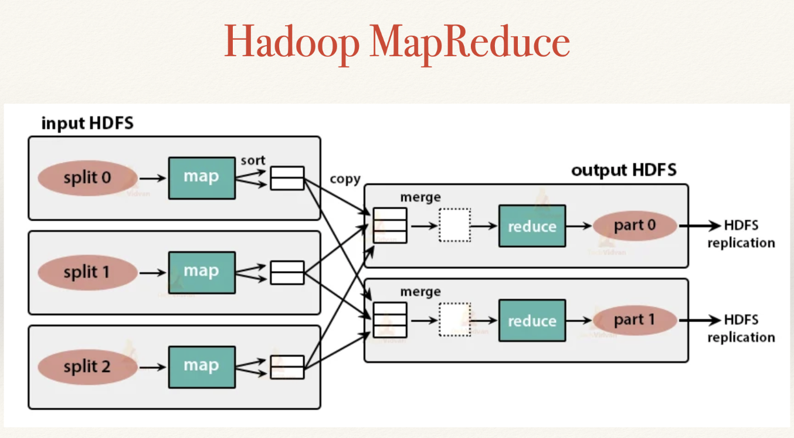
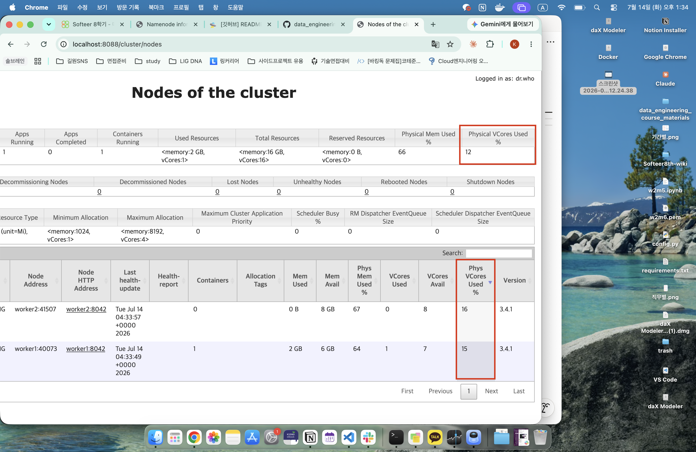

# 7월 14일 학습 내용 정리

## 목차
1. [MapReduce](#mapreduce)(목표 : 30m, 실제 : )
2. [과제 W3M2A](#과제-w3m2a)(목표 : 1h, 실제 : 1h)
3. [과제 W3M2B](#과제-w3m2b)(목표 : 40m, 실제 : 1h)

## MapReduce
1. [MapReduce란?](#mapreduce란?)
2. [동작방식](#전체동작방식)
3. [Map 상세 설명](#map-phase)
4. [Reducer 상세 설명](#reducer-phase)
### MapReduce란?
> 방대한 양의 데이터를 병렬적으로 커다란 클러스터에서 처리하기 위한 application을 쉽게 작성할 수 있게 하는 software framework
- Map Reduce는 스케줄링, 모니터링, 실패 시 재시도 등에 대한 것은 고려하지 않는다. 오직 처리만 담당하는 것
    - **스케줄링, 모니터링, 실패 시 재시도는 YARN이 담당**
- **Data를 저장하는 Node와 계산하는 노드가 동일**하다.
    - 즉, **MapReduce랑 HDFS**는 **동일한 노드에서 동작**함
    - 이러한 설정 덕분에 데이터가 있는 노드에서 작업을 효과적으로 스케줄할 수 있어 클러스터 전체에 매우 높은 bandwidth를 제공
- MapReduce 프레임워크 구성
    - 전체에 1개 Resource Manager
    - Cluster Node 당 1개의 Node Manager
    - Application 당 1개의 MRAppMaster

### 전체 동작 방식

1. 완벽하게 **병렬적**으로 **map task에 의해 처리**되기 위해서, Dataset을 독립적인 chunk로 분해함.
    - 즉, map에서는 각 chunk를 처리함
2. MapReduce는 Map의 결과를 정렬한 뒤, Reduce Task로 넘겨줌
3. Reduce의 결과는 같은 것끼리 partition으로 구분되어 저장된다.
    - 이때 Reduce 호출 횟수는 key의 개수와 같다.
        - Reducer가 1개이고, 해당 reducer가 담당하는 key가 100개라면, reduce 호출은 100번 진행
        - Reducer가 2개고, 각각 30개 70개를 맡는다면, 30번 70번 진행
        - Reducer 코드
            - 아래에 보이는 것처럼 key가 달라지면, reduce가 호출되어 집계를 한다.
            ```python
            def reduce(self, product_id, count, total):
                # 리뷰 수와 평점 합계 -> 평균 평점
                return f"{product_id}\t{count}\t{total / count:.2f}"

            def run(self, stream=sys.stdin, out=sys.stdout):
                for line in stream:
                    product_id, _, rating = line.rstrip("\n").partition("\t")
                    try:
                        rating = float(rating)
                    except ValueError:
                        continue  

                    if product_id != self.current_id:
                        self._flush(out)
                        self.current_id = product_id
                        self.count = 0
                        self.total = 0.0

                    self.count += 1
                    self.total += rating

                self._flush(out)

            def _flush(self, out):
                if self.current_id is not None:
                    out.write(self.reduce(self.current_id, self.count, self.total) + "\n")
            ```

4. 이때, input(map에 넣기 전)과 output(reduce 후) 데이터는 HDFS에 저장된다.
    - map -> reduce로 넘어갈 때는 local file system을 이용
        - spark는 여기서 더 빠르게 처리하기 위해 local file system 대신 memory를 이용

### Map Phase

1. Record Reader
    1. 고정된 크기로 나눠진 split을 **record로 변환**해주는 역할
        - 하둡은 MapReduce에 들어가기 전, **고정된 크기로 나눈다.** 
    2. Data를 **record로 파싱**하는 역할
    3. Record Reader는 **mapper함수에 key-value 쌍을 제공**
2. Map
    - Hadoop은 각 record에 대해 user가 정의한 map 함수를 실행하는 map task를 생성한다.
        - 0개 이상의 key-value pair를 만들어냄
            ```python
            # 예시
            positive 1
            negative 1
            ...
            ```
    - Map Task는 **local disk**에 ouput을 작성하고, output은 유저가 정의한 reducer 함수에 의해 처리된다.
3. Combiner
    - Map 함수의 결과를 결합해서 Reduce Function에 전달하는 역할
        - Map 끝나고 shuffle로 데이터를 네트워크로 보내기 전, 미리 부분 집계해서 전송량을 줄이는 것
        - Combiner가 존재함으로써, Map 노드에서 미리 합쳐서 전송량을 줄일 수 있음
    - 실행 위치 : mapper와 같은 노드에서 local로
    - Combiner는 최적화일 뿐이고, 동작은 Hadoop이 결정
        - 즉, Combiner가 적용되든 안 되든 결과는 동일해야 함.
    - 대부분 Combiner의 로직은 Reducer와 동일해서 많은 경우, Reducer를 Combiner로 재사용함
4. Partitioner
    - map의 출력(key-value)을 어느 Reducer로 보낼지 결정
        - 즉, key를 reducer 번호로 매핑한다.
    - combine과 shuffle 사이 단계에 실행된다.
    - 방식
        1. map이 record를 뱉으면 메모리 버퍼에 쌓임
        2. 각 레코드에 대해 Partitioner가 호출되어, 파티션 번호를 붙임
        3. shuffle 단계에서 이 번호를 기준으로 각 Reducer가 자기 파티션을 가져감
    - 반드시 보장
        > 동일한 key를 가진 모든 레코드는 반드시 같은 Reducer로 간다.
    - Custom Partitioner를 만드는 이유
        1. Data Skew 해결
            - 데이터가 특정 리듀서에 쏠리는 경우, 부하 분산을 위함
        2. 의미 기반 그룹핑
            - 결과를 특정 기준으로 파티션 별로 모으고 싶은 경우 (출력 파일 분리)
### Reducer Phase
1. Sort and Shuffle
    - Reducer는 셔플, 정렬로 시작
    - 이 단계의 목적은 equivalent key끼리 모으는 것
    - 파티션이 기록한 데이터를 Reducer가 동작하는 노드에 다운로드한다.
2. Reduce
    - Reducer는 key grouping 마다 한 번의 reduce 함수를 수행함.
        - 키가 모일 때마다 한 번의 reduce를 한다는 것
    - reduce task의 결과는 HDFS에 기록된다.
3. Output Format
    - 기본적으로 key와 value 사이에 tab을 하나 두는 방식
    - 각 줄로 구분
## 과제 W3M2A

### 전체 그림
- Master와 Worker로 구분된 다중 노드 클러스터를 구축하기
    - Master : NameNode, Resource Manager를 가짐
    - Worker : DataNode, Node Manager를 가짐
- 개념
    - HDFS : 분산 파일 저장소
        - Namenode : 파일의 메타데이터를 가지는 관리자
        - Datanode : 파일의 실제 데이터(블록)를 가지는 저장소
    - YARN : 분산 계산 자원 관리자
        - ResourceManager : 일을 분배하는 관리자.
        - NodeManager : 실제로 일을 진행하는 일꾼
    - Docker Image : **컨테이너를 어떻게 만들지**를 포함하는 템플릿
        - Dockerfile : 템플릿을 작성하는 문서
    - Container : Image로 만들어낸 **실행 중인 인스턴스**
        - 본 과제에서는 image 1개를 만들고, 그것으로 master/worker Container를 여러 개 제작할 예정
- 이전에는 단일 노드였기에, Network를 따로 설정하지 않아도 되었지만, 이제는 여러 개의 Container가 통신해야 하므로, Network 설정이 필요하다.

### 네트워크 연습
1. 네트워크 생성
    ```bash
    docker network create network-test
    ```
2. 네트워크에 빈 컨테이너 2개 생성
    ```bash
    docker run -d --name master --network network-test ubuntu:22.04 sleep infinity
    docker run -d --name worker1 --network network-test ubuntu:22.04 sleep infinity
    ```
    - `sleep infinity` : 그냥 켜두기 의미 
3. worker1 안에서 master라는 이름이 실제 IP로 풀리는지 확인
    ```bash
    docker exec worker1 getent hosts master
    docker exec master getent hosts worker1
    ```
    - `docker exec worker1 getent hosts master`
        > worker1 Container에서 master라는 이름의 hosts의 IP주소를 조회해라.

### 다중 노드 하둡 클러스터 Config 파일 설정
- core-site.xml : 시스템 전반 설정
    - ex, 기본 파일 시스템은 무엇인지, 인증은 어떻게 처리하는지 등
    ```xml
    <configuration>
    <property>
        <name>fs.defaultFS</name>
        <value>hdfs://master:9000</value>
    </property>
    </configuration>
    ```
    - 단일로 할 때와 다르게 localhost가 아닌 **master**를 기재했다.
        - master 호스트의 hdfs를 쓰겠다는 것이다.
- hdfs-site.xml : HDFS 관련 설정 (정책 등)
    - ex, 복제 몇 개 할지, 데이터 경로는 뭔지 등
    ```xml
    <configuration>
    <property><name>dfs.replication</name><value>2</value></property> <!--복제 2개 (Worker 2대)-->
    <property><name>dfs.namenode.name.dir</name><value>/opt/hadoop/data/namenode</value></property> 
    <property><name>dfs.datanode.data.dir</name><value>/opt/hadoop/data/datanode</value></property>
    </configuration>
    ```
    - 단일로 할 떄와 다르게 Worker가 2개이기에 복제를 2개로 설정한다.

- mapred-site.xml : Map-Reduce 관련 설정 
    - ex, JOB을 어떤 엔진에서 돌릴지, 메모리는 얼마로 할지 등
    ```xml
    <configuration>
    <property><name>mapreduce.framework.name</name><value>yarn</value></property>
    <!-- MapReduce가 YARN 위에서 Hadoop 경로를 찾게 함 -->
    <property><name>yarn.app.mapreduce.am.env</name><value>HADOOP_MAPRED_HOME=/opt/hadoop</value></property>
    <property><name>mapreduce.map.env</name><value>HADOOP_MAPRED_HOME=/opt/hadoop</value></property>
    <property><name>mapreduce.reduce.env</name><value>HADOOP_MAPRED_HOME=/opt/hadoop</value></property>
    </configuration>
    ```
    - yarn의 각 설정에 Hadoop 경로를 연결해준다.
        - Map-reduce가 하둡을 찾도록
    
- yarn-site.xml : Yarn 관련 설정
    - ex, Resource Manager는 어디있는지, 노드 당 자원은 얼마인지 등
    ```xml
    <configuration>
    <property><name>yarn.resourcemanager.hostname</name><value>master</value></property> <!--Yarn Resource Manager 이름-->
    <property><name>yarn.nodemanager.aux-services</name><value>mapreduce_shuffle</value></property> <!--MapReduce의 Map 결과를 Reduce로 넘기는 셔플 단계를 켜는 것-->
    <property> 
        <name>yarn.nodemanager.env-whitelist</name> <!-- 컨테이너로 실행되는 작업에게 제공할 환경변수 목록-->
        <value>JAVA_HOME,HADOOP_COMMON_HOME,HADOOP_HDFS_HOME,HADOOP_CONF_DIR,CLASSPATH_PREPEND_DISTCACHE,HADOOP_YARN_HOME,HADOOP_MAPRED_HOME</value>
    </property>
    </configuration>
    ```
    - 이제 yarn을 사용하기 때문에 yarn 설정을 진행한다.
    - `yarn.resourcemanager.hostname` : Resource Manager의 이름
        - master로 설정한다.
    - `yarn.nodemanager.aux-services` : NodeManager의 부가 서비스 명시
        - mapreduce_shuffle : 이게 없으면 JOB이 멈춘다.
    - `yarn.nodemanager.env-whitelist` : 컨테이너로 실행되는 작업에게 제공할 환경변수 목록

- worker : 클러스터 구성원 이름 명시

### entrypoint
> 컨테이너 실행 시 자동으로 실행되는 스크립트
- 본 과제에서는 하나의 이미지로 Master와 Worker를 구분되게 생성해야 한다.
    - 하나의 entrypoint로 어떻게 할 수 있을까 
        > 환경변수로 역할 주입하는 방식
- 다음과 같이 작성하여, 컨테이너 실행 시 `-e`로 환경변수를 받아서 역할 분기하기
    ```sh
    #!/bin/bash
    set -e

    # 컨테이너 역할을 환경변수로 결정 (default: master)
    # docker run -e ROLE=master ... / -e ROLE=worker ... 
    ROLE=${ROLE:-master}
    echo ">> Starting node with ROLE=$ROLE"

    if [ "$ROLE" = "master" ]; then
    # 마스터면, NameNode + ResourceManager

    # 최초 실행일 때만 포맷
    # - 이미 포맷된 경우 패스
    if [ ! -d "$HADOOP_HOME/data/namenode/current" ]; then
        echo "[ENTRYPOINT] Namenode 포맷팅"
        hdfs namenode -format -force
    fi

    echo "[ENTRYPOINT] Namenode랑 ResourceManager 시작"
    hdfs --daemon start namenode
    yarn --daemon start resourcemanager

    else
    # 워커면, Datanode랑 NodeManager 시작하기만 하면 된다, (HDFS는 마스터꺼 쓸거니까)
    echo "[ENTRYPOINT] Datanode랑 NodeManager 시작"
    hdfs --daemon start datanode
    yarn --daemon start nodemanager
    fi

    sleep 3 # 실행 잠깐 대기
    echo "[ENTRYPOINT] 실행 중인 JAVA Process"
    jps

    # 컨테이너 살아있게 로그 출력
    tail -f $HADOOP_HOME/logs/*.log

    ```

### Dockerfile
> Multinode Worker와 Master 둘 다 생성 가능한 Dockerfile
```docker
FROM ubuntu:22.04

RUN apt-get update && apt-get install -y openjdk-8-jdk wget && apt-get clean && rm -rf /var/lib/apt/lists/*

# 경로를 symbolic link로 고정 (아키텍처 상관없이 동작하도록)
RUN ln -s "/usr/lib/jvm/java-8-openjdk-$(dpkg --print-architecture)" /opt/java
ENV JAVA_HOME=/opt/java
ENV HADOOP_HOME=/opt/hadoop
ENV PATH=$PATH:$HADOOP_HOME/bin:$HADOOP_HOME/sbin

# 하둡 설치
RUN cd /opt && wget https://mirror.kakao.com/apache/hadoop/common/hadoop-3.4.1/hadoop-3.4.1.tar.gz && \
    tar -xzf hadoop-3.4.1.tar.gz && mv hadoop-3.4.1 hadoop && rm hadoop-3.4.1.tar.gz


# env에 JAVAHOME 경로 설정
RUN echo "export JAVA_HOME=$JAVA_HOME" >> $HADOOP_HOME/etc/hadoop/hadoop-env.sh

# 설정 파일 전체 하둡 안으로 복사 
COPY config/ $HADOOP_HOME/etc/hadoop/


# entrypoint.sh 복사
COPY entrypoint.sh /entrypoint.sh
RUN chmod +x /entrypoint.sh

# WebUI랑 HDFS 포트 개발
EXPOSE 9870 9000 8088

# 컨테이너 시작 시, entrypoint 실행
ENTRYPOINT ["/entrypoint.sh"]
```
- 거의 동일하다.
    - 달라진 점
        1. COPY 한 번에 전체
        2. 8088추가 (Yarn Web UI)

### Cluster 엮였는지 확인
> 각 Cluster가 서로 엮여서 동작하는지 확인
1. [CLI](#cli에서-확인)
2. [WebUI](#webui에서-확인)
3. [MapReduce예제](#mapreduce-예제-수행)
#### CLI에서 확인
1. HDFS 확인
    > 마스터에 Datanode 몇 대가 살아서 붙어있는가
    ```bash
    docker exec master hdfs dfsadmin -report
    ```
    <details> 
    <summary>출력 결과</summary>

    ```bash
    admin@adminui-MacBookPro-6 W3 % docker exec master hdfs dfsadmin -report
    2026-07-14 03:03:52,386 WARN util.NativeCodeLoader: Unable to load native-hadoop library for your platform... using builtin-java classes where applicable
    Configured Capacity: 970947969024 (904.27 GB)
    Present Capacity: 886428008448 (825.55 GB)
    DFS Remaining: 886427959296 (825.55 GB)
    DFS Used: 49152 (48 KB)
    DFS Used%: 0.00%
    Replicated Blocks:
            Under replicated blocks: 0
            Blocks with corrupt replicas: 0
            Missing blocks: 0
            Missing blocks (with replication factor 1): 0
            Low redundancy blocks with highest priority to recover: 0
            Pending deletion blocks: 0
    Erasure Coded Block Groups: 
            Low redundancy block groups: 0
            Block groups with corrupt internal blocks: 0
            Missing block groups: 0
            Low redundancy blocks with highest priority to recover: 0
            Pending deletion blocks: 0

    -------------------------------------------------
    Live datanodes (2):

    Name: 172.20.0.3:9866 (worker1.hadoop-net)
    Hostname: worker1
    Decommission Status : Normal
    Configured Capacity: 485473984512 (452.13 GB)
    DFS Used: 24576 (24 KB)
    Non DFS Used: 17524006912 (16.32 GB)
    DFS Remaining: 443213996032 (412.78 GB)
    DFS Used%: 0.00%
    DFS Remaining%: 91.30%
    Configured Cache Capacity: 0 (0 B)
    Cache Used: 0 (0 B)
    Cache Remaining: 0 (0 B)
    Cache Used%: 100.00%
    Cache Remaining%: 0.00%
    Xceivers: 0
    Last contact: Tue Jul 14 03:03:52 GMT 2026
    Last Block Report: Tue Jul 14 03:01:27 GMT 2026
    Num of Blocks: 0


    Name: 172.20.0.4:9866 (worker2.hadoop-net)
    Hostname: worker2
    Decommission Status : Normal
    Configured Capacity: 485473984512 (452.13 GB)
    DFS Used: 24576 (24 KB)
    Non DFS Used: 17524039680 (16.32 GB)
    DFS Remaining: 443213963264 (412.78 GB)
    DFS Used%: 0.00%
    DFS Remaining%: 91.30%
    Configured Cache Capacity: 0 (0 B)
    Cache Used: 0 (0 B)
    Cache Remaining: 0 (0 B)
    Cache Used%: 100.00%
    Cache Remaining%: 0.00%
    Xceivers: 0
    Last contact: Tue Jul 14 03:03:52 GMT 2026
    Last Block Report: Tue Jul 14 03:01:34 GMT 2026
    Num of Blocks: 0
    ```
    </details>

2. YARN 확인
    > 마스터에 Node Manager 몇 대가 붙어있는가
    ```bash
    docker exec master yarn node -list
    ```

    <details> 
    <summary>출력 결과</summary>

    ```bash
    admin@adminui-MacBookPro-6 W3 % docker exec master yarn node -list
    2026-07-14 03:04:01,899 WARN util.NativeCodeLoader: Unable to load native-hadoop library for your platform... using builtin-java classes where applicable
    2026-07-14 03:04:01,920 INFO client.DefaultNoHARMFailoverProxyProvider: Connecting to ResourceManager at master/172.20.0.2:8032
    Total Nodes:2
            Node-Id             Node-State Node-Http-Address       Number-of-Running-Containers
    worker1:40073                RUNNING      worker1:8042                                  0
    worker2:41507                RUNNING      worker2:8042                                  0
    ```
    </details>
#### WebUI에서 확인
1. HDFS
    
    - Datanodes 메뉴에서 등록된 워커 확인 가능
    - 파일 시스템 상태, 용량, Datanode 목록을 모두 시각적으로 확인 가능
2. YARN
    
    - Nodes 메뉴에서 등록된 노드 확인 가능
    - 여기서 어떤 job이 어떤 node에서 수행 중인지 모니터링 할 수 있다.

#### MapReduce 예제 수행
- MapReduce 예제 WordCount 수행
    - 입력 텍스트 -> Map에서 분할하여 개수 측정 -> Reduce에서 개수 결합

1. HDFS에 입력 폴더 생성
    ```bash
    docker exec master hdfs dfs -mkdir -p /user/root/wc-input
    ```
2. 텍스트 파일 업로드
    > 내용 : "hello hadoop hello world hadoop is fun hadoop"
    ```bash
    docker exec master bash -c 'echo "hello hadoop hello world hadoop is fun hadoop" > /tmp/words.txt && hdfs dfs -put -f /tmp/words.txt /user/root/wc-input/'
    ```
3. wordcount job 실행 (입력 폴더 -> 출력 폴더)
    ```bash
    docker exec master bash -c 'hadoop jar $HADOOP_HOME/share/hadoop/mapreduce/hadoop-mapreduce-examples-3.4.1.jar wordcount /user/root/wc-input /user/root/wc-output'
    ```
    - `jar $HADOOP_HOME/share/hadoop/mapreduce/hadoop-mapreduce-examples-3.4.1.jar wordcount` : jar 파일 내의 wordcount 프로그램을 대상으로 수행
    - `/user/root/wc-input` : 이 input 데이터를 프로그램 돌려서
    - `/user/root/wc-output` : 여기 output 폴더에 저장
4. Yarn WebUI에서 job이 잘 보이는지 확인
    
    - 1로 활성화된 것을 확인할 수 있다.
5. 결과 확인
    ```bash
    admin@adminui-MacBookPro-6 W3 % docker exec master hdfs dfs -cat /user/root/wc-output/part-r-00000

    2026-07-14 04:36:51,553 WARN util.NativeCodeLoader: Unable to load native-hadoop library for your platform... using builtin-java classes where applicable

    fun     1
    hadoop  3
    hello   2
    is      1
    world   1
    ```

## 과제 W3M2B
> 전반적으로 과제 M2A와 유사하므로, 달라진 점만 정리

### Container에 network alias 붙이기

```bash
docker run -d --name master --hostname master \
  --network hadoop-net --network-alias namenode \
  -p 9870:9870 -p 8088:8088 \
  -e ROLE=master \
  -v hadoop-master:/opt/hadoop/data \
  hadoop-multi
```
> 이름은 master, 네트워크 별명은 namenode로 설정
>> 이러면, master와 namenode 두 개로 모두 불릴 수 있음
- Worker는 W3M2A에서 했던 것과 동일하게 생성
    ```bash
    docker run -d --name worker1 --hostname worker1 --network hadoop-net \
    -e ROLE=worker \
    -v hadoop-worker1:/opt/hadoop/data \
    hadoop-multi
    ```
---
### 설정 수정 스크립트(modify_config.py) 작성
> config directory 경로를 인자로 받아서 정해진 값으로 수정하고, 리포트하는 파일

#### 1 config directory 경로 인자로 받기
1. argv를 이용하여 파싱
    ```python
    config_dir = sys.argv[1] if len(sys.argv) > 1 else DEFAULT_CONFIG_DIR
    print(f"Config 디렉터리: {config_dir}\n")
    ```
2. 반복문을 통해 각 파일들을 순회하며 값 설정
    ```python
    for filename, kv in SETTINGS.items():
        path = os.path.join(config_dir, filename)
        if not os.path.exists(path):
            print(f"[{filename}] FAIL: 파일 없음 ({path})\n")
            fail += 1
            continue
        try:
            modify_file(path, kv)
            ok += 1
        except Exception as e:  # 오류를 우아하게 처리하고 계속 진행
            print(f"    FAIL: {filename} 수정 중 오류 - {e}")
            fail += 1
        print()
    ```

#### 2 수정 전 원본 백업
> 수정 전 backup_file 함수로 들어와 백업 진행

```python
def backup_file(path):
    """원본을 path.bak 으로 백업. 이미 백업이 있으면 덮지 않는다."""
    bak = path + ".bak"
    if os.path.exists(bak):
        print(f"  (백업 이미 존재: {os.path.basename(bak)} - 원본 보존을 위해 건너뜀)")
        return
    shutil.copy2(path, bak)
    print(f"  Backing up {os.path.basename(path)} -> {os.path.basename(bak)}")
```


#### 3 지정된 설정들 정해진 값으로 수정
> xml.etree.ElementTree를 이용하여 정해진 값으로 수정
```python
def set_property(root, key, value):
    """
    <configuration> 아래에서 <property><name>key</name> 를 찾아 <value>를 갱신
    """
    for prop in root.findall("property"):
        name_el = prop.find("name") 
        if name_el is not None and (name_el.text or "").strip() == key:
            value_el = prop.find("value")
            if value_el is None:
                value_el = ET.SubElement(prop, "value")
            old = value_el.text
            value_el.text = value
            return "updated", old
    # 못 찾음 -> 새로 추가
    prop = ET.SubElement(root, "property")
    ET.SubElement(prop, "name").text = key
    ET.SubElement(prop, "value").text = value
    return "inserted", None
```
#### 4 오류를 graceful 처리하고 변경 상태 report
```python
except Exception as e: 
            print(f"    FAIL: {filename} 수정 중 오류 - {e}")
            fail += 1
        print()
```
