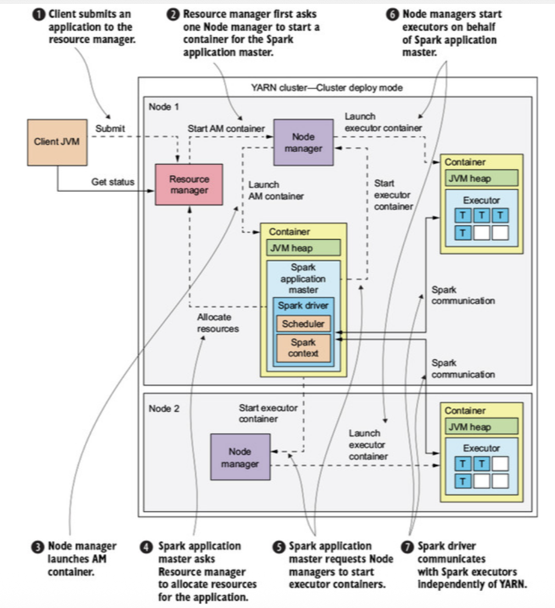

# 7월 20일 학습 내용 정리

## 목차
- [스파크](#스파크)

## 스파크

### 스파크 등장 배경
- 하둡의 등장으로 대량의 데이터를 저렴한 여러 기기들로 병렬 연결하여 처리할 수 있게 되었다.
    - 하둡은 대량의 데이터를 배치 단위로 돌리는 것으로 설계되었다.
        - 문제 
            - 여러 단계를 반복하며 진행되는 처리는 속도가 느리다.
                1. 각 단계가 끝날 때마다 HDFS에 기록해야 하기 때문
                2. 각 단계가 다시 시작할 때마다 매번 새로운 JVM을 띄운다. -> 오버헤드가 큼
    - 스파크는 위 문제를 해결하고자 등장했다.
- 스파크의 등장 배경
    - 실시간으로 데이터를 처리하는 요구사항이 증가함.
        - MapReduce의 한계를 속도와 유연성으로 극복함
            - 속도 : Memory를 이용하여 HDFS에 매번 재작성하는 과정을 없앰
            - 유연성 : 여러 언어나 프레임워크에 대응 가능한 high-level 구조
    - MapReduce는 단순 Map-Reduce 두 단계로만 구성되어있다.
        - 복잡한 처리를 해야한다면, 여러 개의 job을 엮어서 진행해야 한다.
            - 각 job마다 HDFS에 결과를 작성하고, 재실행해야 하니, 시간이 오래 걸린다.
        - 하둡에서 Map-Reduce 각 단계를 분리한 이유
            > 분산 환경의 물리적인 제약 때문에.
            1. 두 단계의 병렬화 기준이 다름
                - Map : 데이터의 위치
                - Reduce : 키
                    - 이 과정에서 데이터가 물리적으로 재배치 되는 과정이 포함된다. 
            2. 동기화 단계 필요
                - Map 계산이 모두 끝나기 전에 계산이 완료될 수가 없다.
- 스파크 사용 예시 
    - 실시간 분석 / 그래프 처리 / 머신러닝 / 반응형 SQL
    - 즉, 실시간으로 처리해야 하는 경우 이용한다.
        - 실시간으로 처리되어야 하는데, 복잡한 단계를 거친다. 
            - MapReduce는 각 단계별로 JOB을 띄우기 때문에 오버헤드가 큼
        - 실시간으로 처리되어야 하는 대화형 분석 대시보드 
### 스파크의 장점
1. `다양한 언어`로 `실시간/배치`에서 `데이터 처리를 통합`시킬 수 있다.
2. 대용량 데이터에 대한 대시 보드 / 애드혹 쿼리가 빠름
    - SQL을 분산된 병렬 클러스터에서 쿼리하기 떄문
    - 대부분의 DW보다 빠른 실행이 된다.
3. 다운 샘플링 없이 PB규모 데이터 EDA 수행 가능
    - 다운 샘플링을 하둡에 비해 덜 해도 하둡보다 빠름
    - 할 필요가 없어지니, 수행하는 결과의 신뢰도가 올라간다.
        - 모집단의 대표성이 높아지니 (동일한 샘플링을 적용한다는 가정)
4. 내 노트북에서 수행한 머신러닝 알고리즘 학습 코드를 동일하게 수천 대의 기계에 배포하여 학습 시킬 수 있다.
### Spark의 Cluster Manager
- Standalone
    
    > Spark 자체에 내장된 클러스터 매니저
    - 구조 
        1. Master : Cluster 중앙 관리자
            - Worker들 등록을 받음
            - Application 제출이 되면, 가용 리소스를 확인해 Executor를 어떤 Worker에 띄울지 결정
            - 7077 포트로 통신, 8080 포트로 웹 UI 보여줌
        2. Worker
            - 각 노드에서 실행된다.
                - 노드란?
                    - CPU와 RAM을 가진 하나의 머신을 의미
                - Worker는 Node 당 1대만 존재하는가?
                    - A) No, `SPARK_WORKER_INSTANCES` 환경 변수를 통해 **하나의 노드**에서 **여러 개의 워커**를 띄울 수가 있다.
                        - 하지만, Worker를 노드 1개에 여러 개 띄우는 것은 현재 무의미하다.
                        - 현재는 `spark.executor.cores` 설정을 통해서 executor 1개에게 **배치할 코어의 개수를 설정**하여 **여러 개의 executor**를 만들 수 있기 떄문
                            - 즉, 워커 여러 개를 두는 것의 장점은 이전에 Worker 1개에 Executor 1개만 있을 시절에 워커 여러 개를 둘 필요가 있었으나, 현재는 Worker 1개에 Executor 여러 개를 둘 수 있기 때문에 필요 없어졌다.
            - 자신의 Resource를 Master에 보고
            - Master 지시에 따라 Executor 프로세스를 실행함.
            - 8081 포트로 웹 UI 보여줌
    - 리소스 스케줄링 : `FIFO` 방식
        - `하나의 어플리케이션`이 `클러스터의 모든 코어를 점유`하려고 한다.
            - 만약, 여러 개의 어플리케이션을 실행하고 싶다면, `spark.cores.max` 설정을 통해서 여러 개의 어플리케이션을 실행하자.
        - 리소스 단위 : Core / Memory
    - High Availability
        > Master가 1대이므로 SPOF가 될 수 있는데, 아래와 같은 방식으로 보완 가능하다.
        1. ZooKeeper 기반 
            - 여러 개의 Master를 띄우고 ZooKeeper로 리더 Master를 선출
            - 리더 Master가 죽으면, 대기 중인 Master가 승격
        2. 로컬 파일 시스템 복구
            - 단일 Master의 상태를 디스크에 기록
            - Master 재시작시, 기뢱된 내용으로 복구
        - 참고) Master가 죽어도 Driver랑 Executor는 이미 둘이서 통신 중이므로, 실행 중인 Job에는 문제가 없다. 새로 Job 제출에만 문제가 생기는 것
    - 장점
        1. 설정이 간단.
        2. Spark만 설치해도 된다.
        3. 소규모 클러스터에서는 오버헤드가 적다.
    - 단점
        1. Spark 전용이라 다른 프레임워크와 리스소 공유 불가
        2. 스케줄링 정책이 단순
        3. 보안, 멀티 태넌시 기능이 제한적
    - 배포 모드
        1. Client : Driver가 Spark-Submit을 실행한 **클라이언트 머신**에서 동작, 대화형 작업에 적합하다.
            - 내 PC에서 실행해보고 결과를 받아볼 수 있어야 하니까
            - 대화형이 아니어도 뭔가 상태를 모니터링해야 하는 경우 Client 배포
            - 이때는 Client 연결이 끊기면 Job이 멈춘다.
        2. Cluster : Driver가 Cluster내의 Worker 중 하나에서 실행
            - Client 연결이 끊겨도 Application이 계속 동작
- YARN Mode
    
    > 리소스 관리를 Hadoop의 Yarn에게 맡기는 구조
    - Yarn 구성 요소 : RM, NM
        - Resource Manager(RM) : Standalone의 Master에 대응
            - 클러스터 전체의 리소스를 관리하는 마스터
            - 각 Application에 얼마나 리소스를 줄 지 결정함.
        - Node Manager(NM) : Standalone의 Worker에 대응
            - 각 노드에서 실행되며, 해당 노드의 리소스를 RM에게 보고
            - 실제 작업은 Node Manager의 Container 단위에서 실행
                - 즉, Spark의 Executor가 Node Manager의 Container 안에서 실행된다.
    - 리소스 스케줄링
        - Capacity Scheduler : 큐 별로 클러스터 용량을 배분한다.
            - 멀티 태넌시 지원, A에게 60%, B에게 40% 이런거 가능
        - Fair Scheduler : 실행 중인 어플리케이션들에게 동일하게 용량 배분
    - 동적 리소스 할당(`Dynamic Allocation`)
        - 워크로드에 따라 Executor의 수를 늘리고 줄인다.
        - Multi tenency를 가정했기에 이게 유용하다.
    - 장점
        - 하둡 에코시스템 통합 : 기존에 쓰던 하둡에 얹어서 바로 사용 가능하다.
        - 다양한 워크로드와 리소스 공유 가능 : Flink같은 다른 프레임워크와 같이 리소스 공유가 가능하다.
        - 정교한 리소스 스케줄링 및 멀티 테넌시
            - 큐 단위로 스케줄링이 가능하다.
            - 여러 조직이 하나의 클러스터를 공유하는 환경에 적합하다.
        - Executor 동적 할당 가능
    - 단점
        - 구축과 운영의 복잡성
            - 하둡을 모르면 구축하고 운영하기 어렵다.
        - 하둡 의존성 존재
            - 이 때문에 최근에는 K8S로 가려한다.
        - 설정의 어려움
            - 메모리 관련 설정이 어렵다.
            - Executor 메모리 외에 오버헤드 메모리까지 고려하여 Yarn Container 크기 한도에 맞춰야 한다.
                - 이를 제대로 설정하지 못하면, Container가 강제 종료될 수 있다.
    - 배포 모드
        1. Client : Driver가 spark-submit을 실행한 머신에 동작
            - 이때, Cluster에 있는 Application Master는 Driver 역할을 하지 않고, 오로지 **Resource Manager**에게 **자원을 요청**하는 역할만 담당
            - Driver가 Client안에 있어 **로그와 결과를 바로 확인 가능**하다.
                - 대화형 분석 작업이나 `spark-shell`에 적합
                - 그래서 셋팅 초기에는 AWS 또는 Client에서 Client모드로 돌리고 실제 클러스터는 VPC에 존재하도록 하여 분리하여 운영하며 확인하도록 한다.

        2. Cluster : Driver가 Application Master 내부에서 동작
            - Driver와 Application Master가 동일한 Container에 존재
            - Client가 spark-submit을 제출한 뒤 끊겨도 job은 지속된다.
                - Driver와 Executor들은 계속 통신이 가능하기 떄문
            - 운영 배치 작업에 적합
        
- Kubernetes Mode
    > Container Orchestration 도구인 Kubernetes에 리소스 관리를 위임
    - K8S 핵심 개념 : `Pod`
        - Pod : 컨테이너를 실행하는 최소 단위
        - Spark on K8S에서는 Driver와 Executor가 각각 Pod에서 동작한다.
            - 즉, Driver와 Executor는 다른 Pod에 존재한다.
    - 동작 구조
        1. spark-submit이 **k8s API server에 요청**을 보냄
        2. k8s가 **Driver Pod을 하나 생성**
        3. Driver Pod 안의 **Driver가 다시 K8S API Server에 요청**해서 필요한 만큼 **Executor를 실행할 Pod들을 생성**
        4. Executor Pod들이 **Driver와 연결되어 작업들을 수행**
        5. Application이 끝나면 **Executor Pod 정리**, **Driver는 로그 확인을 위해 Complete 상태**로 남음
    - 배포 모드
        1. client 모드
            - Driver가 spark-submit을 실행한 곳에서 실행
                - Executor Pod들과 네트워크로 통신할 수 있도록 위치를 잘 구성해야 한다.
        2. cluster 모드
            - Driver가 Cluster 안의 Driver Pod에서 실행
    - 리소스 할당
        > 기본적으로 K8S의 기본 스케줄러가 Pod을 어느 노드에 배치할지 결정
        - Spark와 같이 여러 개의 Pod을 한 번에 요구하는 경우엔
            - `Volcano` / `Apache YuniKorn`같은 배치 스케줄러를 이용하여 **gang scheduling**,**큐 기반 관리**,**우선 순위 제어** 등을 보완하는 경우가 많다.
        - 또는 K8S 기본 제어 기능을 이용할 수도 있다.
            - namespace로 멀티 태넌시 구현 -> ResourceQuota로 팀별 리소스 상한 설정 -> node selector/affinity/taint로 Pod 배치 제어
    - 동적 리소스 할당
        - K8S에서는 Yarn을 사용할 때와 다르게, shuffle tracking 방식을 사용한다.
            - 일반 dynamic allocation처럼 워크로드에 따라 변경되는데 shuffle data를 가진 executor는 함부로 회수하지 않는 방식을 말한다.
    - 장점
        - 컨테이너 환경의 일관성
        - K8S가 배포 표준이 되면서 Spark를 운영 중인 K8S에 자연스럽게 통합할 수 있다.
        - 하둡이 필요없다.
            - 데이터는 S3와 같은 오브젝트 스토리지에 두고, 연산만 K8S에서 한다.
                - 이러한 아키텍처를 스토리지-컴퓨트 분리(decoupling) 아키텍처라고 한다.
        - 세밀한 리소스 관리
            - 컨테이너 단위로 관리하기 때문에 CPU/Memory 격리가 확실하다.
        - Scalability
            - K8S의 Cluster AutoScaler같은 것과 결합하면, 작업 부하에 따라 노드 자체를 늘리고 줄이고 할 수 있어 클라우드 비용 효율이 좋다.
    - 단점
        - 운영 복잡도
        - K8S 학습 필요
        - 셔플과 스토리지 관리 까다로움
            - shuffle tracking과 오브젝트 스토리지로 어느정도 보완하지만, YARN만큼 성숙하고 간단하지는 않다.
        - 이미지랑 설정을 관리하는 것의 부담
        - 네트워킹과 보안 설정의 복잡성
