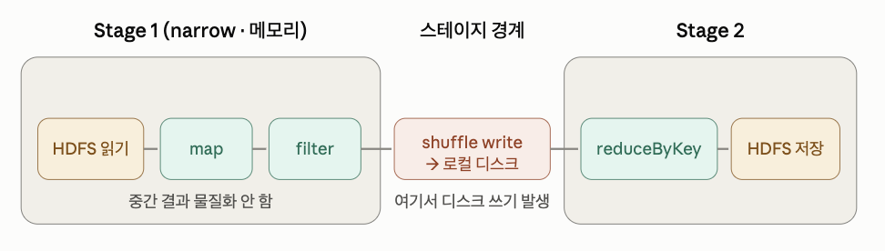

# 7월 22일 학습 내용 정리
---
- Spark Master의 Deploy Options
    - Local
        > 별도의 클러스터 매니저 없이 Spark를 실행하는 방식
        - Driver와 Executor가 하나의 JVM 프로세스 안에서 동작
            - 실제로 병렬이 아니라 멀티 스레드로 병렬처럼 보이게 하는 것
        - 사용 상황
            1. 개발/디버깅 : Cluster 없이 노트북에서 빠르게 테스트
            2. 단위테스트/CI
    - Standalone Cluster
        > Spark에 내장된 자체 클러스터 이용하는 방식
    - Using a Cluster Manager
        > Resource / Yarn / Kubernetes 
        >> 본격적으로 Cluster를 갖다 씀
    
- Spark의 Cluster Manager 구조
    - DRIVER
        - Driver 내부 구성요소 각각은 뭘까?
            1. Driver
                - Application의 두뇌에 해당하는 프로세스
                    - main함수가 실행되는 부분
                    - 전체 작업 흐름 조율
                - 하는 일
                    1. 사용자 코드 -> 실행 계획 변환
                    2. Cluster Manager와 협상하여 Executor 확보
                    3. Executor들에게 작업 보내고 진행 상황 추적
                - 내부에 `Scheduler`와 `Spark Context`를 포함
            2. Spark Application
                - 사용자가 직접 작성한 Application 코드
                    - RDD/DataFrame 연산을 정의한 코드
            3. Spark Context
                - Driver가 Cluster와 소통하기 위한 **EntryPoint**이자 **연결 통로**
                    - Spark 2.0 이후부터는 Spark-Session이 표준
                        - Spark-Session : Spark Context를 감싸는 래퍼
                            - DataFrame과 SQL 기능까지 통합해서 제공
                - Driver 프로그램이 시작될 때 가장 먼저 생성
                    - Spark Context가 생성될 때, Cluster에 연결되는 것
                - 하는 일
                    1. Cluster Manager에 접속해서 Executor 자원 요청 및 확보
                    2. RDD, Accumulator, broadcast 변수 같은 기본 객체 생성
                        - RDD (Resilient Distributed Dataset)
                            > 데이터 그 자체를 담는 가장 기본적인 그릇
                            - 이름 뜻
                                - Resilient(회복력): 중간에 Executor 하나가 죽어서 파티션이 날아가도, 날라간 부분만 다시 계산해 복구
                                    - 즉, 데이터 복제 없이도 fault-tolerant
                                    - 가능한 이유 : 데이터가 어떤 연산을 거쳐서 만들어졌는지 기록해두기 때문
                            - 중요 특성
                                1. Immutable
                                    > 원본을 바꾸지 않고 새로운 RDD를 만들어낸다.
                                2. lazy (지연 실행)
                                    > 바로 실행되지 않고 **계획만 쌓아두다**가, **호출되는 순간 실제 계산** 시작
                        - 분산 환경의 변수 문제
                            > Driver에서 생성한 변수를 Task안에서 사용 시, 변수는 각 Executor로 복사되어 전달된다.
                            >> 여기서 생기는 두 가지 문제
                            1. Executor에서 변수 값을 바꿔도 **Driver쪽 원본에는 반영되지 않는다.**
                            2. **용량이 큰 변수**를 여러 Task가 사용할시 매번 복사 전송되며 **네트워크 낭비**
                        - Accumulator (Executor -> Driver)
                            > 여러 Executor에서 일어난 값들을 Driver쪽으로 안전하게 모아 합산하기 위한 변수
                            - 오직 더하기만 가능하고, 읽는 것은 Driver에서 한다.
                            - 용도 : Counter, 합계
                                - ex, 전체 로그 중 에러가 몇 줄인가?
                                - 분산 환경에서 여러 Executor가 계산한 값을 Driver로 모아 합산하여 결과 추출
                        - broadcast (Driver -> Executor)
                            > Executor마다 딱 한 번만 전송해서 캐싱한다
                            - Task가 100개라도, 100번 보내는게 아니라 Executor 수만큼만 보내고 그 안의 모든 Task가 공유
                            - 용도 : 모든 Task가 참조해야 하는 참조/조회용 데이터 배포

                    3. Scheduler들 초기화

            4. Scheduler
                - 두 계층으로 나뉜다.
                    - SparkContext가 생성될 때 이 둘이 함께 초기화된다.
                    1. DAG Scheduler
                        - 사용자 코드가 만들어낸 **논리적 실행 계획**을 받아서 Shuffle이 필요한 경계를 기준으로 Stage 단위로 쪼갠다.
                        - 각 Stage를 다시 여러 개의 Task 묶음으로 만들어 아래 계층에 넘김
                    2. Task Scheduler
                        - DAG Scheduler가 넘긴 **개별 Task를 실제 Executor에 배분**
                        - Task 실패 시 재시도, 느린 작업에 대흥ㅁ
    - WORKER
        - Executor
            - WORKER의 task란? 
                > task를 실행할 수 있는 자리(실행 단위), CPU 코어
                - Executor에 코어 4개 할당 -> 슬롯 4개 -> 동시에 task 4개 실행 가능하다.
                - slot 1개에 task 1개가 들어가고, task는 파티션 하나를 처리
            - 데이터는 메모리에 존재한다.
                - 메모리에 존재하는 것들
                    1. 지금 처리 중인 파티션
                        - task가 실행되는 동안만 잠깐 올라오는 일시적인 데이터
                    2. 캐시/persist 데이터
                        - .cache()나 .persist()를 호출했을 때, storage 영역에 유지되는 데이터
                    3. shuffle 데이터
                        - 셔플 과정에서 주고받는 중간 결과
                    4. broadcast 변수
                        - Driver 뿌린 공유 데이터
            - Executor는 **외부에서 데이터를 읽어와**서 **메모리에서 처리**
- HDFS와 Spark를 같이 사용할 때 속도 차이 (연결 종류 별)
    > Spark의 Dfata Locality Level에 따른 속도 차이
    - Spark는 Executor에서 실행되는 task가 처리할 데이터가 얼마나 가까이 있느냐에 따라 여러 단계로 나누어 구분
    - 각 레벨의 속도 차이
        1. `PROCESS_LOCAL` : executor와 같은 JVM 안에 데이터가 위치
            - ex, `cache()`한 파티션을 다시 읽는 경우
            - 메모리에서 바로 읽기 때문에 Disk/Network I/O가 전혀 없어 가장 빠름
        2. `NODE_LOCAL` : 데이터가 같은 노드에 있는 경우 (즉, 동일한 로컬 디스크에 위치)
            - ex, Spark Executor와 HDFS DataNode가 같은 서버에 떠 있으면, 그 노드의 로컬 디스크에서 바로 읽는다.
            - 네트워크를 타지 않기에 빠름. HDFS와 Spark를 같은 노드에 배치하는 이유가 이것
        3. `RACK_LOCAL` : 데이터가 같은 랙의 다른 노드에 있는 경우 (스위치를 거쳐 네트워크로 전송)
        4. `ANY` : 데이터가 다른 랙에 존재하는 경우 (랙간 네트워크를 타야해 여러 스위치를 경유하고 많이 느림.)
    - `Spark Scheduler`는 항상 `가장 좋은 locality level`로 `task를 배치`하려고 시도한다.
        - 최적 슬롯이 지금 바빠서 비어있지 않으면, 
            1. `spark.locality.wait`만큼 기다림
            2. 한 단계 낮은 레벨로 떨어뜨려 실행
    - 최대한 NODE_LOCAL 이내로 처리하는 것이 중요하다.

- shuffle과 skewing이 뭘까? 
    - stage
        > JOB을 쪼개는 기준
        - Spark의 실행 단위 : Application -> Job -> Stage -> Task
        - Narrow 의존성 : 출력 파티션 하나가 입력 파티션 하나에만 의존하는 것
            - ex, `map`,`filter`,`union` 등
            - 데이터를 옮길 필요가 없어, 여러 연산을 하나의 stage 안에서 파이프라인으로 묶어 처리
        - Wide 의존성 : 출력 파티션 하나가 입력 파티션 여러 개에 의존하는 것
            - ex, `groupBy`,`reduceByKey`,`join`,`distinct`,`repartition` 등
            - `키 기준`으로 `데이터를 재분배`해야 하고, 이 재분배 지점이 **stage 경계**가 된다.
    - shuffle
        > 데이터를 파티션/executor 사이에서 **키 기준**으로 **재분배**하는 과정
        >> shuffle은 spark에서 가장 비싼 연산이므로 최소화해야 한다.
        - 동작
            1. `Shuffle write` : **map쪽 task**가 **대상 파티션별**로 **데이터를 정렬, 직렬화**해서 로컬 디스크에 쓴다.
            2. `네트워크 전송` : reduce쪽 task가 **필요한 조각을 모든 map 출력에서 끌어옴** (all-to-all 통신)
            3. `Shuffle Read` : 받은 데이터를 역직렬화해서 처리
        - shuffle은 disk I/O와 Network I/O, 직렬화가 모두 겹치기 때문에 줄일수록 성능이 좋아진다. 
            - Spark의 성능 튜닝은 거의 이것을 의미
    - Skew
        > 데이터 불균형이라고 생각하면 된다.
        >> shuffle로 데이터를 키 별로 나눌 때, 특정 키가 몰리면 하나의 파티션만 비대해지는 것
        - skew가 발생하면, 비대한 task가 끝날 때까지 모든 task가 기다려야 하므로 성능에 문제를 준다.
            - ex, null키가 많은 데이터 / 인기 상품 하나 등 전체의 상당 비율을 차지하는 데이터로 `join`/`groupBy`하는 상황
        - 완화 방법
            1. salting : 몰리는 키에 랜덤 접두어를 붙여 여러 파티션으로 흩뿌린 뒤 다시 합치는 것
            2. broadcast join : 작은 테이블에서 셔플을 아예 없애는 것
            3. AQE(Adaptive Query Execution) : 스큐 조인 자동 분할
            4. 파티션 수 조정 

- in-memory caching memory가 뭘까?
    > Spark는 In-Memory 연산을 이용한다.
    >> 즉, 중간 데이터를 디스크가 아닌 메모리에 유지
    
    - 하둡의 처리 단계
        - HDFS 읽기 -> MAP -> Local Disk 저장 -> Reduce -> HDFS 저장
            - 매 단계, 매 잡마다 결과를 디스크에 쓰고 다시 읽는다.
                - 머신러닝 같이 데이터 반복 작업이 많아지면, 병목이 커진다.
    - Spark의 처리 단계
        - HDFS 읽기 -> MAP -> 메모리에 데이터 유지 -> Reduce -> HDFS 저장
            - stage 내에선 중간 결과를 disk에 쓰지 않고 메모리에 유지한 상태로 이용하므로, 반복 연산에서 이득이 커진다.
                - 또한, 재사용하는 데이터는 `cache()`와 `persist()`로 명시적으로 메모리에 올려두면 반복 접근이 매우 빨라진다.
    - Spark는 완전한 인메모리일까?
        
        > 아니다!
        >> 중간 단계(shuffle write,spill)에서 local disk 작업이 존재한다.
        
        - `shuffle write` : 셔플이 필요한 경우에는 `ShuffleBlockFile`이라는 로컬 디스크 파일로 기록되고, shuffle read 단계에서 이걸 가져가서 읽는다.
            - disk 작성 이유
                1. Heap 압력 감소 : 중간 결과를 모두 메모리에 들고 있으면, 메모리가 터질 수 있다.
                2. 내결함성 강화 : task 실패 시, 복구가 쉬워진다.
        - `spill to disk` : execution memory 할당량을 초과한 중간 결과는 disk로 기록된다. 이때 성능이 크게 저하됨. (이 값이 크면 파티션 수나 메모리 튜닝이 필요)

- distribution type을 쓸 때는 항상 Hadoop 버전 먼저 확인해서 맞춰야 한다.

- spark의 optimization이란?
    > 데이터 이동을 줄이고 메모리를 잘 사용하고, 불필요한 계산을 없애는 것
    1. 엔진이 알아서 해주는 것
        1. Catalyst : 쿼리 플랜 최적화
            - DataFrame/Dataset/SQL을 쓸 때 작동하는 쿼리 옵티마이저
            - predicate pushdown으로 filter를 data source 가까이 내려보내기
        2. Tungsten : 실행 코드, 메모리 최적화
            - 실행 엔진 수준의 최적화
            - 아래의 방식을 이용하여 CPU와 메모리를 아낌
                - `whole-stage code generation` : 여러 연산을 하나의 최적화된 코드로 컴파일
                - `off-heap 메모리 관리`
                - `효율적인 직렬화/캐시 친화적 연산`
        3. AQE : 런타임 재최적화
            - 실행 중 실제 데이터 통계를 보고, 셔플 파티션 수를 동적으로 병합하거나 조인 전략을 바꾸는 등 `skew join`을 **자동으로 분할**
        4. DAG 파이프라이닝 : narrow 연산 묶기
            - narrow 연산들을 한 stage 안에서 묶어 중간 결과를 물질화하지 않고 처리하는 scheduler 차원의 최적화
            
    2. 개발자가 수동으로 하는 것
        1. shuffle 및 stage 최소화 
        2. broadcast join : 작은 테이블은 각 executor들에 통째로 뿌려서 셔플을 제거함
        3. 파티셔닝 조정 : 적절한 파티션 수를 유지하는 것
            - `repartition`과 `coalesce`를 활용
            - 파티션 프루닝으로 안 읽어도 되는 데이터는 건너뛰기 등
        4. 캐싱/persist : 반복 재사용하는 데이터를 메모리에 올려 Process_local로 접근
        5. 데이터 스큐 처리 : salting으로 몰린 키를 흩뿌리거나 AQE 이용
        6. 데이터 포맷 및 직렬화 : 
            - 방법 
                1. Parquet 같은 컬럼형 포맷으로 predicate/column pushdown 효과를 극대화
                2. Java 직렬화 대신 Kryo를 사용해서 셔플,캐시 비용을 줄이기
                3. executor의 코어 메모리 튜닝으로 spill 감소시키기
    
    
- W4M2 데이터 많이 보고 생각하기
    - 인사이트가 많다.
    - 오늘부터 얘기하고 피드백 받고, 빨리빠릴 해보기
    - Context 시나리오를 작성해서 상황을 컨텍스트를 만들어가며 좁혀서 구체적인 행동하기 