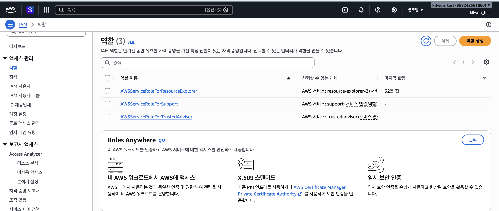
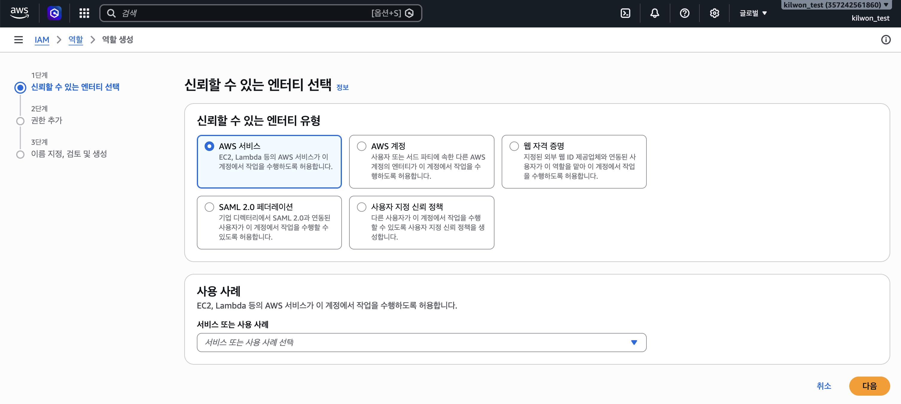
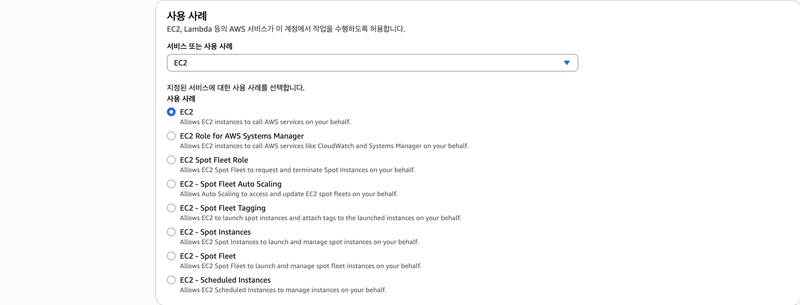

# 7월 23일 학습 내용 정리

## 목차
1. [EC2](#EC2)
2. [저장소](#저장소)
3. [Lambda](#lambda)
4. [DynamoDB](#dynamodb)
5. [S3](#s3)

## EC2
### EC2의 상태
- 시작 
- 멈춤 (STOP)
- 종료 (Terminate)

### EC2 Instance Type
> EX) T4g.micro
- T : T type(AWS에서 구분하기 위해 사용하는 타입 표기)
- 4 : 4세대
- g : Processor
    - Processor는 생략될 수 있다.
- micro : Size 

- 예시(size에 따른 차이)
    1. m7g.medium
        - vCPU : 1
        - vMemory : 4GiB
    2. m7g.large 
        - vCPU : 2
        - vMemory : 8GiB
    > CPU나 Memory가 2배씩 늘어난다고 생각하면 된다.
    >> size가 커지면 성능이 좋아진다고 이해하기

## 저장소
### EBS(Elastic Block Store)
- 저장 방식 : Block 단위의 읽기 쓰기
- 용량 : 볼륨 크기 제한 존재 (최대 64TB)
- 접근 방식 : 파일 시스템을 통한 접근 (ext4, NTFS 등)
    - 네트워크 방식에 비해 빠르다. -> 빠른 접근이 필요한 경우 이용
- 연결성 : 항상 EC2 인스턴스에 연결해야 사용 가능 (로컬 디스크처럼 사용 가능하다)
- 사용 사례
    1. 운영 체제 및 부트 볼륨 (로컬 디스크처럼 BootLoader 저장)
    2. DB Storage 
    3. Application Data
    4. 빠른 I/O가 필요한 작업

### S3(Simple Storage Service)
- 저장 방식 : Object 단위의 읽기/쓰기
- 용량 : 저장 공간에 제약이 없는 스토리지
- 접근 방식 : HTTP/HTTPS를 통한 REST API 접근
    - EBS에 비해 느리다.
- 연결성 : 독립적으로 존재, 어디서든 접근 가능
- 사용 사례
    - 정적 파일 호스팅 (이미지, 동영상, 문서)
    - 백업 및 아카이빙
    - 데이터 레이크
    - 정적 웹사이트 호스팅

### 선택 가이드
1. S3
    - 대량의 정적 파일 저장
    - 여러 서비스에서 동시 접근
    - 비용 효율적인 장기 저장
2. EBS
    - DB같이 빠른 I/O가 필요할 때
    - 파일의 일부 수정이 잦을 때
    - OS나 Application 실행 환경이 필요할 떄

## IAM
### User
> AWS 사용자
### Group
> AWS 사용자 집단
- 정책을 상속해준다.
    - User로서 가진 정책도 가지며 동시에 Group 정책을 가짐
    - 그룹을 동시에 속해도 여러 그룹의 정책을 모두 가진다.

### Role
- 개념
    - `권한을 가진 신원`, but IAM User랑 다르게 비밀번호나 액세스 키같은 장기 자격 증명이 없다.
        - 신뢰받는 대상이 일시적으로 맡아서 사용하는 방식 (사용할 때마다 STS 토큰(임시 자격 증명)을 발급받는 구조라서 보안상 훨씬 안전)
- 구성요소
    1. 신뢰 정책 : 누가 이 역할을 맡을 수 있는가
    2. 권한 정책 : 역할을 맡은 대상이 무엇을 할 수 있는가
- Role을 받으면, 개인,그룹으로 갖는 권한이 사라진다.
    - Role을 반납하면, 다시 개인,그룹으로 갖는 권한을 가진다.
    - 즉, **정책을 상속하지 않고 뒤집어 씌운다.** (유저가 사용할 때)

- 정책을 할당하는 경우도 존재한다. (AWS 리소스가 사용할 때)
    - 예시, EC2가 S3에 어떠한 오브젝트를 가지고 오고 싶은 경우
        - 그냥은 가지러 가기 불가, 모든 AWS 서비스는 IAM 방화벽을 거쳐야 한다.
        - 이때 S3 접근 가능 ROLE을 EC2에 붙여주면 가능
- 만드는 방법
    1. IAM -> Role(역할) -> 역할 생성 클릭

        
    2. 신뢰할 엔터티 선택 (AWS 서비스 / 다른 AWS 계정 / 웹 자격 증명 / SAML)

        

    3. 사용 사례 결정 (AWS서비스에 역할을 주는 경우)
        > 사용 사례 : 신뢰 정책을 결정 (신뢰 정책 : 이 역할을 어떤 서비스가 맡아서 사용할 것인가)

        
        - 사용 사례를 선택하면, 해당 서비스에 맞게 신뢰 정책 JSON을 자동으로 만들어준다. 

    4. 부여할 권한 정책 연결
        > 해당 역할이 무엇을 할 수 있게 할 것인가를 결정
        
    4. 이름 지정 후 생성

- 이용 방법
    1. assume으로 ARN을 이용해서 부여하기
    2. GUI에서 역할을 직접 지정해주기
    
### Policy
> 개인, 그룹에게 권한을 부여하는 정의 문서 (json) (ALLOW or DENY)
- 정책 종류
    1. AWS 관리형 : AWS가 미리 만들어서 제공, 수정 불가
    2. 고객 관리형 : 사용자가 직접 만들어 여러 대상에 재사용, 버전 관리 가능
    3. 인라인 정책 : 특정 사용자/그룹/역할에 1:1로 붙이는 정책

- Policy 작성 방법
    1. IAM -> 정책 -> 정책 생성에서 Json 편집기로 작성


## Lambda

### State-less
> 상태를 기록하지 않는다. 
>> 한 번 호출된 내용을 처리하고 나면, 처리하던 과정의 내용을 기억하지 않는다.
- 이 이유로 영속적으로 저장해야 하는 것이 필요하다면, 외부 저장소(S3, DB, Cache 서비스 등)를 붙여줘야 한다.
    - lambda 내부에 /tmp/files에다가 만들어서 관리해봤자 운이 좋으면 만나고 운 없으면 못 만난다.
        - lambda는 매번 새로운 환경에서 실행되기 떄문
    - 외부 저장소를 사용하면 아까 위에서 말한 것처럼 ROLE(실행 역할)을 부여해줘야 한다.
        - 두 개를 확인해야 한다. 
            1. AWS Lambda가 접근할 권한이 있는가.
            2. 해당 외부 저장소가 Lambda가 접근할 권한을 허락했는가?

### Server-less
- 서버가 없다는 것이 아니다.
    - 사람이 예전처럼 관리를 많이하지 않아도 된다는 의미

- 특징
    1. 트래픽이 있을 때만 코드를 실행한다는 개념 도입
    2. EC2 기반 서버 운영 부담, 상시 기동, 스케일링 관리, OS 패치 배경 모두 해줌
        - 코드만 신경 쓰면 된다.
            - 그럼 EC2가 왜 필요?
                - 제약 조건이 존재함. (성능/실행 시간)
                    - Lambda의 최대 코드 실행 시간 : 15m
                        - 15m이내에 응답을 내보내야 함. 안 그러면 그냥 죽음
                        - 왜 실행시간 제약이 있을까?
                            - 요청이 안 들어오는데 계속 실행할 수는 없으니까
    3. 다양한 언어를 지원함. 코드를 짜서 올려두면, 요청 발생 시 응답을 내보내줌.
        - Handler라는 실행 코드를 작성한다.
        - 이 Handler가 요청에 대해 응답을 만드는 구조
    4. 실행 성능을 우리가 정해야 하나, 메모리만 정하면 된다.
        - 128MB~10GB 사이에서 Memory 성능을 결정해야 한다.
        - 그 외에 CPU, 네트워크 throughput 등을 Memory에 합쳐서 뭉뚱그려놓음
            - 우리가 관리를 최소화할 수 있다.
    5. 실행 시간(Timeout)을 우리가 정해야 한다. 
        - 최대 실행 시간 15m으로 줌
            - 해결하지 못하면 Lambda로 실행하는게 적합하지 않을 수 있다는 것
            - lambda는 빠르게 실행하는 코드에 사용하는 것
    6. lambda 핸들러 여러 개 작성
        - 여러 개 작성 후, handler 부분 이름만 바꿔주면 그걸로 처리한다.
        - 따라서 하나에 이름 여러 개로 많이 만들고 여러 람다에서 이름만 바꿔가며 설정 가능
    7. 호출이 늘어나면 알아서 lambda의 실행환경이 늘어난다.
        - 만약 호출이 하나도 없으면? lambda 실행 환경도 없어짐
            - 이때, 호출이 생기면 실행 환경을 setup해서 실행
                - 이때 생긴 overhead가 cold-start <- 면접 단골 문제
                - cold-start 회피 방법 (돈을 쓰기)
                    1. 주기적 호출 (수동)
                    2. concurrency 관리 (자동)

- Lambda 사용법 
    1. Lambda 생성
    2. handler 작성
    3. trigger 생성

## DynamoDB
> Serverless (NoSQL) lambda에 붙여쓰기 좋음
- 일관성 종류가 두 개로 이루어져있다.
    1. Eventually
        - 항상 응답 주겠다. 근데 틀릴 수도 있으니까 여러 번 물어보면 결국엔 최신 값을 준다.
        - DynamoDB의 default
    2. Strong
        - 느릴 순 있어도 무조건 최신 값을 응답해준다.
        - DynamoDB에서 지원하긴 함
    - CAP이론이란?
        > CAP 중 하나는 포기해야 한다. 
        >> 따라서 CP(strong consistency)와 AP(Eventually Consistency) 중 선택해야 한다.
        - Consistency (일관성)
            > 무슨 일이 있어도 최신 값을 응답하겠다.
            >> 최신을 못 준다면 차라리 에러를 주겠다.
        - Availability (가용성)
            > 최신 값을 안 줘도 응답은 하겠다.
        - Partition tolerence (파티션 내구성)
            > 우리는 분산 환경 이야기를 하기 떄문에 이거는 **무조건 골라야 한다.**
            >> 이걸 안 고르면 파티션이 없어져서 한 통에서 관리된다는 뜻
    - PACELC 이론이란?
- 구조
    - Attribute
        > key-value pair
        - 예시
            ```
            "name" : "kingrangE"
            ```
            - name이 key(attribute)고, kingrangE가 value(data)
            - RDB의 column과 유사하지만, 미리 정의하지 않아도 되고, 아이템마다 속성이 달라도 된다는 차이가 존재한다.
                - NoSQL
    - Item
        > 관련된 Attribute를 묶은 것
        - 예시
            ```json
            {
                "user_id": "K30017",
                "name": "전길원",
                "email": "kilwon.jeon00@gmail.com"
            }
            ```
        - 아이템마다 속성 구성이 달라도 된다.
            - schemaless
    - Table
        > Item 집합
        - 위에 적혀있듯 schemaless로 구조가 미리 정해져있지 않다.
    - Partition Key
        > 각 **아이템을 구분하는 기본키**이자 동시에 **데이터가 물리적으로 어디에 저장될지를 결정**하는 값
        - 역할
            1. 고유 식별
            2. 물리적 분산 저장
                - PK를 해시함수에 넣어 이 아이템이 몇 번 파티션에 저장할지를 결정한다.
                - 이 덕분에 데이터가 아무리 많아져도 골고루 저장해서 빠른 속도를 유지할 수 있다.
    - Sort Key
        > PK에는 PK만 쓰는 것과 PK+정렬 키를 같이 쓰는 두 가지 방식이 존재한다.
        - PK만 사용 : Partition Key 값이 각 행에 고유해야 한다.
        - PK+SK 사용 : PK가 같아도 Sort Key로 구분가능하다.
            - 즉, 동일한 partition에 PK가 동일한 Item이 여러 개 존재 가능
- DynamoDB serverless
    - 성능을 어떻게 조절할까?
        - 읽기 성능 / 쓰기 성능을 초당 얼마씩 할지 정해줌

## S3
> 서버리스 객체 스토리지
>> 무제한 확장 가능한 완전 관리형 객체 스토리지
- 개념
    - bucket : S3의 기본적인 단위   
        - **특정 리전에 종속되는 리전 서비스**
            - 글로벌 서비스가 아니다. (글로벌 서비스 : 글로벌 전체 공유)
    - object : file을 말하는 것
        - CRUD
            - C : 쓰기 (업로드),URL이 발생한다.
            - R : 읽기 (다운로드)
                - presigned URL?
            - U : 갱신 (덮어쓰기, overwrite)
            - D : 삭제 
                - 지우면 안 되는 것을 지울 수도 있다. 
                    - versioning 기능을 이용해서 이전에 업로드했던 파일이 살아있다.
                        - 언제든 찾아볼 수 있지만, 또 다시 비용 문제로 돌아간다.
- 기본적으로 모두 닫혀있다. (`Block Public Access`)

## Step Functions
> 여러 작업을 순서대로 조건에 따라 엮는 워크플로우 관리 툴
- 발생 배경
    > lamdba 함수에서 여러 분기가 필요하다면?
    - ex, 분기 많은 lambda 예시
        ```python
        def handler(event, context):
            result1 = 함수A()               # 1단계
            if result1 성공:
                result2 = 함수B(result1)    # 2단계
                if result2 성공:
                    함수C(result2)          # 3단계
                else:
                    에러처리()
            else:
                재시도()
        ```
        - 작업이 많아질수록 이 흐름 제어가 복잡해진다.
    - STEP FUNCTION은 흐름을 코드에서 분리해 별도로 관리할 수 있게 해주는 도구
        - 이를 통해 각 lambda는 자기 할 일만하고, 분기는 Step Function이 담당한다.
- 구성요소
    1. `State Machine` : 워크플로우 자체
        - 전체 흐름을 담은 설계도
        - `이 작업들을 이러한 순서로, 이런 조건으로 실행해라`를 정의한 `하나의 상태 머신`
    2. `State` : 흐름의 각 단계
        1. Task : 실제 작업 수행
        2. Choice : 조건 분기
        3. Parallel : 여러 작업 동시에 병렬 실행
        4. Map : 배열의 각 항목마다 반복 실행
        5. Wait : 대기
        6. Succeed / Fail : 워크플로우 성공/실패로 종료
        7. Pass : 아무것도 안하고 데이터만 넘김
    3. ASL : 정의 언어
        > 상태 머신은 아래처럼 Json으로 기술한다.
        ```json
        {
            "StartAt": "주문검증",
            "States": {
                "주문검증": {
                    "Type": "Task",
                    "Resource": "arn:aws:lambda:...:function:ValidateOrder",
                    "Next": "결제처리"
                },
                "결제처리": {
                    "Type": "Task",
                    "Resource": "arn:aws:lambda:...:function:ProcessPayment",
                    "Next": "완료"
                },
                "완료": {
                    "Type": "Succeed"
                }
            }
        }
        ```
        - Next : 다음 단계 지정
        - Resource: Lambda의 ARN
    4. 자동 재시도와 에러 처리
        - Retry : 자동 재시도 설정
        - Catch : 에러 로직