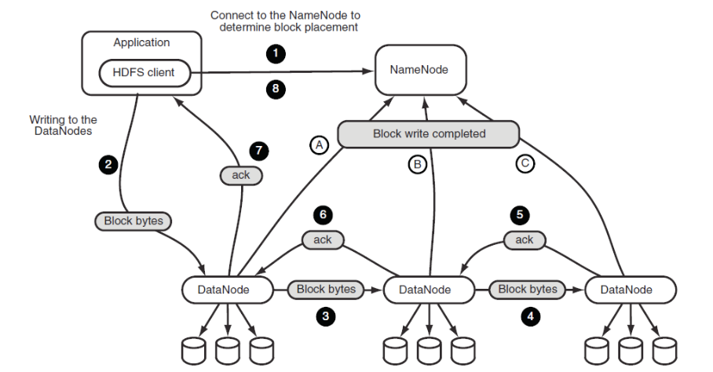

# 7월 24일 학습 내용 정리
## Hadoop 
### Hadoop 구성 요소
1. HDFS (Storage Layer)
2. YARN (Resource Management Layer)
3. MapReduce (Compute Layer, Application Layer)

### HDFS 구성 요소

> Namenode, Datanode, Client는 RPC 또는 데이터스트림 형태로 TCP위에서 동작

1. **Namenode**
    - 파일 시스템의 메타데이터를 관리함
    - 파일/디렉토리 namespace, block mapping, block 위치 정보 저장
    - 장점
        - 파일 위치 한 번에 파악 가능
            - Client가 바로 Datanode와 통신 가능
    - 단점
        - 모든 metadata를 메모리에 유지해야 함.
            - 파일이 늘어날 수록 메모리 부담 증가
        - Namenode가 병목 지점이 될 가능성 존재
            - SPOF가 된다.

2. **Datanode**
    - 실제 Application Data 저장
        - Block 단위로 나누어진 파일을 저장
    - Replication
        - 각 Block을 여러 데이터 노드에 복제하여 저장
        - 복제하여 저장함으로써 얻는 장점
            1. 여러 노드에서 동시 READ 가능
            2. 데이터 내구성 좋아짐
            3. 연산을 필요한 데이터 근처에 배치하게 될 확률 증가
                - 데이터가 여러 곳에 있으니까 만날 확률 올라감
    - 복제할 Datanode는 어떻게 선택할까? 
        - default는 아래와 같다. (default의 복제 계수 : 3)
            - network topology (물리적으로 어떻게 연결되어 있는가)를 따짐
            1. 쓰기 주체와 가까운 노드 또는 안 바쁜 노드
            2. 다른 랙에 위치한 노드
            3. 2번과 같은 랙에 위치한 다른 노드
        - 위와 같이 하는 이유
            1. 안정성
                - 랙 하나가 죽어도 데이터가 안정적으로 존재하게
            2. 성능
                - 전부 다른 랙에 위치하면, 랙 간 통신이 늘어나 비용이 비싸짐
                - 그래서 2개는 같은 랙에 위치시키는거
    - 데이터를 그럼 어떤 Datanode에 저장할까?
        1. 쓰기 주체가 Datanode인 경우 (map,reduce 결과 저장)
            - 자기 자신에게 제일 먼저 저장함.
                - write locality
        2. 쓰기 주체가 Datanode가 아닌 경우 (client의 put 등)
            - 자신이 가진 Datanode 중 **여유 공간을 가진 안 바쁜 노드들** 중 선택

### HDFS Read

1. Client가 **Open을 호출**하여 **파일 읽기 요청**
2. Distributed File System이 Namenode에게 RPC 요청
    - 파일의 Block 목록과 각 Block의 Datanode 위치 반환
3. FSDataInputStream 생성
4. Client는 가장 가까운 Datanode에 연결하여 읽기 시작
5. 그 다음 블록을 가진 Datanode 읽음
6. 모든 block을 읽었다면 close

- 특징
    1. Namenode는 오직 메타데이터 정보 제공만 함.
    2. 데이터를 읽기는 Client가 직접
        - 메타데이터를 기반으로 직접 Datanode에 접근하여 진행
    3. block 단위로 읽음
        - 가장 가까운 replication부터 읽는다. 

### HDFS Write

1. Client가 create를 호출하여 파일 생성 요청
2. Namenode가 파일 존재 여부/권한 확인
    - Metadata 생성 및 파일 등록
3. FSDataOutputStream 생성 후 쓰기 시작
4. Data를 packet 단위로 분할하여 전송
    - Datanode에 패킷 하나를 전송하면, 바로 그것을 다른 Datanode로 복제하면서 동시에 다음 데이터를 받는다.
        - EX)
            1. Datanode A가 1번 패킷을 받는 중
                - 자기 디스크에 저장하며 동시에 Datanode B로 1번 패킷 전달
            2. 그와 동시에 Datanode A는 Client로부터 2번 패킷을 받음
            3. Datanode B는 패킷을 받으면 저장하며 동시에 Data C로 전달
5. 데이터 저장이 완료되면 Ack를 전송함
6. client가 stream을 닫고 남은 packet 처리 완료 대기
7. Namenode에 write 완료 통보
    - 파일 상태 complete로 변경

- 특징
    1. WORM(Write Once Read Many) 구조
        - 한 번 쓰고 여러 번 읽는 구조
        - ex, 로그 데이터
    2. 파일 수정 불가 추가는 가능 (WORM이기 때문)
        - 파일 내용 중간을 수정/overwrite할 수 없다.
        - 파일 내용 끝에 append는 가능
        - 파일 전체 삭제 후, 같은 이름으로 다시 생성은 가능하다.
    3. Fault tolerance
        - 데이터를 여러 노드에 복제하여 저장
        - 노드 장애 발생 시, 자동으로 replica 재생성
    4. High throughput
        > HDFS는 작은 데이터를 빠르게 찾는 용도가 아닌, 거대한 데이터를 한 번에 읽어서 처리하는 용도에 맞다.
        >> < log 분석, 대규모 배치 처리에 유리 / 특정 레코드 조회,수정에 불리 > 이 용도를 기억하여 사용하기
        - 작은 random access보다 대용량 sequential read/write에 적합하다.
        - Why?
            1. Namenode 메타데이터 부담
                - 작은 파일을 많이 다루면, 메타데이터가 많이 쌓여 부담이 커짐
            2. 디스크의 물리적 특성
                - 데이터를 순차적으로 읽으면, 디스크가 이어진 위치를 읽기 때문에 빠른데, 임의 위치를 옮겨다니면 위치를 찾는 비용이 들어서 느려진다. 
                - HDFS는 seek을 최소화하고 연속 전송을 극대화하도록 설계
            3. 큰 블록 단위
                - HDFS는 파일을 블록으로 쪼개서 저장함.
                    - 순차적으로 읽으면 큰 블록을 통째로 효율적으로 읽는다.
                    - But, 작은 데이터를 찾으려할 땐 Block 단위로 접근해야 해서 낭비가 크다.
    5. Scalability
        - 노드 추가만으로 저장 공간 및 성능 증가
### HDFS Checksum

- 각 데이터 노드에는 Data외에 Checksum 메타데이터가 함께 저장된다.
- Client가 데이터를 읽고 checksum을 계산하여 대조한다.
    - 만약 checksum이 맞지 않으면 `corruption`으로 판단한다.
        - 해당 Block을 사용하지 않고, 같은 block의 다른 Replica를 가진 Datanode에서 다시 읽음
    - Namenode는 손상된 replica를 corrupt replica로 표시
        - 정상 replica를 기준으로 새로운 replica를 생성하여 복구

### HDFS heartbeat
- Namenode는 주기적으로 heartbeat를 통해 Datanode의 상태를 확인한다.
    - 정보 : 저장 용량, 사용량, 현재 처리 중인 작업 정보 파악

### HDFS Failure Handling
> HDFS는 장애를 특수한 것이 아닌 항상 일어나는 것으로 파악
>> 즉, 장애를 피하기보다 장애 발생 시, 빠르게 감지하고 복구하는 것을 목표로 설계함.

#### 1. Datanode Failure
> 데이터 노드가 죽으면 어떻게 처리될까?

1. Datanode는 주기적으로 Namenode에게 Heartbeat를 전송한다.
2. Namenode가 일정 시간 Heartbeat를 받지 못하면, Timeout 발생
    - Datanode가 죽었다고 판단
3. Namenode는 해당 Datanode를 live node 목록에서 제거 
    - 해당 Datanode에 있던 Block들을 unavailable 상태로 간주
4. 영향 받은 Block 파악
    - 죽은 Datanode가 가진 block 목록을 기준으로 현재 replica 개수 파악
    - 최소 복제 개수보다 적어진 Datanode를 under replicated block으로 분류
5. Replication Queue
    - under replicated block을 replication queue에 등록 
    - 이때, 복제 개수가 적은 것과 같은 data block들을 더 높은 우선 순위로 처리
6. 새 데이터 노드 선택
    - Namenode가 replication을 저장할 새 Datanode를 선택
    - 이때 선택은 무작위가 아닌 rack 위치, 남은 저장 공간, 현재 부하 등을 고려
7. 복제 명령 전달
    - Namenode가 heartbeat응답을 통해 각 Datanode에게 복제 명령을 전달한다.
8. Datanode간 Block copy
    - Data copy에 Namenode는 관여하지 않는다.
    - Replica를 가진 Datanode가 새로운 Datanode로 block 복사
9. Block report
    - 데이터 복사가 완료되면, Datanode가 Namenode에게 block report 또는 상태 보고
    - Namenode는 block 위치 정보를 갱신
10. 정상 replica 수 회복
    - 현재 replica 수가 정상 replica 수가 되면, 해당 block은 정상 상태로 돌아감

#### 2. Namenode Failure
> 네임 노드가 죽으면 어떻게 처리될까?
- Namenode가 죽으면 발생하는 문제
    - Namenode가 죽어도, Datanode의 실제 데이터는 그대로 남아있다.
        - 하지만, 
            - 어떤 파일이 어떤 block으로 구성되는지 모름
            - 어떤 데이터 노드에 데이터 Block이 있는지 모름
            - client가 read/write 불가
    - Namenode가 그래서 SPOF가 된다.
        - 이걸 방지하고자 이중화

- Namenode의 High Availability를 달성하는 요소
    1. Active Namenode
        > 실제로 일하는 Namenode
        - Client의 모든 요청을 이 노드가 처리
        - 평상시엔 이것만 갖고 메타데이터 변경 내역 기록
    2. Standby Namenode
        > 대기 중인 예비 Namenode
        - 평소엔 Client 요청 처리 X
            - Active 상태를 따라가며 대기
        - Active가 죽는 순간, 즉시 Active로 failover(승격)돼서 서비스 이어받음
            - 즉시 이어받기 위해 항상 Active와 Metadata가 똑같이 동기화되어있다.
    3. JournalNode <- Metadata 동기화
        > Standby Namenode의 동기화를 위한 노드
        - 동작 방식
            1. Active는 Metatdata 변경시마다 변경 기록을 Journal Node에 기록
            2. Standby는 JournalNode들에서 변경 기록을 계속 읽어와서 자기 메타데이터에 반영
        - JournalNode는 보통 여러 대(홀수)로 구성
            - 과반수에 기록이 되면 정상으로 처리하기 때문에 JournalNode 하나가 죽어도 문제 X
    4. ZooKeeper <- Failover 관리
        > Active가 죽었는지 감시하고, 죽었으면 Standby를 Active로 Failover
        - 동작 방식
            1. 각 Namenode 옆에 ZKFC(ZooKeeper Failover Controller) 감시 프로세스가 붙어서 Namenode의 health check
            2. Active는 ZooKeeper에 자신이 Active라는 표시를 가짐
            3. Active가 죽으면, 세션이 끊기고 ZooKeeper가 이를 감지해서 Standby를 새 Active로 승격
        - Split-brain도 방지
            - split-brain : 양쪽 다 자기가 Active라고 착각하는 상황

## 수업 내용 정리
### Parole vs Longue
- Parole: 개인이 생각하는 언어에 대한 이미지
- Longue: 모두가 동일하게 생각하는 이미지
- 프로젝트에서 이거를 확인하지 않고 넘어가면 다른 방향으로 나아가게 된다.
    - 같은 언어를 사용했다해서 생각이 같다고 생각하지 말자.

### 문제 정의와 문제 해결
- 문제를 정의하는 것과 문제를 해결하는 것은 분리해서 생각하라.
    > 분리하지 않고, 어떠한 데이터를 기반으로 문제를 해결하자로 넘어가면 안 된다. 무조건 문제 정의 -> 문제 해결이다.
    - 문제 정의 : 어떠한 문제를 해결할까?
        - 누구의 무슨 문제를 해결할까?
    - 문제 해결 : 어떠한 데이터로 해결할까?

### 보고서 양식
1. 우리가 무엇을 만들었습니다.
2. 우리는 누구의 무슨 문제를 해결했습니다.
3. 우리는 어떠한 문제를 해결했습니다.
4. 읽는데 도움이 되는 순서로 작성하라.
5. 맨 앞에 Executive Summary를 만들기 : 경영진을 위한거 딱 한 장 보고 바로 확인할 수 있다.
    - 뭐하는 거고 왜 있고, 뭐하겠다.
    - 그리고 결론은 다 뒤에 쓰기
    - 이걸 잘해야 한다.
6. 마무리엔 뭘 해야 하는지를 던져라. (누군가 책임을 져라)

### 팀플
1. 문제 정의를 엑셀에 적고, 이게 계속 어떻게 바뀌어 가는지 History를 확인
2. 최대한 디테일하게 들어가기
3. 누구의 / 어떤 문제를 해결하는지 쓰기