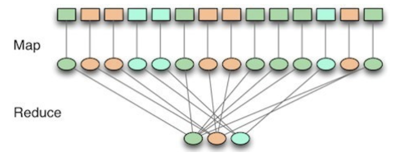

# 7월 25일 학습 내용 정리

## Hadoop

### Hadoop Performance & Optimization

#### Block size
- HDFS는 큰 Block 단위로 데이터를 저장한다.
    - Block이 크면 
        - Sequential Read/Write에 유리하고, Metadata 수 감소
        - 너무 크면, 병렬 처리 단위가 줄어들 수 있다.
            - 하둡에서 큰 파일을 처리할 때, Block 하나 당 처리 작업 하나가 붙어서 병렬로 돌아간다.
                - 즉, Block의 개수는 동시의 수행 가능한 작업의 수
            - Block size를 너무 크게 잡으면, 파일이 조금 쪼개져서, 동시에 수행 가능한 작업 수가 줄어든다.
    - Block이 작으면 
        - Namenode가 관리해야 하는 Block의 metadata가 증가

#### Replication Factor
- Block을 몇 개의 Datanode에 복제할지 결정
- 복제 개수가 많으면 
    - 장점 : `fault tolerance`와 `read bandwidth`가 함께 증가
    - 단점 : `저장 공간 사용량`과 `write 비용` 함께 증가

#### Data Locality
- 데이터가 있는 노드 근처에서 연산할수록 Network I/O 감소
- Hadoop은 데이터를 옮기기보다 계산을 데이터로 보내는 것을 선호한다.
    - Data 용량이 계산 코드보다 무거움 -> 계산 코드를 전달하는게 편하다.

#### Cluster Size
- Datanode 수가 많아질수록 
    - 장점 : `저장 용량`과 `aggregate bandwidth`가 함께 증가
    - 단점 ㅣ `장애 감지/복구`,`metadata 관리` 부담 증가

### Mapreduce
> 하둡의 대표적인 분산 계산 모델 (Map->Shuffle->Reduce)

- HDFS에 저장된 대용량 데이터를 여러 조각으로 나누어 병렬 처리한다.
- Input : HDFS에 저장된 파일을 block 또는 split 단위로 쪼갬.
    - Block과 Split의 차이 : 거의 일치하지만 항상 일치는 아니다.
        - Block : 물리적으로 정해진 크기로 쪼갠 것
            - HDFS에 저장할 때 진행
            - 데이터를 분산 저장하기 위함
        - Split : 논리적으로 나눈 처리 단위
            - Mapreduce 실행 시 진행
            - Maptask에 분배하기 위함
            - ex, 물리적으로 쪼개는 과정에서 단어가 분할되었다면 제대로 계산이 안된다.
                - 이를 살짝씩 조정한게 split 단위
- Map
    - 각 worker가 자기에게 배정된 split을 맡아 동시에 처리
        - 각 타원이 하나의 Map task, 서로 다른 노드에서 병렬로 수행된다.
    - 각 Map task는 자기가 맡은 데이터를 key-value로 변환
    - Map 단계의 최적화 : Data locality
        > 계산을 데이터에 보낸다.
        - Map task는 아무 노드에서나 수행하지 않고, 자기가 처리할 블록이 저장된 Datanode에서 실행
- Shuffle
    > Map 결과를 key별로 모음
    >> 이미지에서 Map 결과들이 Reduce 3개로 선이 모이는 단계
    - Map task가 뱉어낸 key-value들을 **같은 key**끼리 **같은 Reduce**로 모은다.
        - 같은 key는 무조건 같은 reduce로 재배치된다.
- Reduce
    > Key별로 최종 집계
    - 자기가 맡은 key에 모인 value들을 합쳐서 최종 결과를 만들고, HDFS에 저장
        - 같은 key가 같은 reducer에 모이는 것은 맞지만, key 1개당 1개의 reducer가 배정되는 것은 아니다.
            - 미리 사전에 정해둔 reduce에 나눠지는 것
            - 나눠지는 기준 -> `partitioner`

### YARN
> Hadoop 클러스터의 CPU, Memory 등 자원을 관리하는 자원 관리 시스템
- 원래 하둡 : HDFS + Mapreduce로만 돌아갔다.
    - 문제 : 머신러닝, 그래프 처리, 스트리밍 등을 처리하기 어렵고, 다양한 Application을 올리기 어려워졌다.
- YARN : 아래를 이용하여 여러 Application이 같은 Cluster 위에서 실행될 수 있도록 해주는 시스템
    1. Resource Manager(RM): 클러스터 전체 자원 관리
        - 어느 노드에 얼만큼의 Container를 줄지 결정
        - 배분에만 참여
            - 작업이 잘 돌아가는지 감시, 실패시 재시도 이런거 안함
    2. Node Manager : 각 노드의 자원 상태 관리
        - 자기 Node에서 Container 실행
        - 자기 노드의 자원(CPU/Memory) 사용량 감시 후, RM 보고
    3. Application Master(AM): 각 Application마다 생성되는 관리자
        - JOB에 필요한 자원을 RM에 요청
        - 실제 task를 NodeManager에 띄움
        - task 감시, 관리
    4. Applications Manager(AsM): Application 시작 관리
        - 하는 일
            - Client의 job 요청을 받고, job을 지휘할 `Application Master`를 띄우기
            - `ApplicationMaster`가 **죽으면 다시 살리는 일**

- 동작 방식
    
    1. Client : AsM에게 Application 실행 요청
        - 이때, AM을 어떻게 띄울지에 대한 정보도 같이 전송
            - 실행할 코드, 필요 자원 등
    2. AsM : Client 요청 받고, Scheduler에게 AM을 띄울 Container 요청
    3. Scheduler : AsM의 요청을 받고, 여유 있는 Node에 Container 하나 배정
    4. AsM : Scheduler가 배정한 Container가 있는 노드의 NodeManager에게 AM을 띄우라 지시
    5. Node Manager : AM 실행
    6. AM : Resource Manager에 자기 자신 등록
        - 등록으로 인해 아래 두 가지가 가능해짐
            1. RM은 AM이 살아있는지 heartbeat로 확인할 수 있게 된다.
            2. Client는 RM을 통해 job의 상태를 조회할 수 있게 된다.
    7. AM : Scheduler에게 필요한 자원 요청
        - job을 수행하기 위해 필요한 자원을 계산해서 요청
        - 이때 data locality도 같이 요청
            - 가능하면, 이 블록이 저장된 노드에 컨테이너 달라
    8. Scheduler : AM에게 Container 배정
        - Cluster 상황과 정책을 확인 후 배정해줌
        - Scheduler는 **배분**만 하고, Node Manager가 Container 띄워 task 실행하는거
    9. AM : task 실행 및 감시
        - Container 안에서 task가 실제 계산 수행
            - task들은 진행 상황을 **AM**에게 보고
            - AM이 상황 감시, 실패 시 Scheduler에게 다시 컨테이너 요청하여 재실행 
    10. NodeManager : 자기 노드의 자원 상태를 계속 RM에 heartbeat로 보고
    11. AM : 잡이 끝나면, RM에서 등록 해제 후 종료
        - Container 반납
